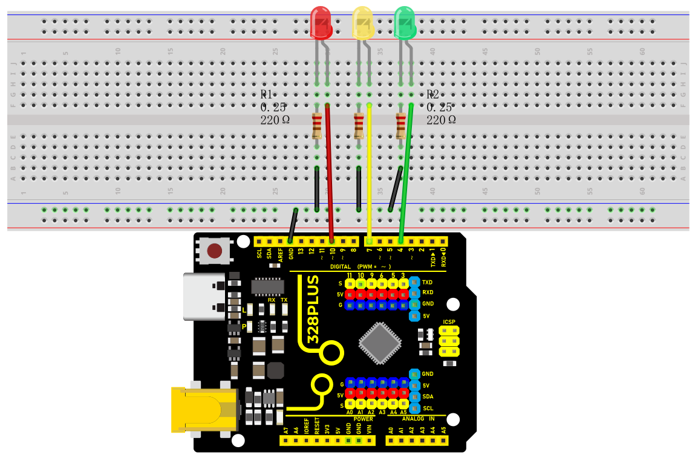
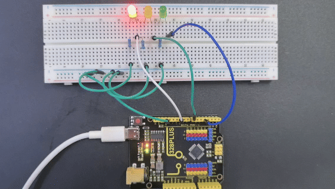

### Project 4 Traffic Lights


#### Description

Traffic lights are important traffic safety facilities on the road. They use different light colors to direct the passage of vehicles and pedestrians to ensure road safety and order.

This project will use a Arduino development board and LEDs to implement a simple traffic light system. By writing Arduino code, you can control the LEDs of red, yellow, and green colors to realize the basic functions of traffic lights.

#### Hardware

1\. 328 Plus development board x1

2\. Red LED x1

3\. Yellow LED x1

4\. Green LED x1

5\. 220 ohm resistor x3

6\. Breadboard x1

7\. Jumper wires

#### Working Principle

Traffic lights are an indispensable part of the modern transportation system, which use red, yellow, and green lights to control the passage of vehicles and pedestrians, thereby ensuring orderly and safe traffic. This project will seek to how traffic lights work.

The traffic lights mainly consist of an electronic controller and a signal light. The electronic controller is the "brain" of the traffic light. It controls the changes of the signal light according to the preset time and logic. Signal lights are usually composed of LEDs or incandescent bulbs, which display three colors: red, yellow, and green.


The working cycle of traffic lights is usually divided into four stages: red light, red and yellow light, green light and yellow light. During the red light phase, the red light lights up and all vehicles and pedestrians must stop and wait. When the red light ends, the red and yellow lights will light up at the same time, prompting drivers and pedestrians to prepare to leave. Next, the green light turns on and vehicles and pedestrians can pass. Finally, the yellow light turns on, reminding drivers and pedestrians that the green light is about to end and they need to prepare to stop or speed up to pass.

#### Wiring Diagram

1.Connect the red LED anode to digital pin D10 on the board, and cathode to pin GND with a 220 ohm resistor in serial;

2.Connect the yellow LED anode to digital pin D7 on the board, and cathode to pin GND with a 220 ohm resistor in serial;

3.Connect the green LED anode to digital pin D4 on the board, and cathode to pin GND with a 220 ohm resistor in serial;

 

#### Sample Code

```cpp

/*

Keye New RFID Starter Kit

Project 4

Traffic light

Edit By Keyes

*/

int redPin = 10; // Red LED is connected to digital pin 10

int yellowPin = 7; // Yellow LED is connected to digital pin 7

int greenPin = 4; // Green LED is connected to digital pin 4

void setup() {

pinMode(redPin, OUTPUT);

pinMode(yellowPin, OUTPUT);

pinMode(greenPin, OUTPUT);

}

void loop() {

// Red LED will be on for 5s

digitalWrite(redPin, HIGH);

delay(5000);

// Red LED will be off and green LED will be on for 3s

digitalWrite(redPin, LOW);

digitalWrite(greenPin, HIGH);

delay(3000);

// Green LED will be off and yellow LED will be on for 1s

digitalWrite(greenPin, LOW);

digitalWrite(yellowPin, HIGH);

delay(1000);

// Yellow LED will be off

digitalWrite(yellowPin, LOW);

}

```

#### Code Explanation

The code defines three integer variables, `redPin`, `yellowPin`, and `greenPin`, which store the digital pin numbers connected to the three LEDs on the Arduino board. The red LED is connected to digital pin 10, the yellow LED is connected to digital pin 7, and the green LED is connected to digital pin 4.

```cpp

int redPin = 10; // Red LED connected to digital pin 10

int yellowPin = 7; // Yellow LED connected to digital pin 7

int greenPin = 4; // Green LED connected to digital pin 4

```

In the `setup()` function, these three pins are set to output mode (`OUTPUT`) using the `pinMode()` function. This is because the LEDs need to receive a power signal from the Arduino board to control their on/off state.

```cpp

void setup() {

pinMode(redPin, OUTPUT);

pinMode(yellowPin, OUTPUT);

pinMode(greenPin, OUTPUT);

}

```

The `loop()` function is the core of the Arduino program and is executed repeatedly. In this function, the `digitalWrite()` function controls the on/off state of each LED, while the `delay()` function controls the duration of each state.

1\. First, the red LED is set to high level (`HIGH`), which means it is turned on, for 5 seconds (5000 milliseconds).

```cpp

digitalWrite(redPin, HIGH);

delay(5000);

```

2\. After 5 seconds, the red LED turns off (set to low level, `LOW`), and the green LED turns on for 3 seconds.

```cpp

digitalWrite(redPin, LOW);

digitalWrite(greenPin, HIGH);

delay(3000);

```

3\. Next, the green LED turns off, and the yellow LED turns on for only 1 second.

```cpp

digitalWrite(greenPin, LOW);

digitalWrite(yellowPin, HIGH);

delay(1000);

```

4\. Finally, the yellow LED turns off.

```cpp

digitalWrite(yellowPin, LOW);

```

#### Project Result

After uploading the code to the development board, the LEDs will be on and off according to the set time sequence, simulating the working status of a traffic light. 



The red light is on for 5s and then goes off; the green light is on for 3s and then goes off; the yellow light is on for 1s and then goes off.

