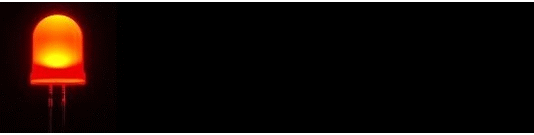
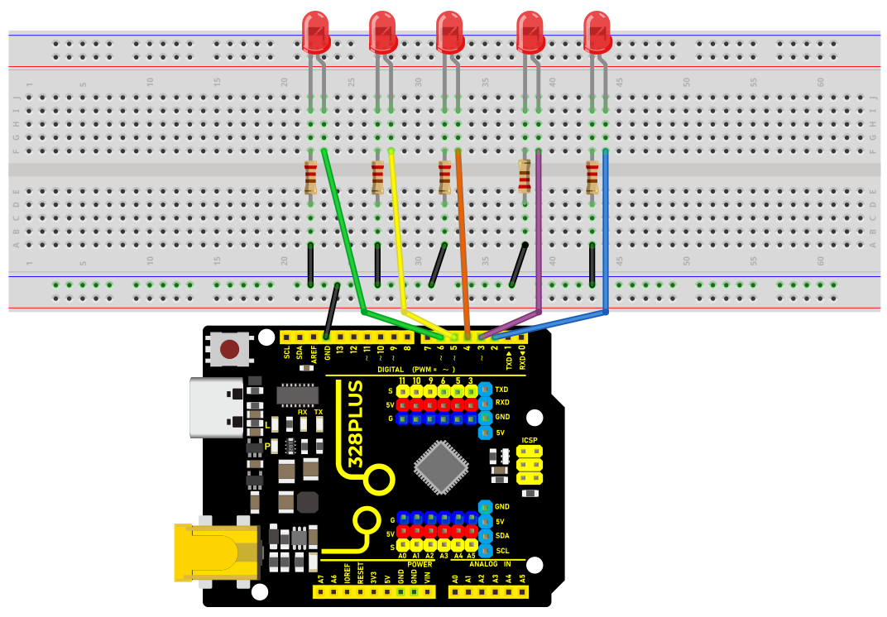
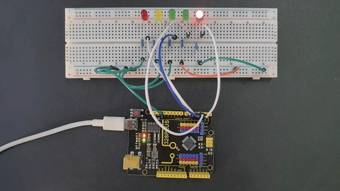

### Project 5 LED Flowing Light


#### Description

A flowing water light flashes continuously like running water. It is a common decorative light that is widely used in various occasions, such as festival celebrations, shopping mall windows, stage performances, etc.

This project will use an Arduino development board and 5 LEDs to make a simple LED flowing water light. By controlling the sequence of LEDs on and off, you can create a visual effect like flowing water.

#### Hardware

1\. 328 Plus development board x1

2\. LED x5

3\. 220 ohm resistor x5

4\. Breadboard x1

5\. Jumper wires

#### Working Principle

The working principle of the LED flowing water light is to control the on and off sequence of the LEDs through the Arduino development board, thereby producing a visual effect like flowing water. The Arduino development board is connected to the positive pin of the LED through the digital output pin, while the negative pin of the LED is connected to the GND (ground) pin of the board through a resistor. By writing Arduino code, we can control the high and low levels of the digital output pins to control the LED on and off.



#### Wiring Diagram

1.Connect the 5 LED anode pins to digital pins D2, D3, D4, D5, D6 on the Arduino development board respectively.

2.Connect the cathode pins of each of the five LED to one end of each of the five 220 ohm resistors.

3.Connect the other end of the five 220 ohm resistors to the GND (ground) of the development board.




#### Sample Code

```cpp

/*

Keye New RFID Starter Kit

Project 5

LED flowing light

Edit By Keyes

*/

int ledPins[] = {2, 3, 4, 5, 6, }; // Define the pin of the LED

int ledCount = 5; // Number of LEDs

int delayTime = 100; // Delay time in ms

void setup() {

for (int i = 0; i < ledCount; i++) {

pinMode(ledPins[], OUTPUT); // Set the LED pin to output mode

}

}

void loop() {

for (int i = 0; i < ledCount; i++) {

digitalWrite(ledPins[], HIGH); // Light up the current LED

delay(delayTime); // Delay

digitalWrite(ledPins[], LOW); // Light off the current LED

}

for (int i = ledCount - 2; i > 0; i--) {

digitalWrite(ledPins[], HIGH); // Light up the current LED

delay(delayTime); // Delay

digitalWrite(ledPins[], LOW); // Light off the current LED

}

}

```

#### Code Explanation

Variable Definitions

```cpp

int ledPins[] = {2, 3, 4, 5, 6}; // Define the pins for the LEDs

int ledCount = 5; // Number of LEDs

int delayTime = 100; // Delay time in milliseconds

```

`ledPins[]`: This is an integer array that stores the digital pin numbers to which each LED is connected. In this example, the LEDs are connected to digital pins 2, 3, 4, 5, and 6 on the Arduino board.

`ledCount`: This variable stores the total number of LEDs, making it convenient to use in for loops.

`delayTime`: Controls the delay time between each LED turning on or off, in milliseconds.

Setup Function `setup()`

```cpp

void setup() {

for (int i = 0; i < ledCount; i++) {

pinMode(ledPins[], OUTPUT); // Set the LED pins as output mode

}

}

```

The `setup()` function is a standard initialization function in Arduino programs, automatically called once at the beginning of the program.

`pinMode(ledPins[], OUTPUT)`: This line of code configures each LED pin as output mode. `OUTPUT` is a constant in the Arduino language used to specify the pin as an output.

Main Loop Function `loop()`

```cpp

void loop() {

for (int i = 0; i < ledCount; i++) {

digitalWrite(ledPins[], HIGH); // Turn on the current LED

delay(delayTime); // Delay

digitalWrite(ledPins[], LOW); // Turn off the current LED

}

for (int i = ledCount - 2; i > 0; i--) {

digitalWrite(ledPins[], HIGH); // Turn on the current LED

delay(delayTime); // Delay

digitalWrite(ledPins[], LOW); // Turn off the current LED

}

}

```

The `loop()` function is the main loop part of the Arduino program, repeatedly executed after the `setup()` function.

The first for loop is responsible for turning on each LED in sequence, keeping each LED on for the time specified by `delayTime`, and then turning it off.

The second for loop turns off the LEDs in reverse order, starting from the second to last LED and ending at the second LED.

`digitalWrite(pin, value)`: Used to control the high or low level on the specified pin. `HIGH` represents a high level, turning the LED on; `LOW` represents a low level, turning the LED off.

#### Project Result

After uploading the sample code to the development board,



the LEDs will light up and turn off in sequence from left to right, and then from right to left, creating a flowing water effect.

