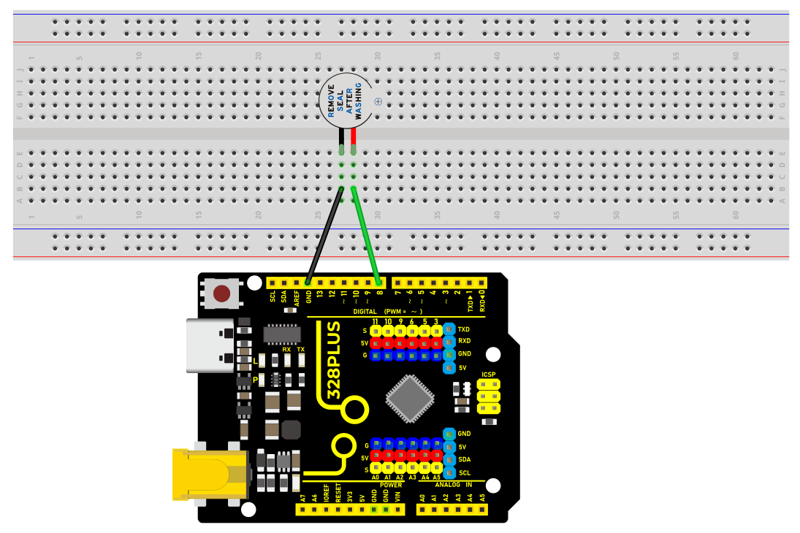
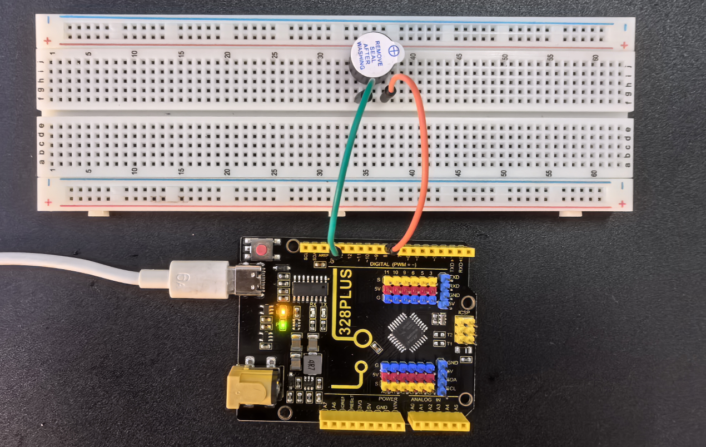

### Project 6 Active Buzzer


#### Description

An active buzzer is a buzzer with a built-in drive circuit. Compared with traditional passive buzzers, it features small size, adjustable tone, and simple drive. In daily life, we often encounter active buzzers, such as mobile phones, computers as well as household appliances.

In this project, we will make a simple alarm system via an Arduino board and an active buzzer. This system can be used in a variety of situations, such as doorbell prompts and temperature exceeding warnings.

#### Hardware

1\. 328 Plus development board x1

2\. Active buzzer x1

3\. Jumper wires 

#### Working Principle

Active buzzer is a common electronic sound-generating device and is widely used in various electronic equipment. Here's how it works:

1.  Oscillation circuit: The active buzzer contains an oscillation circuit inside, which is usually composed of resistors, capacitors, transistors and other components. When the buzzer is powered on, the oscillation circuit generates an electrical signal of a specific frequency.
1.  Piezoelectric element: The buzzer also contains a piezoelectric element, which is usually made of piezoelectric ceramics or piezoelectric film. Piezoelectric elements have unique properties: when a voltage is applied, they produce mechanical deformation; conversely, when subjected to mechanical stress, they produce a voltage.

3. Sound generation: The electrical signal generated by the oscillation circuit is applied to the piezoelectric element, causing it to rapidly mechanically deform and push the surrounding air to generate sound waves. The frequency of the sound wave depends on the frequency of the oscillation circuit, so the tone emitted by the buzzer can be controlled by changing the parameters of the oscillation circuit.

4. Drive circuit: The active buzzer has a simple built-in drive circuit to amplify the signal generated by the oscillation circuit and provide sufficient current to the piezoelectric element to produce a loud enough sound.


In short, the active buzzer generates an electrical signal of a specific frequency through an internal oscillation circuit and uses a piezoelectric element to convert the electrical signal into sound. This simple and effective working principle makes the active buzzer a commonly used electronic sound-generating device.

#### Specifications

Min/Max Operating Voltage +3.3V to +5V

Maximum Current: 30mA

Resonance Frequency: 2500Hz ± 300Hz continous

Minimum Sound Output 85Db @ 4in (10cm)

Storage Temperature: -22°F to 221°F (-30°C to 105°C)

Operating Temperature: -4°F to 158°F (-20°C to 70°C)

#### Pinout


#### Wiring Diagram

1\. Connect the positive pole of the active buzzer (usually "S" or "+") to the digital pin D8 on the development board.

2\. Connect the negative pole of the buzzer (“-”) to GND.




#### Sample Code

```cpp

/*

Keye New RFID Starter Kit

Project 6

Active buzzer

Edit By Keyes

*/

const int BUZZER_PIN = 8;// Define the digital port to which the buzzer is connected

void setup() {

// Set the buzzer port to output mode

pinMode(BUZZER_PIN, OUTPUT);

}

void loop() {

// Make the buzzer sound

digitalWrite(BUZZER_PIN, HIGH);

delay(1000); // Sound lasts 1s

// Stop sounding

digitalWrite(BUZZER_PIN, LOW);

delay(1000); // Stop sounding for 1s

}

```

#### Code Explanation

```cpp

const int BUZZER_PIN = 8; // Define a constant BUZZER_PIN with a value of 8, indicating the buzzer is connected to digital pin 8

```

First, the code defines a constant `BUZZER_PIN` to store the pin number 8 where the buzzer is connected. Using a constant makes the code easier to understand and maintain.

```cpp

void setup() {

// Set the buzzer pin to output mode

pinMode(BUZZER_PIN, OUTPUT);

}

```

The `setup()` function is a special initialization function in Arduino that runs first when the program starts or resets. Here, the `pinMode()` function sets the buzzer pin to output mode. This means the pin will output a voltage signal to control an external device—in this case, the buzzer.

```cpp

void loop() {

// Make the buzzer sound

digitalWrite(BUZZER_PIN, HIGH);

delay(1000); // Sound for 1 second

// Stop the sound

digitalWrite(BUZZER_PIN, LOW);

delay(1000); // Stop for 1 second

}

```

The `loop()` function runs continuously and is the core functional block of Arduino code. In this loop, the code uses the `digitalWrite()` function to set the pin to `HIGH`, making the buzzer sound. Then, it uses `delay(1000)` to create a 1-second delay, allowing the buzzer to sound for 1 second. After that, the code sets the pin to `LOW` to stop the buzzer sound and delays again for 1 second. Therefore, this loop makes the buzzer sound for 1 second and stop for 1 second in a regular alternating pattern.

#### Project Result

After uploading the above code to the development board, the active buzzer will emit a sound every second, forming an intermittent sound.



Such output can be used as various prompts or warning signals.

