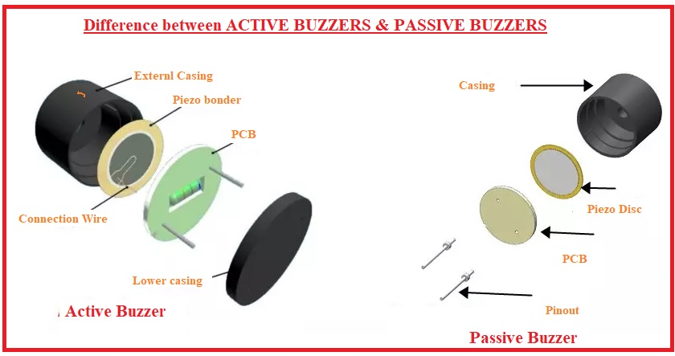
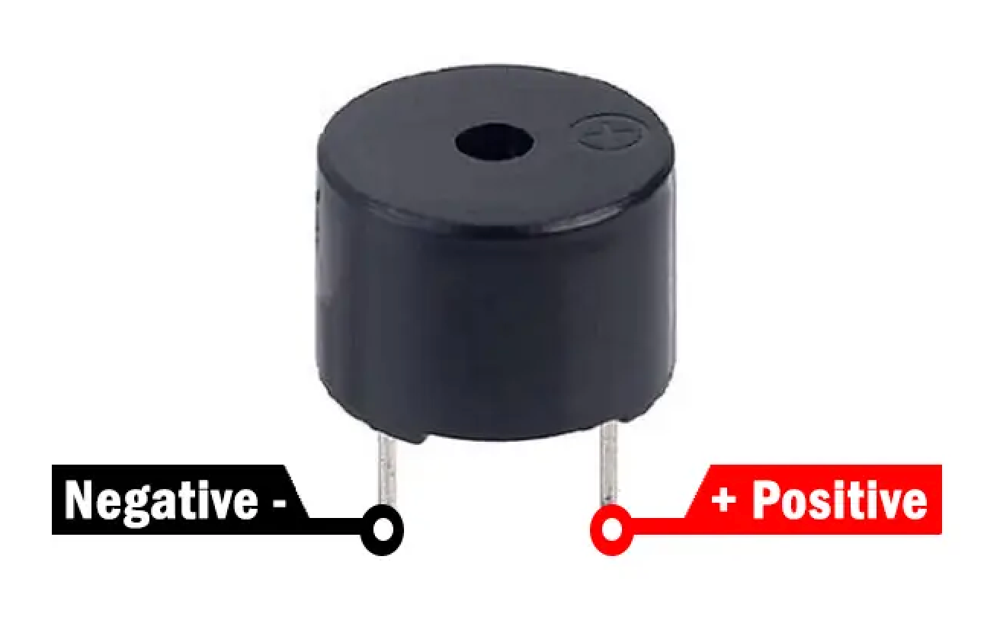
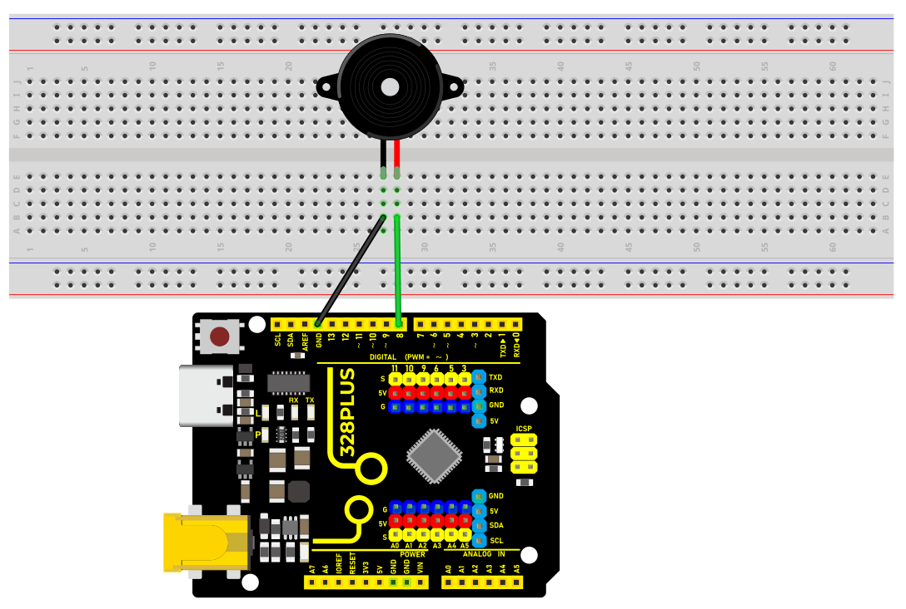
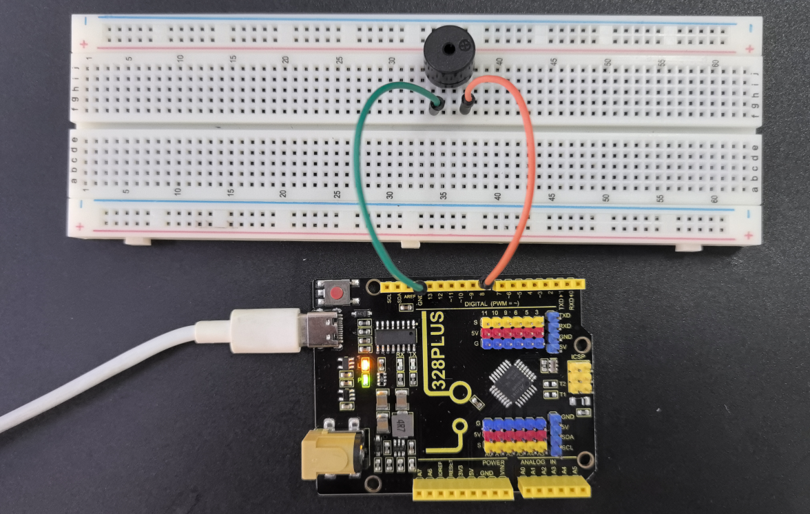

### Project 7 Passive Buzzer


#### Description

Passive buzzer is a common electronic component that is widely used in various electronic devices to issue sound prompts or alarms. Unlike the active buzzer, the passive buzzer itself does not contain an oscillation circuit and requires an external circuit to provide a pulse signal to work.

This project aims to control a passive buzzer to emit sounds of different frequencies through an Arduino development board to play a simple melody.

#### Hardware

1\. 328 Plus development board x1

2\. Passive buzzer x1

3\. Breadboard x1

4\. Jumper wires

#### Working Principle

Passive buzzer is a common electronic component that is widely used in various electronic devices to sound prompts or alarm sounds. Its working principle is based on the piezoelectric effect.

There is a piezoelectric ceramic piece inside the passive buzzer. When a voltage is applied, the piezoelectric ceramic piece will mechanically deform, causing it to vibrate and emit sound. When the frequency of the AC voltage matches the natural frequency of the piezoelectric ceramic piece, the buzzer will produce maximum sound output.



Passive buzzers require an external circuit to provide a driving signal, which usually use a square wave or pulse wave signal. The frequency of the drive signal determines the pitch of the buzzer sound, while the amplitude of the signal affects the volume. By changing the frequency and duty cycle of the driving signal, the buzzer can be controlled to emit different sound effects.

Compared with active buzzers, passive buzzers have simple structure and low cost, but they require external circuits to provide driving signals. In practical applications, it is necessary to select a suitable passive buzzer according to specific needs and design a corresponding drive circuit to achieve the required sound effect.

#### Specifications

Min/Max Operating Voltage 1.5V to 5V DC

Current: <25mA

Frequency: <20Hz to >2.5kHz

#### Pinout



#### Wiring Diagram

1\. Connect the positive pole of the passive buzzer to the digital pin D8 of the development board.

2\. Connect the negative pole of the passive buzzer to GND of the port.




#### Sample Code

```cpp

/*

Keye New RFID Starter Kit

Project 7

Passive buzzer

Edit By Keyes

*/

const int buzzerPin = 8; // Define the digital pin to which the buzzer is connected

// Define the frequency corresponding to the note

#define NOTE_C4 262

#define NOTE_D4 294

#define NOTE_E4 330

#define NOTE_F4 349

#define NOTE_G4 392

#define NOTE_A4 440

#define NOTE_B4 494

#define NOTE_C5 523

// Define a melody array containing notes and duration

int melody[] = {

NOTE_C4, NOTE_G4, NOTE_G4, NOTE_A4, NOTE_G4, 0, NOTE_B4, NOTE_C5

};

int noteDurations[] = {

4, 8, 8, 4, 4, 4, 4, 4

};

void setup() {

pinMode(buzzerPin, OUTPUT); // Set the buzzer pin to output mode

}

void loop() {

// Play a melody in a loop

for (int thisNote = 0; thisNote < 8; thisNote++) {

int noteDuration = 1000 / noteDurations[]; // Calculate note duration

tone(buzzerPin, melody[], noteDuration); // Play notes

int pauseBetweenNotes = noteDuration * 1.30; // Calculate the pause time between notes

delay(pauseBetweenNotes); // Wait for pause time

noTone(buzzerPin); // Stop playing notes

}

}

```

#### Code Explanation

1\. Define the buzzer pin

```cpp

const int buzzerPin = 8; // Define the digital pin that the buzzer is connected to

```

This line of code defines a constant `buzzerPin` and sets it to 8. This means that the buzzer is connected to digital I/O pin 8 on the Arduino board. In Arduino programming, using constants can improve code readability and maintainability.

2\. Define note frequencies

```cpp

#define NOTE_C4 262

#define NOTE_D4 294

#define NOTE_E4 330

#define NOTE_F4 349

#define NOTE_G4 392

#define NOTE_A4 440

#define NOTE_B4 494

#define NOTE_C5 523

```

These preprocessor directives define the frequencies (in Hertz) of various musical notes. These values represent the standard frequencies of different notes, such as middle C (C4) at 262Hz. These definitions make it more intuitive and convenient to reference these notes in the code.

3\. Define the melody and rhythm

```cpp

int melody[] = {

NOTE_C4, NOTE_G4, NOTE_G4, NOTE_A4, NOTE_G4, 0, NOTE_B4, NOTE_C5

};

int noteDurations[] = {

4, 8, 8, 4, 4, 4, 4, 4

};

```

These two arrays define the notes in the melody and the duration of each note, respectively. The `melody` array stores a sequence of note frequencies, while the `noteDurations` array defines the relative duration of each note. For example, `4` represents a quarter note, and `8` represents an eighth note.

Setup initialization

```cpp

void setup() {

pinMode(buzzerPin, OUTPUT); // Set the buzzer pin as an output

}

```

In the `setup()` function, we set `buzzerPin` as an output using the `pinMode()` function. This is because the buzzer needs to receive electrical signals from the Arduino to produce sound.

Main loop to play the melody

```cpp

void loop() {

for (int thisNote = 0; thisNote < 8; thisNote++) {

int noteDuration = 1000 / noteDurations[]; // Calculate the note duration

tone(buzzerPin, melody[], noteDuration); // Play the note

int pauseBetweenNotes = noteDuration * 1.30; // Calculate the pause between notes

delay(pauseBetweenNotes); // Wait for the pause duration

noTone(buzzerPin); // Stop playing the note

}

}

```

The code in the `loop()` function is the core of the entire program. It iterates through each note in the `melody` array using a loop and plays each note on the buzzer using the `tone()` function. The actual duration of each note is calculated by dividing 1000 milliseconds by the corresponding value in the `noteDurations` array. After playing each note, the program pauses for a certain duration using the `delay()` function. This pause is slightly longer than the duration of the note itself to create a gap between notes. The `noTone()` function is used to stop playing the current note, and then the program proceeds to the next note.

#### Project Result

After uploading the code, the passive buzzer will play a simple melody in sequence according to the notes and duration in the melody array.



