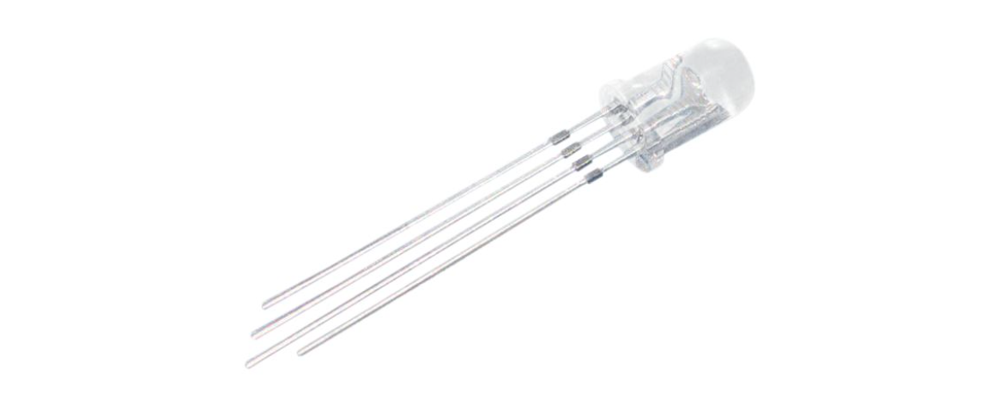
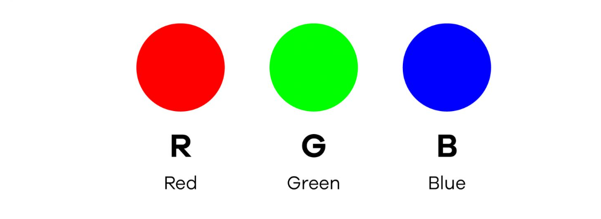
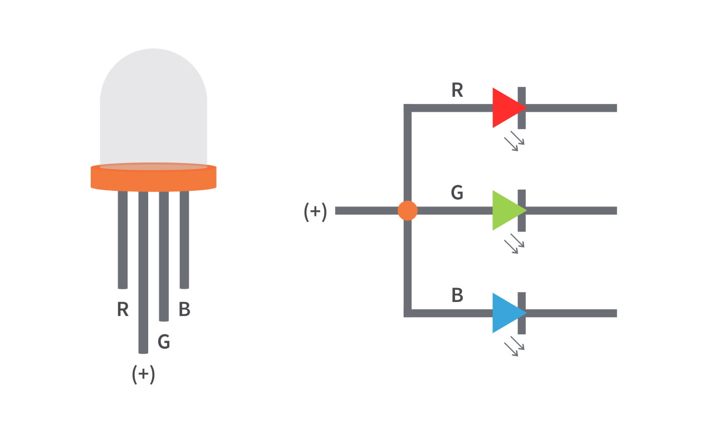
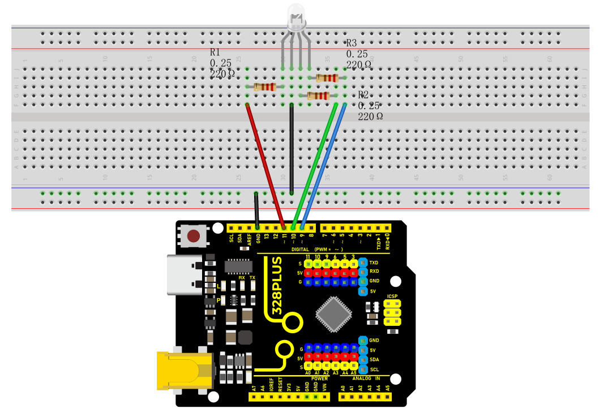
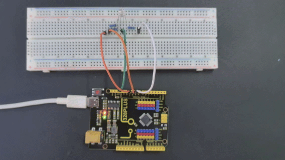

### Project 8 RGB LED



#### Description

RGB LED (Red Green Blue Light Emitting Diode) is a light-emitting diode that can emit light in three basic colors of red, green, and blue, and produce various other colors through different combinations of these three colors.

This project will use a RGB LED to achieve color changes and gradient effects of RGB LED through Arduino programming.

#### Hardware

1\. 328 Plus development board x1

2\. RGB LED x1

3\. 220 ohm resistor x3

4\. Breadboard x1

5\. Jumper wires

#### Working Principle

An RGB LED is basically an LED package that can produce almost any color. It can be used in different applications such as outdoor decoration lighting, stage lighting designs, home decoration lighting, LED matrix display, and more.

RGB LEDs have three internal LEDs (Red, Green, and Blue) that can be combined to produce almost any color output. In order to produce different kinds of colors, we need to set the intensity of each internal LED and combine the three color outputs. In this project, we are going to use PWM to adjust the intensity of the red, green, and blue LEDs individually and the trick here is that our eyes will see the combination of the colors, instead of the individual colors because the LEDs are very close to each other inside.

**RGB LED Types and Structure**

As mentioned earlier, RGB LEDs have three LEDs inside them and usually, these three internal LEDs share either a common anode or a common cathode especially in a through-hole package. So basically, we can categorize RGB LEDs as either common anode or common cathode type just like in seven segment displays.


When you look at an RGB LED, you'll see that it has four leads. If you face it so that its longest lead is second from the left, the leads should be in the following order: red, anode or cathode, green, and blue.

**Common Anode RGB LED**

In a common anode RGB LED, the anode of the internal LEDs are all connected to the external anode lead. To control each color, you need to apply a LOW signal or ground to the red, green, and blue leads and connect the anode lead to the positive terminal of the power supply.



**Common Cathode RGB LED**

In a common cathode RGB LED, the cathode of the internal LEDs are all connected to the external cathode lead. To control each color, you need to apply a HIGH signal or VCC to the red, green, and blue leads and connect the anode lead to the negative terminal of the power supply.

#### Specifications

Low Thermal Resistance

No UV rays

Super High flux Output and High luminance

Forward Current for Red, Blue and Green color: 20mA

Forward Voltage

Red: 2v (typical)

Blue: 3.2(typical)

Green: 3.2(typical)

Luminous Intensity

Red: 800 mcd

Blue: 4000 mcd

Green: 900 mcd

Wavelength

Red: 625 nm

Blue: 520 nm

Green: 467.5 nm

Operating Temperature: -25 ℃ to 85 ℃

Storage Temperature: -30 ℃ to 85 ℃

#### Wiring Diagram

Connect the R pin of the RGB LED to digital pin D9 on the board

Connect the G pin of the RGB LED to digital pin D10 on the board

Connect the B pin of the RGB LED to digital pin D11 on the board

Connect the GND pin of the RGB LED to GND on the board




#### Sample Code

```cpp

/*

Keye New RFID Starter Kit

Project 8

RGB LED

Edit By Keyes

*/

int redPin = 9; // red pin

int greenPin = 10; // green pin

int bluePin = 11; // blue pin

void setup() {

pinMode(redPin, OUTPUT);

pinMode(greenPin, OUTPUT);

pinMode(bluePin, OUTPUT);

}

void loop() {

// red gradient

for (int i = 0; i <= 255; i++) {

analogWrite(redPin, i);

delay(10);

}

for (int i = 255; i >= 0; i--) {

analogWrite(redPin, i);

delay(10);

}

// green gradient

for (int i = 0; i <= 255; i++) {

analogWrite(greenPin, i);

delay(10);

}

for (int i = 255; i >= 0; i--) {

analogWrite(greenPin, i);

delay(10);

}

// blue gradient

for (int i = 0; i <= 255; i++) {

analogWrite(bluePin, i);

delay(10);

}

for (int i = 255; i >= 0; i--) {

analogWrite(bluePin, i);

delay(10);

}

}

```

#### Code Explanation

The code defines three integer variables, `redPin`, `greenPin`, and `bluePin`, which are assigned the values 9, 10, and 11, respectively. These numbers represent the corresponding pins on the Arduino board connected to the RGB LED. These pins will be configured in output mode to send analog signals to control the brightness of the LEDs.

```cpp

int redPin = 9; // Pin connected to the red LED

int greenPin = 10; // Pin connected to the green LED

int bluePin = 11; // Pin connected to the blue LED

```

In the `setup()` function, we use the `pinMode()` function to set each color pin to output (OUTPUT). This is necessary because the Arduino pins are set to input mode by default.

```cpp

void setup() {

pinMode(redPin, OUTPUT);

pinMode(greenPin, OUTPUT);

pinMode(bluePin, OUTPUT);

}

```

The `loop()` function contains the main logic for controlling the RGB LED color gradient. Three separate for loops are used to control the brightness of the red, green, and blue LEDs, respectively. Each loop first increases gradually from 0 to 255 and then decreases gradually back to 0. This process creates a fade-in, fade-out effect from completely off to the brightest and then back to off. The `analogWrite()` function is used to set the PWM (Pulse Width Modulation) value of a specific pin, which adjusts the brightness of the LED.

```cpp

void loop() {

// Red fade

for (int i = 0; i <= 255; i++) {

analogWrite(redPin, i);

delay(10);

}

for (int i = 255; i >= 0; i--) {

analogWrite(redPin, i);

delay(10);

}

// Green fade

for (int i = 0; i <= 255; i++) {

analogWrite(greenPin, i);

delay(10);

}

for (int i = 255; i >= 0; i--) {

analogWrite(greenPin, i);

delay(10);

}

// Blue fade

for (int i = 0; i <= 255; i++) {

analogWrite(bluePin, i);

delay(10);

}

for (int i = 255; i >= 0; i--) {

analogWrite(bluePin, i);

delay(10);

}

}

```

#### Project Result

After uploading the code to the development board, the RGB LED will display a gradient effect of red, green and blue in sequence.



The brightness of each color will gradually increase from 0 to 255, and then gradually decrease to 0.

