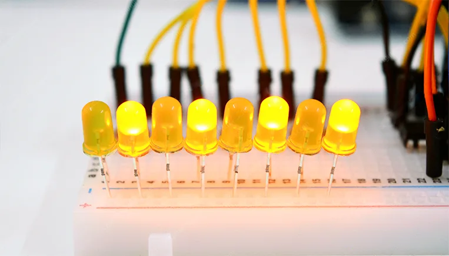
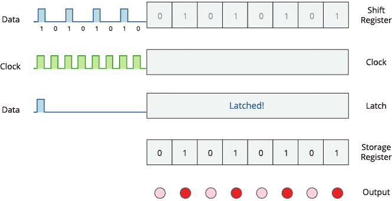
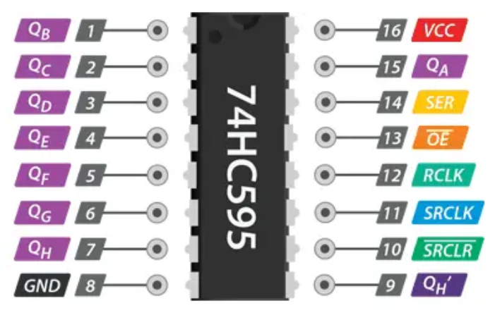
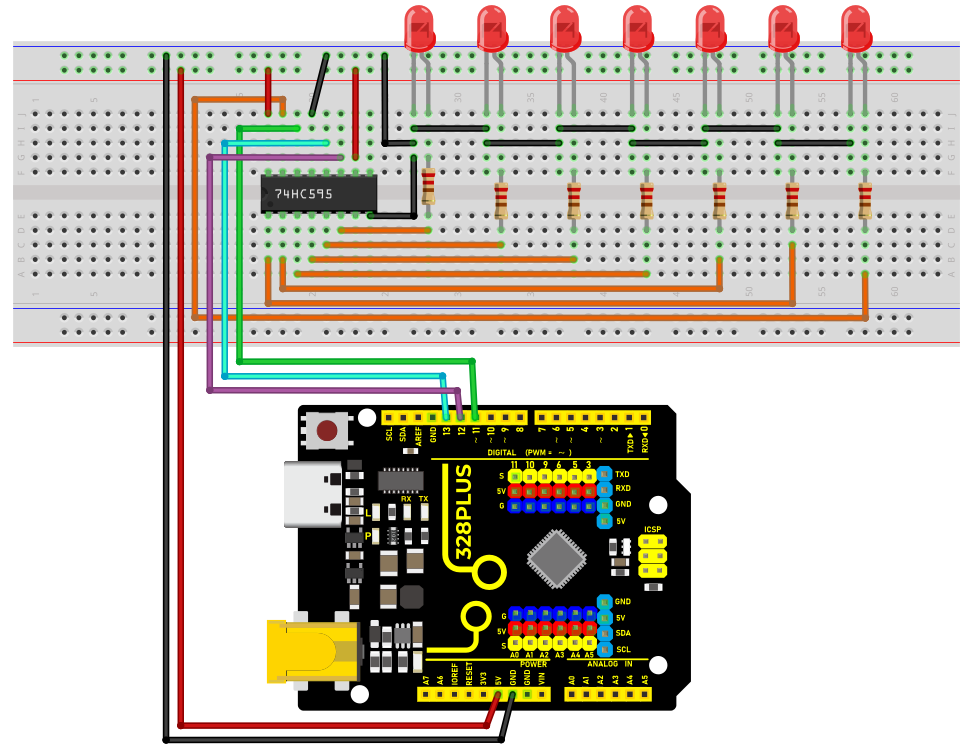

### Project 9 74HC595 Chip



#### Description

The 74HC595 is a common IO chip that controls multiple outputs with a small number of control pins, making it ideal for scenarios where multiple LEDs or output devices need to be controlled.

In this project, we control 7 LEDs on and off via 74HC595 chip to achieve the effect of water flow lights.

#### Hardware

1\. 328 Plus development board x1

2\. 74HC595 chip x1

3\. LED x7

4\. 220 resistor x7

5\. Breadboard x1

6\. Jumper wires

#### Working Principle

The 74HC595 has two 8-bit registers (which can be thought of as “memory containers”). The first is referred to as the Shift Register, and the second as the Storage/Latch Register.

Every time the 74HC595 receives a clock pulse, two things happen:

The bits contained in the shift register are shifted to the left by one position. Bit 0’s value is pushed into bit 1, while bit 1’s value is pushed into bit 2, and so on.

Bit 0 in the shift register accepts the current value on the DATA pin. On the rising edge of the clock pulse, if the DATA pin is high, 1 is pushed into the shift register, otherwise 0.

This process will continue as long as 74HC595 is clocked.

When the latch pin is enabled, the contents of the shift register are copied to the storage/latch register. Each bit of the storage register is linked to one of the IC’s output pins QA-QH. As a result, whenever the value in the storage register changes, the output changes.

The animation below will help you understand it better.



#### Specifications

8-bit serial input

8-bit serial or parallel output

Storage register with 3-state outputs

Shift register with direct clear

100 MHz (typical) shift out frequency

#### Pinout



GND is the ground pin.

VCC is the power supply for the 74HC595 shift register, which must be connected to 5V.

SER (Serial Input) pin is used to send data into the shift register one bit at a time.

SRCLK (Shift Register Clock) is the clock for the shift-register and is positive-edge triggered. This means that the bits are pushed in on the rising edge of the clock.

RCLK (Register Clock / Latch) is a very important pin. When this pin is pulled HIGH, the contents of the Shift Register are copied into the Storage/Latch Register, which eventually appears at the output. So, the latch pin can be seen as the last step before we see our results at the output.

SRCLR (Shift Register Clear) pin allows us to reset the entire Shift Register, setting all the bits to zero. Because this is an active-low pin, we must pull the SRCLR pin LOW to perform the reset.

OE (Output Enable) is also an active-low pin: when pulled HIGH, the output pins are disabled (set to high impedance state). When it is pulled LOW, the output pins function normally.

QA–QH (Output Enable) are the output pins.

QH’ pin outputs bit 7 of the shift register. This allows you to daisy-chain the 74HC595s. If you connect this pin to the SER pin of another 74HC595, and feed both ICs the same clock signal, they will behave as if they were a single IC with 16 outputs. Of course, with this technique, you can daisy-chain as many ICs as you want.

#### Wiring Diagram

1\. Connect pin VCC of the 74HC595 chip to 5V on the board, and pin GND to GND on the board.

2\. Connect DS(pin 14) of 74HC595 chip to D11 on the board, SHCP(pin 11) to D12, and STCP(pin 12) to D13.

3\. Connect Q0-Q7(pin 15, pin 1-6) of 74HC595 to the anodes of 7 LED via 220 ohm resistor, connect cathodes of LED to GND.




#### Sample Code

```cpp

/*

Keye New RFID Starter Kit

Project 9

74HC595 chip

Edit By Keyes

*/

const int DS = 11; // serial data input

const int SHCP = 12; // Shift register clock input

const int STCP = 13; // Latch clock input

void setup() {

pinMode(DS, OUTPUT);

pinMode(SHCP, OUTPUT);

pinMode(STCP, OUTPUT);

}

void loop() {

for (int i = 0; i < 7; i++) {

digitalWrite(STCP, LOW);

shiftOut(DS, SHCP, MSBFIRST, 1 << i); // Move data into the shift register by serial

digitalWrite(STCP, HIGH); // Output shift register data to the latch in parallel

delay(200);

}

}

```

#### Code Explanation

First, the code defines three pin variables: DS, SHCP, and STCP, which are used for serial data input, shift register clock input, and latch register clock input, respectively. These pins are mapped to specific pins on the Arduino board through digital definitions.

```cpp

const int DS = 11; // Serial data input

const int SHCP = 12; // Shift register clock input

const int STCP = 13; // Latch register clock input

```

Next, in the `setup()` function, all three pins are set to output mode because they will be used to send signals to the shift register.

```cpp

void setup() {

pinMode(DS, OUTPUT);

pinMode(SHCP, OUTPUT);

pinMode(STCP, OUTPUT);

}

```

Main loop logic

In the `loop()` function, the code controls the sequential lighting of the LEDs through a loop. The loop iterates seven times, and each iteration controls the state of one LED through the shift register and latch register.

```cpp

void loop() {

for (int i = 0; i < 7; i++) {

digitalWrite(STCP, LOW);

shiftOut(DS, SHCP, MSBFIRST, 1 << i);

digitalWrite(STCP, HIGH);

delay(200);

}

}

```

**Setting STCP to low level**: Before sending data, the STCP pin is set to low level to prepare the shift register to receive data.

```cpp

digitalWrite(STCP, LOW);

```

**Shifting out the data**: The `shiftOut()` function is used to send data bit by bit from the DS pin to the shift register. The `MSBFIRST` parameter indicates that the data is sent starting from the most significant bit. `1 << i` is a bitwise operation that represents only one bit being high level (1) while the other bits are low level (0). This operation effectively controls which LED is lit.

```cpp

shiftOut(DS, SHCP, MSBFIRST, 1 << i);

```

**Setting STCP to high level**: After the data is sent, the STCP pin is set to high level. This action triggers the contents of the shift register to be copied to the latch register, updating the display state of the LEDs.

```cpp

digitalWrite(STCP, HIGH);

```

**Delay**: The `delay(200)` function call keeps each lit LED on for 200 milliseconds, allowing users to clearly see the LED lighting sequence.

#### Project Result

After uploading code, 7LED will light up in sequence which looks like a water flow. With 74HC595 chip, we control 7 outputs only through three Arduino pins, which largely saves pins.

