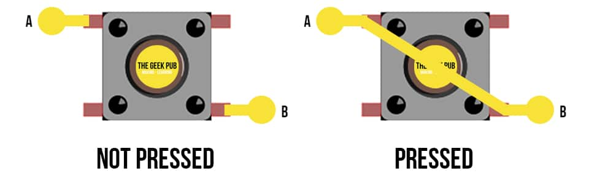
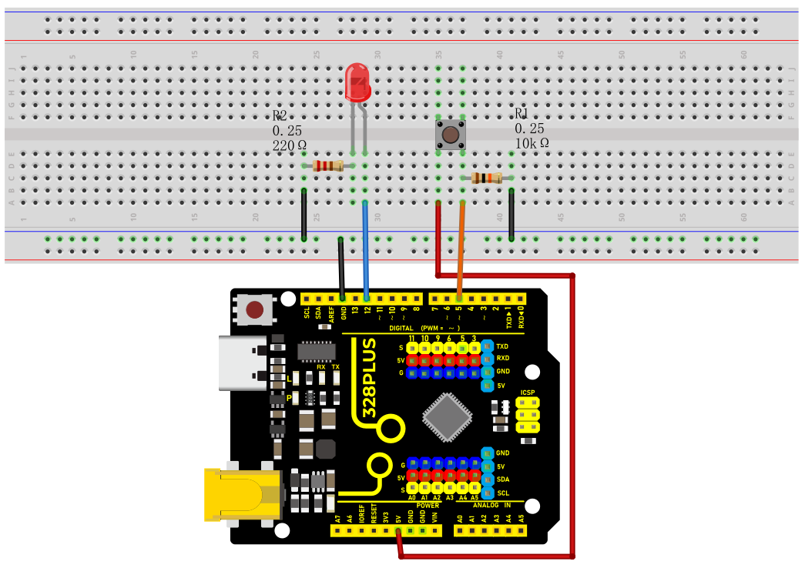
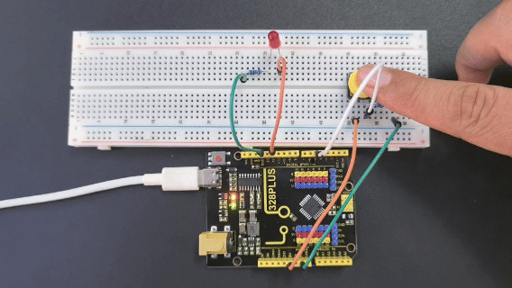

### Project 10 Button-Controlled LED


#### Description

Button switch is a common electrical component that controls the on and off of a circuit by pressing a button, which is widely used in various electronic devices, such as mobile phones, computers, televisions, remote controls, etc.

This project will use a button switch and a LED to make a Button-Controlled LED project, which is a simple and interesting Arduino project that controls the LED on and off through a button switch. This project can help beginners understand how button works and how to use digital inputs and outputs in Arduino.

#### Hardware

1\. 328 Plus development board x1

2\. Breadboard x1

3\. Button x1

4\. LED x1

5\. 220 ohm resistor x1

6\. 10k ohm resistor x1

7\. Jumper wires

#### Working Principle

The button switch is a common mechanical switch. When the button is pressed, two contacts will be closed, allowing current to pass; when the button is released, the contacts will be opened and the current stops. In this project, we will use a pull-up resistor so that when the button is not pressed, the digital pin of the Arduino will read high (5V); when pressed, the digital pin will read low level (0V).



Buttons are a common input device that are widely used in various electronic products, such as keyboards, remote controls, and phones. The working principle of the button is based on the switching of the circuit. When the button is pressed, the internal conductive sheets contact each other, closing the circuit and allowing current to flow; when the button is released, the conductive sheets separate, the circuit is disconnected, and the current stops flowing. .

The internal structure of the button usually includes components such as conductive sheets, elastic parts, and shells. The conductive sheet is generally made of metal materials and is used to conduct circuits; elastic parts such as springs or rubber provide a restoring force so that the buttons can automatically return to their original position after being released; the shell plays a role in protection and fixation, and determines the look and feel of the buttons.


Through the switch characteristics and circuit design of the buttons, various functions can be realized, such as digital or character input, device control, parameter adjustment, etc. As one of the important ways of human-computer interaction, buttons are indispensable in modern electronic equipment due to their simple and reliable working principle.

#### Specifications

Mode of Operation: Tactile feedback

Power Rating: MAX 50mA 24V DC

Insulation Resistance: 100Mohm at 100v

Operating Force: 2.55±0.69 N

Contact Resistance: MAX 100mOhm

Operating Temperature Range: -20 to +70 ℃

Storage Temperature Range: -20 to +70 ℃

#### Pinout


#### Wiring Diagram

1\. Connect one pin of the button to GND and the digital pin D5 of the development board via 10K resistor respectively, and the other pin to VCC.

2\. Connect the anode (long pin) of the LED to the digital pin D12 of the Arduino board and the cathode (short pin) to GND via a 220 ohm resistor.




#### Sample Code

```cpp

/*

Keye New RFID Starter Kit

Project 10

Button-Controlled LED

Edit By Keyes

*/

const int buttonPin = 5;

const int ledPin = 12;

int buttonState = 0;

void setup() {

pinMode(ledPin, OUTPUT);

pinMode(buttonPin, INPUT);

}

void loop() {

buttonState = digitalRead(buttonPin);

if (buttonState == LOW) {

digitalWrite(ledPin, LOW);

} else {

digitalWrite(ledPin, HIGH);

}

}

```

#### Code Explanation

Variable Definitions

```cpp

const int buttonPin = 5; // Constant definition, the pin number of the button

const int ledPin = 12; // Constant definition, the pin number of the LED light

int buttonState = 0; // Variable definition, used to store the state of the button

```

First, we define three variables:

`buttonPin`: represents the pin number where the button is connected to the Arduino, which is pin 5.

`ledPin`: represents the pin number where the LED light is connected to the Arduino, which is pin 12.

`buttonState`: used to store the state value read from the button.

setup Function

```cpp

void setup() {

pinMode(ledPin, OUTPUT); // Set the LED pin as output mode

pinMode(buttonPin, INPUT); // Set the button pin as input mode

}

```

The `setup()` function is executed once when the Arduino starts or resets and is used for initialization settings. In this function:

`pinMode(ledPin, OUTPUT)`: sets the LED pin as output mode, which means that the current can be controlled through this pin to turn the LED on or off.

`pinMode(buttonPin, INPUT)`: sets the button pin as input mode, which means that this pin is used to read the state of the button.

loop Function

```cpp

void loop() {

buttonState = digitalRead(buttonPin); // Read the button state and store it in the buttonState variable

if (buttonState == LOW) { // If the button is in the unpressed state (low level)

digitalWrite(ledPin, LOW); // Set the LED light to the off state

} else { // Otherwise (button is in the pressed state, high level)

digitalWrite(ledPin, HIGH); // Set the LED light to the on state

}

}

```

The `loop()` function is repeatedly executed during the program run. In this function:

`buttonState = digitalRead(buttonPin)`: uses the `digitalRead` function to read the voltage level state of the button pin and stores the result in the `buttonState` variable.

`if (buttonState == LOW)`: checks if the read button state is low level (button is not pressed).

`digitalWrite(ledPin, LOW)`: sets the LED light to the off state (low level).

If the button state is not low level (i.e., high level, indicating the button is pressed),

`digitalWrite(ledPin, HIGH)`: sets the LED light to the on state (high level).

#### Project Result

After uploading the code to the development board，When the button is not pressed, the LED turns off; when the button is pressed, the LED turns on.



