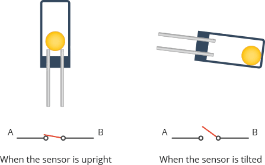
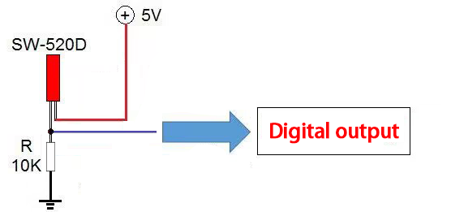
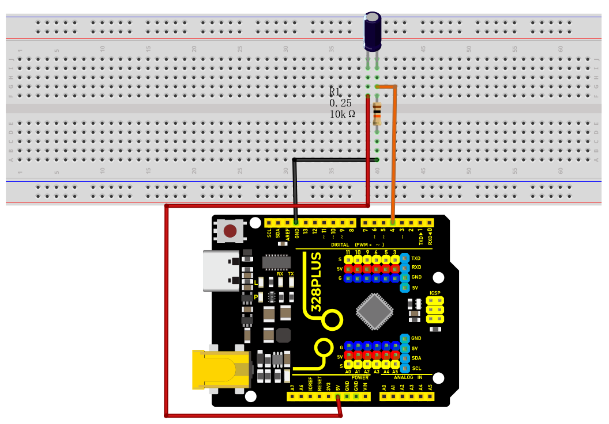
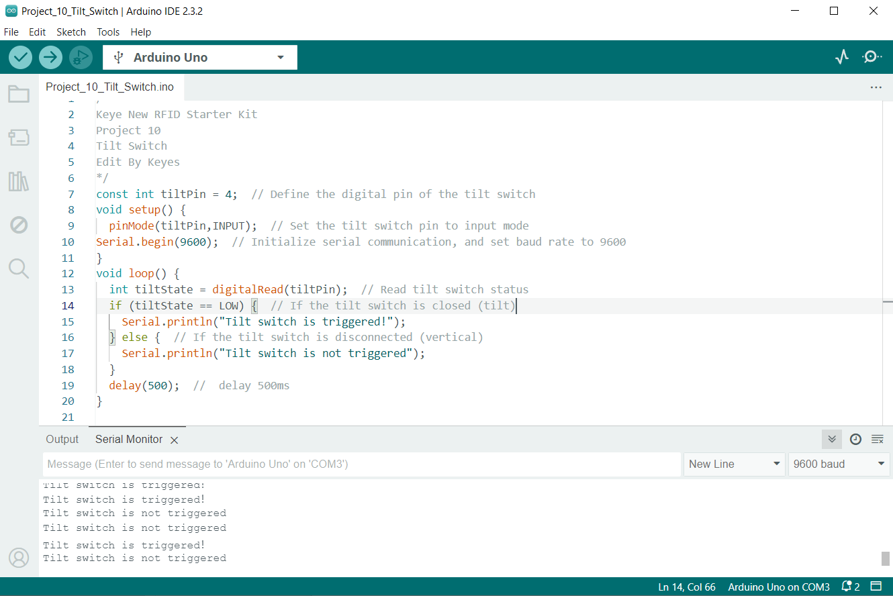

### Project 11 Tilt Switch


#### Description

The ball tilt switch is a sensor that uses the principle of gravity to detect the tilt angle through the movement of internal balls. When the switch is tilted, the ball rolls onto the contacts, closing the circuit and triggering the signal.

This project will guide you to create a simple Arduino project via a 328 Plus development board and a Tilt Switch.

#### Hardware

1\. 328 Plus development board x1

2\. Tilt Switch x1

3\. Breadboard x1

4\. 10k ohm resistor x1

5\. Jumper wires

#### Working Principle

A ball tilt sensor is typically made up of a metal tube with a little metal ball that rolls around in it. One end of the cavity has two conductive elements (poles). The sensor is designed in such a way that a sufficient level of tilt allows the ball to roll, making or breaking an electrical connection.



When the sensor is upright the ball touches the poles and makes an electrical connection. And when the sensor is tilted the ball rolls off the poles and the connection is broken.

#### Specifications

Detect orientation or inclination

Small and inexpensive

Low-power and easy-to-use

If used properly, they will not wear out.

Sensitivity range: > +-15 degrees

Lifetime: 50,000+ cycles (switches)

Power supply: Up to 24V, switching less than 5mA

#### Pinout



#### Wiring Diagram

1\. Connect one pin of the tilt switch to digital pin D4 on the board;

2\. connect the other pin of the tilt switch to GND(ground).




#### Sample Code

```cpp

/*

Keye New RFID Starter Kit

Project 11

Tilt Switch

Edit By Keyes

*/

const int tiltPin = 4; // Define the digital pin of the tilt switch

void setup() {

pinMode(tiltPin,INPUT); // Set the tilt switch pin to input mode

Serial.begin(9600); // Initialize serial communication, and set baud rate to 9600

}

void loop() {

int tiltState = digitalRead(tiltPin); // Read tilt switch status

if (tiltState == LOW) { // If the tilt switch is closed (tilt)

Serial.println("Tilt switch is triggered！");

} else { // If the tilt switch is disconnected (vertical)

Serial.println("Tilt switch is not triggered");

}

delay(500); // delay 500ms

}

```

#### Code Explanation

Variable Definitions

```cpp

const int tiltPin = 4; // Define the digital pin for the tilt switch

```

This line of code defines a constant named `tiltPin` with a value of 4. This means that the tilt switch is connected to digital pin 4 on the Arduino board. The `const` keyword indicates that this pin number will not change during the program execution.

setup() Function

```cpp

void setup() {

pinMode(tiltPin, INPUT); // Set the tilt switch pin as an input

Serial.begin(9600); // Initialize serial communication with a baud rate of 9600

}

```

The `setup()` function is called once when the Arduino board is powered on. It is used to set pin modes and perform initial setup.

`pinMode(tiltPin, INPUT);` This line sets the `tiltPin` as an input mode, which is necessary because we need to read the state (open or closed) of the tilt switch from this pin.

`Serial.begin(9600);` This line starts serial communication and sets the communication baud rate to 9600. This allows the Arduino to send data to a computer or other serial devices via USB.

loop() Function

```cpp

void loop() {

int tiltState = digitalRead(tiltPin); // Read the state of the tilt switch

if (tiltState == LOW) { // If the tilt switch is closed (tilted)

Serial.println("Tilt switch is triggered!");

} else { // If the tilt switch is open (vertical)

Serial.println("Tilt switch is not triggered");

}

delay(500); // Delay for 500 milliseconds

}

```

The `loop()` function is repeatedly executed after the `setup()` function. It is the core part of the program, used to continuously monitor and respond to the state of the tilt switch.

`int tiltState = digitalRead(tiltPin);` This line reads the voltage state (high or low) of the `tiltPin` and stores it in the `tiltState` variable.

`if (tiltState == LOW)` checks if `tiltState` is `LOW` (low voltage), which typically indicates that the tilt switch is triggered (closed state). If so, it sends a message via the serial port: "Tilt switch is triggered!".

If `tiltState` is not `LOW`, it means the tilt switch is not triggered (open state), and it sends "Tilt switch is not triggered" via the serial port.

`delay(500);` This line pauses the program for 500 milliseconds. This reduces the reading frequency, avoiding continuous rapid reactions to the tilt state, thereby conserving processing resources and power.

#### Project Result

After uploading the code to the development board, open the serial monitor of the Arduino IDE and set the baud rate to 9600. When the tilt switch is in the vertical position, the serial monitor will display "Tilt switch is not triggered."; when the tilt switch is tilted to a certain angle, the serial monitor will display "Tilt switch has been triggered!".



