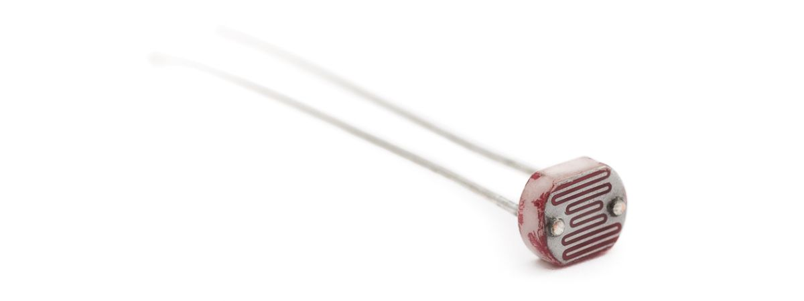
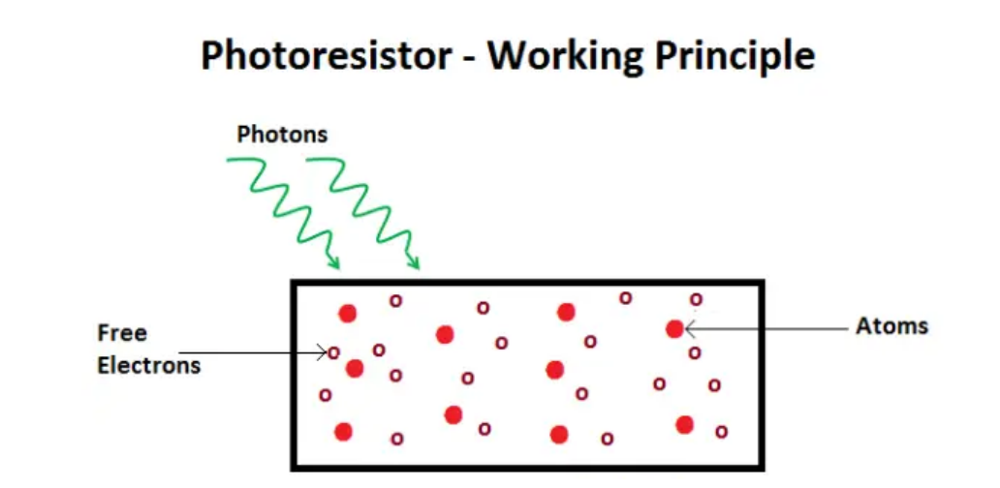
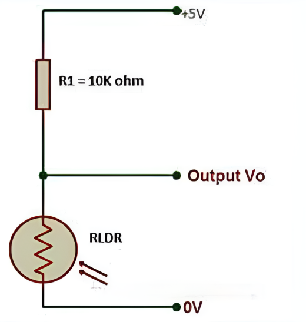
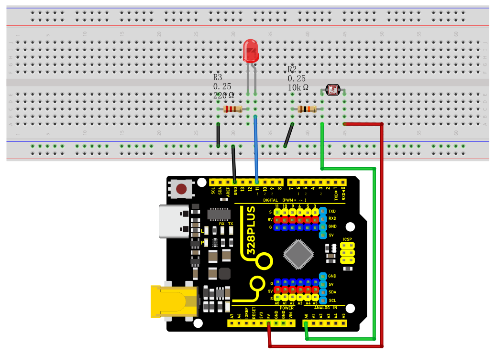

### Project 12 Photoresistor



#### Description

Photoresistor is a resistor that is sensitive to light. When light shines on a photoresistor, its resistance changes. The stronger the light, the lower the resistance; the weaker the light, the higher the resistance. This characteristic makes photoresistor an important optoelectronic component and is widely used in various light control circuits.

This project will use a 328 Plus development board, and a photoresistor to implement a simple light-controlled LED circuit. When the ambient light becomes dark, the LED will automatically light up; when it becomes brighter, the LED will automatically turn off.

#### Hardware

1\. 328 Plus development board x 1

2\. Photoresistor x 1

3\. LED x 1

4\. 220Ω resistor x 1

5\. 10kΩ resistor x 1

6\. Breadboard x 1

7\. Jumper wires

#### Working Principle

To understand the working principle of a Photoresistor, let’s brush up a little about the valence electrons and the free electrons.

As we know valence electrons are those found in the outermost shell of an atom. Hence, these are loosely attached to the nucleus of the atom. This means that only some small amount of energy is needed to pull it out from the outer orbit.

Free electrons on the other hand are those which are not attached to the nucleus and hence free to move when an external energy like an electric field is applied. Thus when some energy makes the valence electron pull out from the outer orbit, it acts as a free electron; ready to move whenever an electric field is applied. The light energy is used to make valence electron a free electron.

This very basic principle is used in the Photoresistor. The light that falls on a photoconductive material is absorbed by it which in turn makes lots of free electrons from the valence electrons.

The figure below shows a pictorial representation of the same:

Photoresistor Working Priciple

As the light energy falling on the photoconductive material increases, number of valence electrons that gain energy and leave the bonding with the nucleus increases. This leads to a large number of valence electrons jump to the conduction band, ready to move with an application of any external force like an electric field.

*Thus, as the light intensity increases, the number of free electrons increases. This means the photoconductivity increases that imply a decrease in photo resistivity of the material.*

Now that we have covered the working mechanism, we got an idea that a photoconductive material is used for the construction of a Photoresistor. According to the type of photoconductive material the Photoresistors are of two types. A brief introduction is given in the next section

#### Specifications

Resistance:10kΩ

Working voltage:3.3-5V

Working current:20MA

Maximum power :0.1W

Operating temperature: -10 degrees Celsius to +50 degrees Celsius

#### Pinout



#### Wiring Diagram

1\. Connect one end of the photoresistor to 5V pin of the development board, and the other end of the pin to 10kΩ resistor,

2\. connect that 10kΩ resistor to GND of the board.

3\. Connect the joint of the photoresistor and the 10kΩ resistor to the analog input pin A0 of the development board.

4\. Connect the anode of the LED (long pin) to the digital pin 13 on the board via a 220Ω resistor, and the cathode (short pin) to the GND.




#### Sample Code

```cpp

/*

Keye New RFID Starter Kit

Project 12

Photoresistor

Edit By Keyes

*/

const int lightSensorPin = A0; // Photoresistor connected to analog pin A0

const int ledPin = 11; // LED connected to digital pin 11

const int threshold = 500; // Light intensity threshold, it can be adjusted according to actual situation

void setup() {

pinMode(ledPin, OUTPUT); // Set the LED pin to output mode

Serial.begin(9600); // initialize serial port

}

void loop() {

int lightValue = analogRead(lightSensorPin); // Read the analog value of the photoresistor

Serial.println(lightValue); // print the light sensor value on the serial monitor

if (lightValue < threshold) {

digitalWrite(ledPin, HIGH); // If the light intensity is less than the threshold, the LED will light up

} else {

digitalWrite(ledPin, LOW); // If the light intensity is greater than the threshold, the LED will light off

}

delay(100); // delay 100ms

}

```

#### Code Explanation

1\. Define constants and variables

```cpp

const int lightSensorPin = A0; // Light sensor is connected to analog pin A0

const int ledPin = 11; // LED is connected to digital pin 11

const int threshold = 500; // Light intensity threshold, can be adjusted according to actual conditions

```

`lightSensorPin` defines the pin to which the light sensor is connected, which is analog pin A0.

`ledPin` defines the pin to which the LED is connected, which is digital pin 11.

`threshold` sets the threshold for light intensity. When the ambient light is below this value, the LED will light up; otherwise, the LED will turn off. This threshold can be adjusted according to actual needs.

2\. Initialization setup

```cpp

void setup() {

pinMode(ledPin, OUTPUT); // Set the LED pin as an output mode

Serial.begin(9600); // Initialize serial communication with a baud rate of 9600

}

```

`pinMode(ledPin, OUTPUT)` sets the LED pin to output mode, so that the LED can be controlled to turn on or off.

`Serial.begin(9600)` initializes serial communication for debugging and viewing the light sensor readings. The baud rate is set to 9600.

3\. Loop reading and control

```cpp

void loop() {

int lightValue = analogRead(lightSensorPin); // Read the analog value of the light sensor

Serial.println(lightValue); // Print the value of the light sensor on the serial monitor

if (lightValue < threshold) {

digitalWrite(ledPin, HIGH); // If the light intensity is less than the threshold, turn on the LED

} else {

digitalWrite(ledPin, LOW); // If the light intensity is greater than or equal to the threshold, turn off the LED

}

delay(100); // Delay for 100 milliseconds

}

```

`analogRead(lightSensorPin)` reads the analog value of the light sensor. This returns an integer between 0 and 1023, representing the light intensity detected by the light sensor.

`Serial.println(lightValue)` prints the light sensor reading to the serial monitor for debugging and observing real-time light intensity changes.

`if (lightValue < threshold)` checks if the reading is less than the preset threshold:

If it is less than the threshold, `digitalWrite(ledPin, HIGH)` is executed to turn on the LED.

If it is not less than the threshold, `digitalWrite(ledPin, LOW)` is executed to turn off the LED.

`delay(100)` sets a delay time of 100 milliseconds to prevent the program from running too quickly and causing the LED to flicker.

#### Project Result

After uploading the code to the development board, the LED will automatically turn on when the ambient light becomes dark; when the ambient light becomes brighter, the LED will automatically turn off. You can observe changes in the LED by blocking or illuminating the photoresistor.


