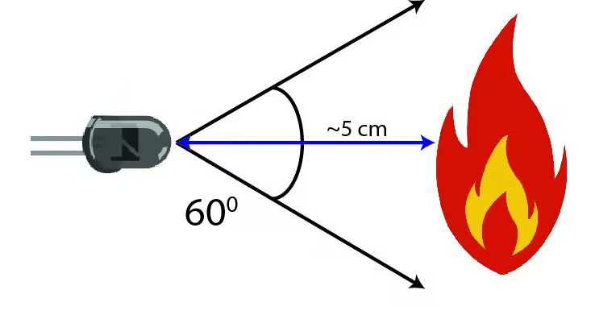
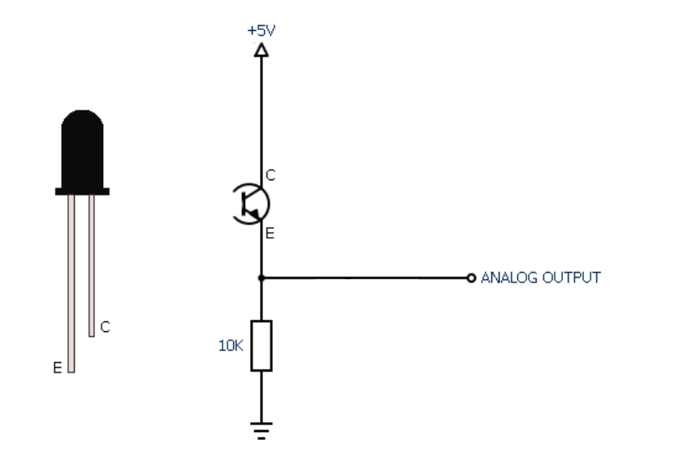
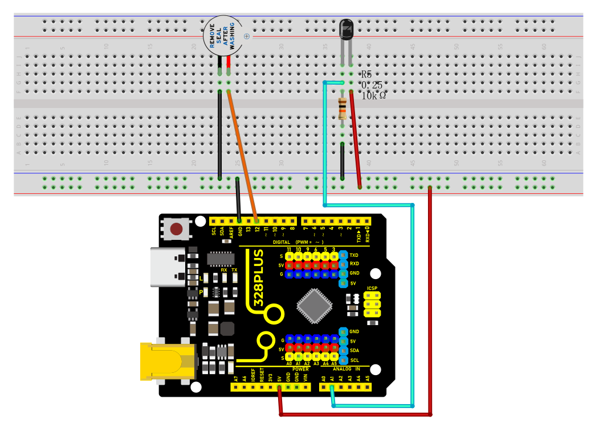
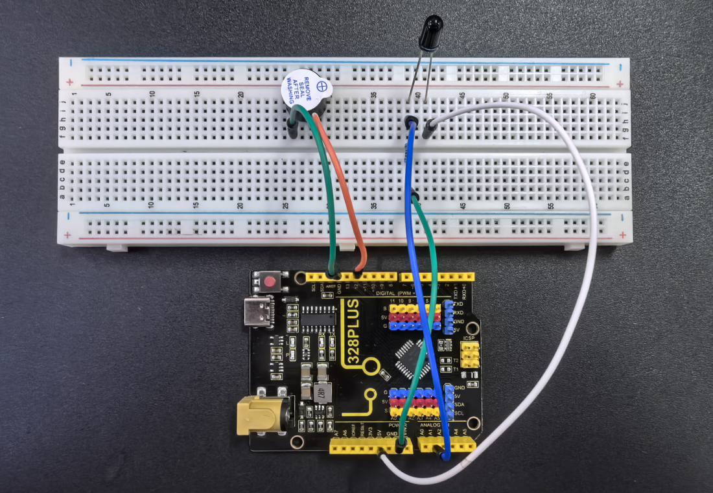
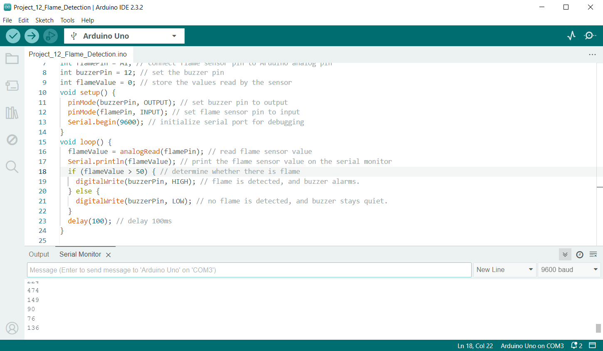

### Project 13 Flame Detection


#### Description

An IR flame sensor is a device that uses infrared technology to detect flames. It can sense the infrared radiation generated by the flame and convert it into electrical signals to achieve flame alarm and control.

This project aims to use the 328 Plus development board and a Flame Sensor to implement the flame detection function through Arduino programming. When the Flame Sensor detects a flame, the LED will light up and the buzzer will sound an alarm. This project can be used in fire warning systems to improve the safety of homes and industrial sites.

#### Hardware

1\. 328 Plus development board x1

2\. Flame Sensor x1

3\. LED x1

4\. Buzzer x1

5\. 10kΩ resistor x 1

6\. Breadboard x1

7\. Jumper wires

#### Working Principle

A flame sensor is an electronic device used to detect the presence of flame. Its working principle is based on the infrared radiation produced by the flame.

Flame sensors usually contain an infrared receiver inside, such as a thermopile or photodiode. When a flame appears, it emits a large amount of infrared radiation. The sensor receives these radiations and converts them into electrical signals.



The strength of the electrical signal output by the sensor depends on the size and distance of the flame. This signal can be amplified and processed and used to trigger alarms or activate automatic fire extinguishing systems.

Flame sensors are very sensitive to infrared light, but they can also produce false alarms to other infrared sources, such as sunlight or hot objects. In order to reduce false alarms, some flame sensors also use technologies such as ultraviolet detection or flicker frequency analysis.

In summary, flame sensors utilize the infrared radiation of flames to achieve reliable fire detection, which are widely used in industrial and civil fields, providing an important guarantee for fire safety.

#### Specifications

Photosensitivity is high

Response time is fast

Sensitivity is adjustable

Detection angle is 600,

It is responsive to the flame range.

Operating voltage of this sensor is 3.3V to 5V

#### Pinout



#### Wiring Diagram

1\. Connect the Flame Sensor pin to analog pin A1 on the board,

2\. Connect the positive pin of the buzzer to the digital pin D12 on the board and the negative pin to GND.




#### Sample Code

```cpp

/*

Keye New RFID Starter Kit

Project 13

Flame detection

Edit By Keyes

*/

int flamePin = A1; // connect flame sensor pin to Arduino analog pin

int buzzerPin = 12; // set the buzzer pin

int flameValue = 0; // store the values read by the sensor

void setup() {

pinMode(buzzerPin, OUTPUT); // set buzzer pin to output

pinMode(flamePin, INPUT); // set flame sensor pin to input

Serial.begin(9600); // initialize serial port for debugging

}

void loop() {

flameValue = analogRead(flamePin); // read flame sensor value

Serial.println(flameValue); // print the flame sensor value on the serial monitor

if (flameValue > 50) { // determine whether there is flame

digitalWrite(buzzerPin, HIGH); // flame is detected, and buzzer alarms.

} else {

digitalWrite(buzzerPin, LOW); // no flame is detected, and buzzer stays quiet.

}

delay(100); // delay 100ms

}

```

#### Code Explanation

```cpp

int flamePin = A1; // Connect the flame sensor pin to Arduino's analog pin A1

int buzzerPin = 12; // Set the buzzer pin to digital pin 12

int flameValue = 0; // Used to store the value read from the flame sensor

```

First, we define two pin variables `flamePin` and `buzzerPin`, used for the flame sensor and buzzer respectively. `flameValue` is used to store the analog value read from the sensor.

```cpp

void setup() {

pinMode(buzzerPin, OUTPUT); // Set the buzzer pin as output mode

pinMode(flamePin, INPUT); // Set the flame sensor pin as input mode

Serial.begin(9600); // Initialize serial communication with a baud rate of 9600

}

```

In the `setup` function, we set the buzzer pin to output mode and the flame sensor pin to input mode. Then, we initialize serial communication using `Serial.begin(9600)` for debugging purposes.

```cpp

void loop() {

flameValue = analogRead(flamePin); // Read the value from the flame sensor

Serial.println(flameValue); // Print the flame sensor value on the serial monitor

if (flameValue > 50) { // Check if there is a flame

digitalWrite(buzzerPin, HIGH); // Flame detected, buzzer sounds the alarm

} else {

digitalWrite(buzzerPin, LOW); // No flame detected, buzzer remains silent

}

delay(100); // Delay for 100 milliseconds

}

```

In the `loop` function, we first read the value from the flame sensor using `analogRead(flamePin)` and store it in the `flameValue` variable. Next, we print the read value to the serial monitor using `Serial.println(flameValue)` for observation. Then, the program determines whether a flame is detected by checking if `flameValue` is greater than 50. If a flame is detected (`flameValue` is greater than 50), the buzzer is set to high level, and it sounds an alarm; otherwise, the buzzer is set to low level and remains silent. Finally, there is a delay of 100 milliseconds.

#### Project Result

During the project, the Arduino serial monitor can monitor the readings of the flame sensor in real-time.



When a flame approaches the sensor, its reading increases significantly, usually exceeding the set threshold of 50. At this point, the buzzer emits an alarm sound, indicating that a flame has been detected. If the flame moves away, the reading decreases below the threshold, and the buzzer stops sounding the alarm.



