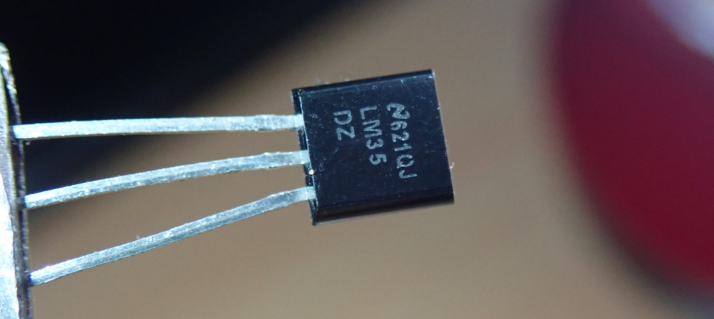
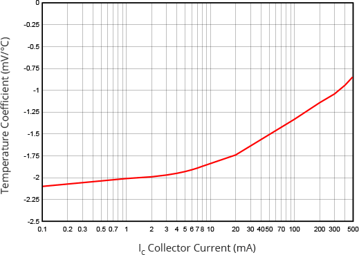
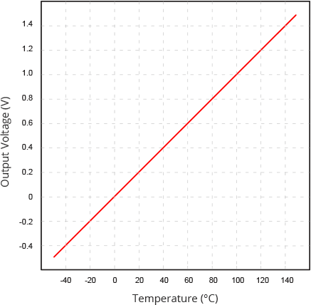
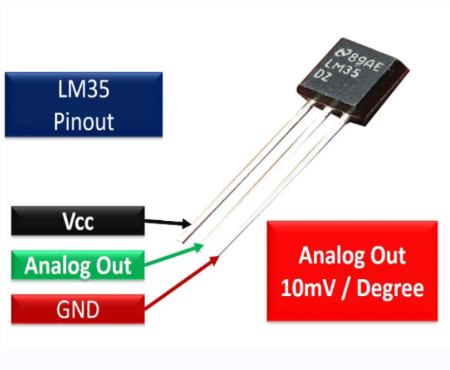
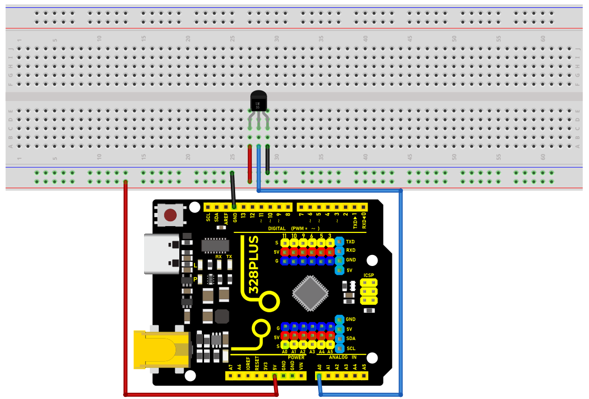
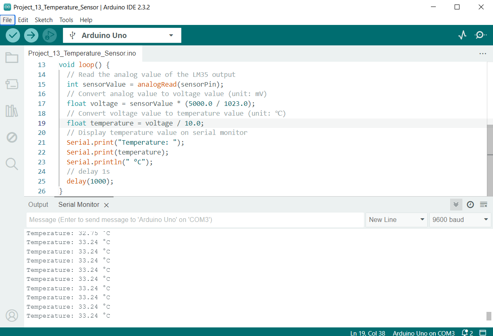

### Project 14 Temperature Sensor

 Description

The LM35 is a widely used temperature sensor that directly converts Celsius temperature into a proportional voltage output. This means that, without complicated calculations, you can simply measure the voltage to get a temperature reading.

This project aims to create a temperature monitoring system using the 328 Plus development board and a LM35 temperature sensor.

#### Hardware

1\. 328 Plus development board x1

2\. LM35 temperature sensor x1

3\. Breadboard x1

4\. Jumper wires

#### Working Principle

The LM35 uses a solid-state technique to measure the temperature. It makes use of the fact that the voltage drop between the base and emitter (forward voltage – Vbe) of the [](https://en.wikipedia.org/wiki/Diode-connected_transistor) decreases at a known rate as the temperature increases. By precisely amplifying this voltage change, it is easy to generate an analog signal that is directly proportional to temperature.



This linear relationship between forward voltage and temperature is the reason why diode-connected transistors are used as temperature measurement devices. Essentially this is how temperature is measured, although there have been some improvements in this technique over the years. More information about this technique can be found [](https://www.ti.com/lit/an/sboa277a/sboa277a.pdf).

The good news is that all these complex calculations are done inside the LM35. It just outputs a voltage that is linearly proportional to temperature.

How to Measure Temperature

The LM35 is easy to use; just connect the left pin to power (4V to 30V) and the right pin to ground (assuming the flat side of the sensor is facing you). Then the middle pin will have an analog voltage that is directly proportional (linear) to the temperature in °C. This can be easily seen in the output voltage vs temperature characteristic. Note that the analog output voltage is independent of the power supply.



To convert the voltage to temperature, simply use the basic formula:

Temperature (°C) = Vout * 100

For example, if the voltage out is 0.5V that means that the temperature is 0.5 * 100 = 50 °C

Specifications

Minimum and Maximum Input Voltage is 35V and -2V respectively. Typically 5V.

Can measure temperature ranging from -55°C to 150°C

Output voltage is directly proportional (Linear) to temperature (i.e.) there will be a rise of 10mV (0.01V) for every 1°C rise in temperature.

±0.5°C Accuracy

Drain current is less than 60uA

Low cost temperature sensor

Small and hence suitable for remote applications

Available in TO-92, TO-220, TO-CAN and SOIC package

#### Pinout



#### Wiring Diagram

1\. Connect pin VCC of LM35 to 5V power on the board;

2\. Connect pin GND of LM35 to GND on the board;

3\. Connect pin Vout of LM35 to analog pin A0 on the board.




#### Sample Code

```cpp

/*

Keye New RFID Starter Kit

Project 14

Temperature detection

Edit By Keyes

*/

// Define the pin of LM35

const int sensorPin = A0;

void setup() {

// Initialize serial communication, and baud rate is 9600

Serial.begin(9600);

}

void loop() {

// Read the analog value of the LM35 output

int sensorValue = analogRead(sensorPin);

// Convert analog value to voltage value (unit: mV)

float voltage = sensorValue * (5000.0 / 1023.0);

// Convert voltage value to temperature value (unit: ℃)

float temperature = voltage / 10.0;

// Display temperature value on serial monitor

Serial.print("Temperature: ");

Serial.print(temperature);

Serial.println(" °C");

// delay 1s

delay(1000);

}

```

#### Code Explanation

Defining the LM35 Pin

```cpp

const int sensorPin = A0;

```

This line of code defines a constant `sensorPin` with a value of `A0`. `A0` is an analog input pin on the Arduino board used to receive the analog output signal from the LM35 temperature sensor.

Initialization Setup

```cpp

void setup() {

// Initialize serial communication, and baud rate is 9600

Serial.begin(9600);

}

```

The `setup()` function is a special function in an Arduino program that is executed only once after the Arduino board is powered on or reset. In this function, we initialize serial communication using `Serial.begin(9600);` and set the baud rate to 9600. This allows the Arduino to connect to the computer via USB and send data to the computer's serial monitor.

Main Loop

```cpp

void loop() {

// Read the analog value of the LM35 output

int sensorValue = analogRead(sensorPin);

// Convert analog value to voltage value (unit: mV)

float voltage = sensorValue * (5000.0 / 1023.0);

// Convert voltage value to temperature value (unit: ℃)

float temperature = voltage / 10.0;

// Display temperature value on serial monitor

Serial.print("Temperature: ");

Serial.print(temperature);

Serial.println(" °C");

// delay 1s

delay(1000);

}

```

The `loop()` function is another special function that continuously executes in a loop after the `setup()` function is completed. Here is an explanation of each line of code in this function:

**Reading the Analog Value**:

```cpp

int sensorValue = analogRead(sensorPin);

```

The `analogRead(sensorPin)` function is used to read the analog value output by the LM35 sensor connected to pin `A0`. This value is an integer between 0 and 1023, representing a voltage from 0V to 5V.

**Converting Analog Value to Voltage Value**:

```cpp

float voltage = sensorValue * (5000.0 / 1023.0);

```

The analog value is converted to the actual voltage value (unit: millivolts). Since the Arduino's analog input range is 0-1023, representing 0V to 5V, each unit of analog value is approximately equal to 4.887 millivolts (5000/1023 ≈ 4.887).

**Converting Voltage Value to Temperature Value**:

```cpp

float temperature = voltage / 10.0;

```

The LM35's output characteristic is 10 millivolts per degree Celsius, so dividing the voltage value by 10 yields the temperature value (unit: degrees Celsius).

**Displaying Temperature on Serial Monitor**:

```cpp

Serial.print("Temperature: ");

Serial.print(temperature);

Serial.println(" °C");

```

The `Serial.print()` and `Serial.println()` functions are used to display the temperature value on the serial monitor.

**Delaying for 1 Second**:

```cpp

delay(1000);

```

The `delay(1000)` function pauses the program for 1000 milliseconds (i.e., 1 second). This is done to provide sufficient time intervals between consecutive readings, making the output easy to read.

#### Project Result

After uploading the code to the development board, open the serial monitor of the Arduino IDE and set the baud rate to 9600. Then the current ambient temperature will be printed every second in degrees Celsius (℃).



