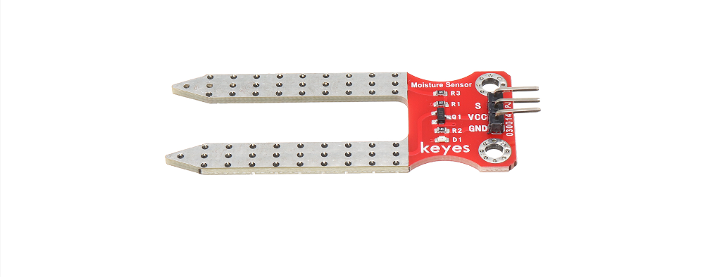
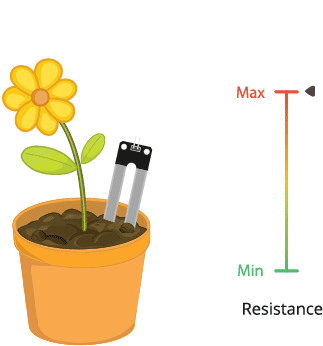
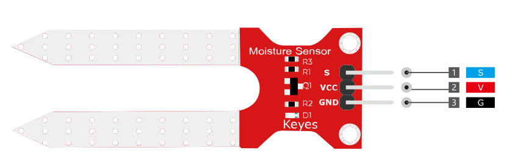
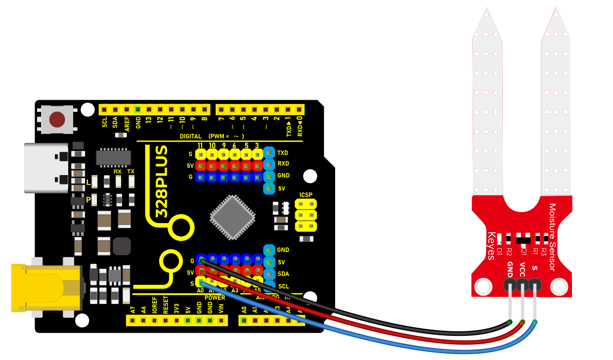
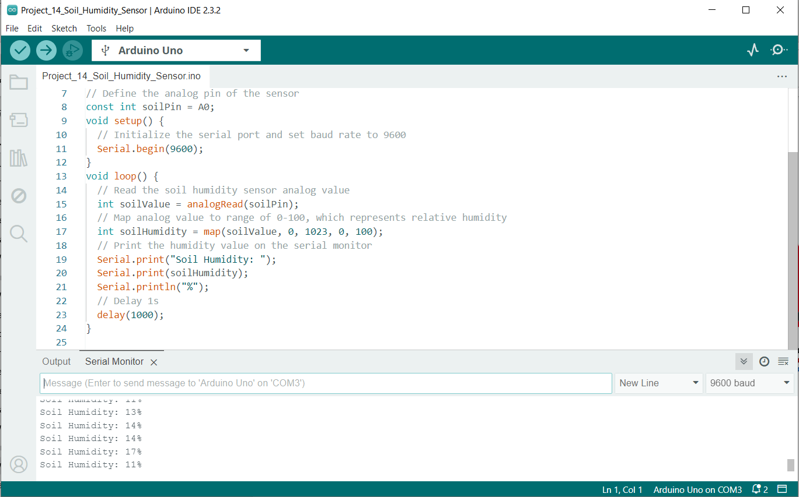

### Project 15 Soil Humidity Sensor



#### Description

A soil humidity sensor is used to measure the moisture content of soil, so it is widely applied in agriculture, horticulture as well as environmental humidity monitoring.

In this project, we adopt the 328 Plus development board and the Soil Humidity Sensor to real-time monitor soil humidity in the growing environment.

Through this experiment, we may understand the working principle of the sensor and learn how to collect and process sensor data via Arduino programming, so as to provide data support for further optimization of plant growth environment.

#### Hardware

1\. 328 Plus development board x1

2\. Soil Humidity Sensor x1

3\. DuPont wires

#### Working Principle

The soil moisture sensor operates in a straightforward manner.

The fork-shaped probe with two exposed conductors acts as a variable resistor (similar to a potentiometer) whose resistance varies with the soil’s moisture content.



This resistance varies inversely with soil moisture:

The more water in the soil, the better the conductivity and the lower the resistance.

The less water in the soil, the lower the conductivity and thus the higher the resistance.

The sensor produces an output voltage according to the resistance, which by measuring we can determine the soil moisture level.

Specifications:

Power Supply Voltage: 3.3V or 5V

Working Current: ≤ 20mA

Output Voltage: 0-2.3V (When the sensor is totally immersed in water, the voltage will be 2.3V) the higher humidity, the higher the output voltage

Sensor type: Analog output

Interface definition: Pin1- signal, Pin2- GND, Pin3 - VCC

Packaging : Electrostatic bag sealing

#### Pinout



V is the power supply pin of the soil moisture sensor that can be connected to 3.3V or 5V of the supply.

G is the ground pin of the board and it should be connected to the ground pin of the Arduino

S is the **Analog output pin** of the board that will give us an analog signal in between vcc and ground.

#### Wiring Diagram

1\. Connect the VCC pin of the soil humidity sensor to 5V port on the board.

2\. Connect GND pin of the soil humidity sensor to GND on the board.

3\. Connect S pin of the soil humidity sensor to analog input pin A0 on the board.




#### Sample Code

```cpp

/*

Keye New RFID Starter Kit

Project 15

Soil humidity sensor

Edit By Keyes

*/

// Define the analog pin of the sensor

const int soilPin = A0;

void setup() {

// Initialize the serial port and set baud rate to 9600

Serial.begin(9600);

}

void loop() {

// Read the soil humidity sensor analog value

int soilValue = analogRead(soilPin);

// Map analog value to range of 0-100, which represents relative humidity

int soilHumidity = map(soilValue, 0, 1023, 0, 100);

// Print the humidity value on the serial monitor

Serial.print("Soil Humidity: ");

Serial.print(soilHumidity);

Serial.println("%");

// Delay 1s

delay(1000);

}

```

#### Code Explanation

First, let's start with the first part of the code, which defines the analog pin for the sensor connection:

```cpp

const int soilPin = A0;

```

This line of code defines a constant `soilPin` with a value of `A0`. On the Arduino board, `A0` represents analog input pin 0, which is where the soil humidity sensor is connected. By connecting the sensor output to this pin, the Arduino can read the analog voltage value measured by the sensor.

Next, we see the `setup()` function:

```cpp

void setup() {

// Initialize the serial port and set baud rate to 9600

Serial.begin(9600);

}

```

The `setup()` function is used for initializing settings in Arduino code. Here, we initialize serial communication using `Serial.begin(9600);` and set the baud rate to 9600. This is the rate at which data is communicated between the Arduino and the connected computer. After initializing the serial port, we can send data to the connected computer to be displayed on the serial monitor.

Then, the code enters the main `loop()` function, which is the core part of the Arduino program that executes repeatedly:

```cpp

void loop() {

// Read the soil humidity sensor analog value

int soilValue = analogRead(soilPin);

// Map analog value to range of 0-100, which represents relative humidity

int soilHumidity = map(soilValue, 0, 1023, 0, 100);

// Print the humidity value on the serial monitor

Serial.print("Soil Humidity: ");

Serial.print(soilHumidity);

Serial.println("%");

// Delay 1s

delay(1000);

}

```

Inside the `loop()` function, the analog value from the soil humidity sensor connected to pin `A0` is read using `analogRead(soilPin);`. The `analogRead` function returns an integer between 0 and 1023, representing the voltage level read from the sensor.

The read analog value is then converted to a percentage of relative humidity using the `map()` function. The `map()` function maps a value from one range to another range, in this case, mapping the 0-1023 value to 0-100, which represents the humidity percentage.

The converted humidity value is output through the serial port using the `Serial.print()` and `Serial.println()` functions, sending the humidity value to the serial monitor in the format "Soil Humidity: X%".

Finally, the `delay(1000);` function call pauses the program for 1000 milliseconds (1 second). This is done to avoid continuously reading and sending data, giving the sensor and Arduino enough response time and making the output easy to read.

#### Project Result

After uploading the code to the development board, open the serial monitor of the Arduino IDE and set the baud rate to 9600. The soil humidity value will show up on the monitor in percentage(%). These values will change in different environment, so according to these values, we can clearly know the moisture in the plant environment.



