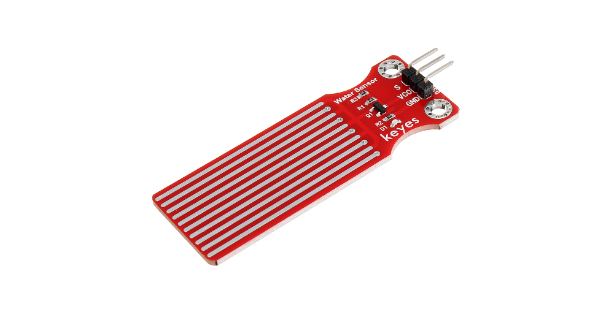
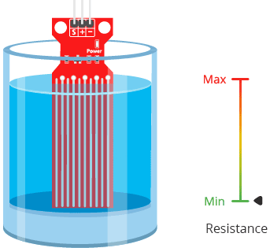
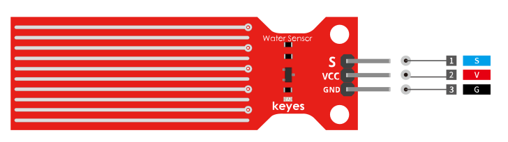
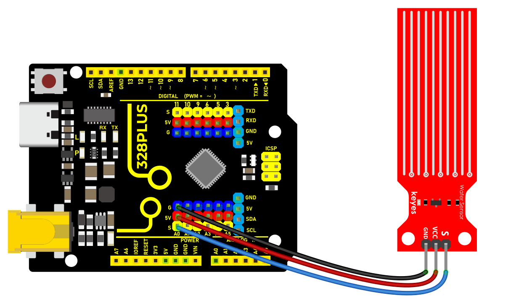
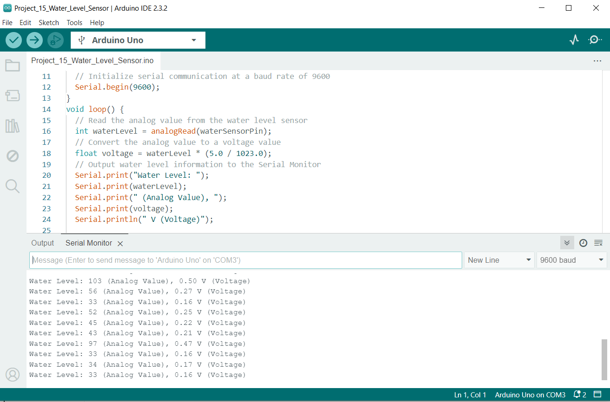

### Project 16 Water Level Sensor

 Description

A water level sensor is a device used to detect and measure the height of water levels. In Arduino projects, a simple water level sensor module is often used. This module comes with a set of probes that conduct electricity when they come into contact with water. If the water level rises or falls, the sensor can detect changes in the electrical signal. This signal is then processed by the Arduino to monitor the water level. Water level detection is a common application, and today we will provide a detailed explanation of how to build a water level sensor system using Arduino.

#### Hardware

1\. 328 Plus development board x1

2\. water level sensor x1

3\. DuPont wires

#### Working Principle

The operation of the water level sensor is fairly simple.The power and sense traces form a variable resistor (much like a potentiometer) whose resistance varies based on how much they are exposed to water.



This resistance varies inversely with the depth of immersion of the sensor in water:

The more water the sensor is immersed in, the better the conductivity and the lower the resistance.

The less water the sensor is immersed in, the poorer the conductivity and the higher the resistance.

The sensor generates an output voltage proportional to the resistance; by measuring this voltage, the water level can be determined.

#### Pinout



S (Signal) is an analog output pin that will be connected to one of your Arduino’s analog inputs.

\+ (VCC) pin provides power to the sensor. It is recommended that the sensor be powered from 3.3V to 5V. Please keep in mind that the analog output will vary depending on the voltage supplied to the sensor.

– (GND) is the ground pin.

#### Wiring Diagram

Connect the VCC pin of the water level sensor to the 5V voltage pin of the Arduino. - Connect the GND pin of the water level sensor to the GND of the Arduino. - Connect the SIGNAL pin of the water level sensor to the analog input pin A0 of the Arduino.



#### Sample Code

```cpp

/*

Keye New RFID Starter Kit

Project 16

Water level sensor

Edit By Keyes

*/

// Define the pin for the water level sensor

const int waterSensorPin = A0;

void setup() {

// Initialize serial communication at a baud rate of 9600

Serial.begin(9600);

}

void loop() {

// Read the analog value from the water level sensor

int waterLevel = analogRead(waterSensorPin);

// Convert the analog value to a voltage value

float voltage = waterLevel * (5.0 / 1023.0);

// Output water level information to the Serial Monitor

Serial.print("Water Level: ");

Serial.print(waterLevel);

Serial.print(" (Analog Value), ");

Serial.print(voltage);

Serial.println(" V (Voltage)");

// Read once per second

delay(1000);

}

```

#### Code Explanation

`const int waterSensorPin = A0;` defines the Arduino analog pin A0 to which the water level sensor is connected.

`Serial.begin(9600);` initializes serial communication so that the sensor output can be viewed through the Serial Monitor.

`analogRead(waterSensorPin)` is used to read the analog value from the connected water level sensor and store it in the variable `waterLevel`.

`float voltage = waterLevel * (5.0 / 1023.0)` converts the analog value to a voltage value, allowing us to understand the water level information more intuitively.

`Serial.print` and `Serial.println` are used to output the analog value and voltage value of the water level to the Serial Monitor.

`delay(1000)` waits for 1 second between each reading.

#### Project Result

After uploading the code to Arduino, open the Serial Monitor in the Arduino IDE, and you will see the analog output value and voltage value from the water level sensor, which can help you determine the water level. By adjusting the sensor's position in the water, you can observe changes in the values.



