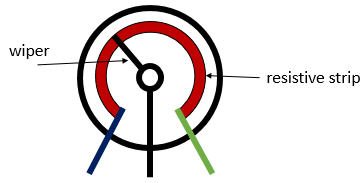
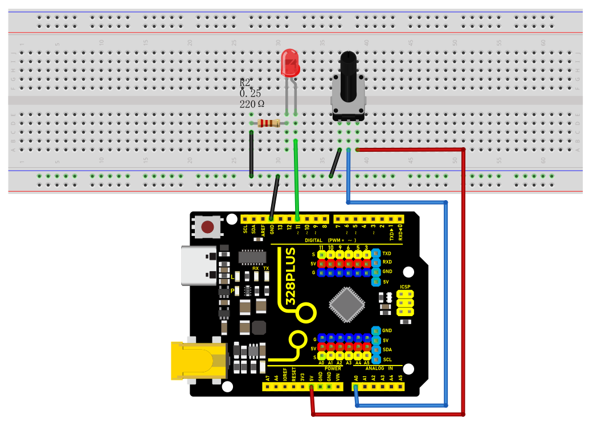
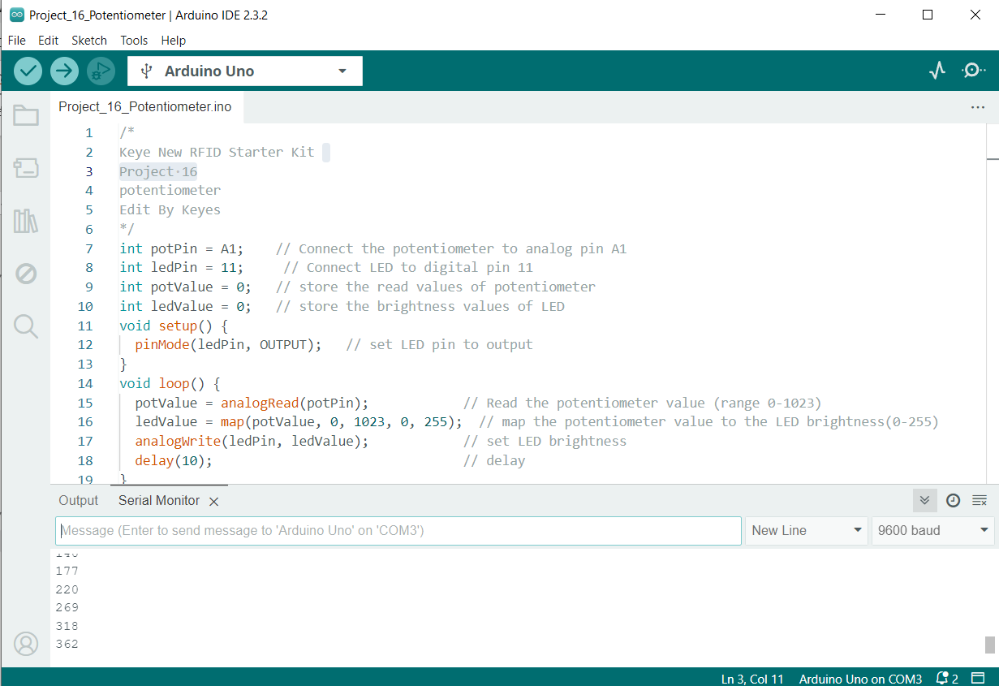
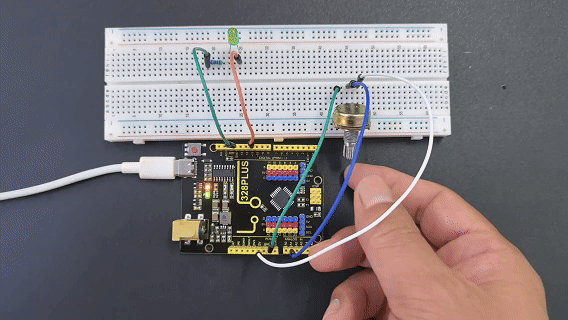

### Project 17 Potentiometer


#### Description

A potentiometer consists of a rotatable knob and a resistor, whose resistance value is changed by rotating the knob, thus controlling current in the circuit.

In this project, we create a circuit in which the LED brightness can be adjusted by programming on the development board and rotating the potentiometer. So we can understand how the potentiometer works and how to use analog inputs in the Arduino.

#### Hardware

1\. 328 Plus development board x1

2\. Breadboard x1

3\. Potentiometer(10kΩ) x1

4\. LED x1

5\. 220Ω resistor x1

6\. Jumper wires

#### Working Principle

A potentiometer has 3 pins. Two terminals (the blue and green) are connected to a resistive element and the third terminal (the black one) is connected to an adjustable wiper.



The potentiometer can work as a **rheostat** (variable resistor) or as a **voltage divider**.

Rheostat

To use the potentiometer as a rheostat, only two pins are used: one outside pin and the center pin. The position of the wiper determines how much resistance the potentiometer is imposing to the circuit, as the figure demonstrates:


If we have a 10kΩ potentiometer, it means that the maximum resistance of the variable resistor is 10kΩ and the minimum is 0Ω. This means that by changing the wiper position, you get a value between 0Ω and 10kΩ.

Specifications:

Standard Resistance Range：10 to 2 megohms

Resistance Tolerance：±10 % std.

Absolute Minimum Resistance:2 ohm max

Contact Resistance Variation:2 % or 3 ohms max.(whichever is greater)

Voltage:±0.05 %

Resistance:±0.15 %

Resolution:Infinite

Insulation Resistance“500 vdc. 1,000 megohms min.

Power Rating(300 volts max.)

85 °C：0.5 watt

150 °C：0 watt

Temperature Range：-55 °C to +125 °C

Temperature Coefficient：±100 ppm/°C

Torque：5.0 oz-in. max.

#### Pinout


#### Wiring Diagram

1\. Insert the three pins of the potentiometer to the breadboard holes.

2\. Connect one outside pin of the potentiometer to the 5V pin of the development board.

3\. Connect another outside pin of the potentiometer to the GND pin of the development board.

4\. Connect the middle pin of the potentiometer to the analog input pin A1 of the development board.

5\. Connect the anode of LED (long pin) to the digital pin 11 on the board via 220Ωresistor.

6\. Connect the cathode of LED (short pin) to the GND on the board.




#### Sample Code

```cpp

/*

Keye New RFID Starter Kit

Project 17

potentiometer

Edit By Keyes

*/

int potPin = A1; // Connect the potentiometer to analog pin A1

int ledPin = 11; // Connect LED to digital pin 11

int potValue = 0; // store the read values of potentiometer

int ledValue = 0; // store the brightness values of LED

void setup() {

pinMode(ledPin, OUTPUT); // set LED pin to output

}

void loop() {

potValue = analogRead(potPin); // Read the potentiometer value (range 0-1023)

ledValue = map(potValue, 0, 1023, 0, 255); // map the potentiometer value to the LED brightness(0-255)

analogWrite(ledPin, ledValue); // set LED brightness

delay(10); // delay

}

```

#### Code Explanation

First, let's start with the definition and initialization part of the code:

```cpp

int potPin = A1; // Connect the potentiometer to analog pin A1

int ledPin = 11; // Connect LED to digital pin 11

int potValue = 0; // store the read values of potentiometer

int ledValue = 0; // store the brightness values of LED

```

Here, we define four variables:

`potPin`: defines the analog input pin A1 on the Arduino board where the potentiometer is connected.

`ledPin`: defines the digital pin 11 to which the LED is connected.

`potValue`: used to store the values read from the potentiometer.

`ledValue`: used to store the brightness values mapped to the LED.

Next is the `setup()` function:

```cpp

void setup() {

pinMode(ledPin, OUTPUT); // set LED pin to output

}

```

The `setup()` function is executed only once in Arduino code and is used to set pin modes or initialize serial communication. Here, we set `ledPin` to output mode because the LED needs to receive power signals from the Arduino.

Then, we enter the main loop `loop()` function:

```cpp

void loop() {

potValue = analogRead(potPin); // Read the potentiometer value (range 0-1023)

ledValue = map(potValue, 0, 1023, 0, 255); // map the potentiometer value to the LED brightness(0-255)

analogWrite(ledPin, ledValue); // set LED brightness

delay(10); // delay

}

```

The `loop()` function runs continuously on the Arduino after uploading, performing the following operations:

1\. Read the value of the potentiometer from `potPin` using the `analogRead()` function. The potentiometer values range from 0 to 1023, representing the position of the potentiometer knob.

2\. Map the read potentiometer value (0-1023) to the brightness value (0-255) that the LED can accept using the `map()` function. This is because the `analogWrite()` function used for PWM output can only accept values from 0 to 255.

3\. Send the mapped brightness value to `ledPin` using the `analogWrite()` function, adjusting the LED brightness accordingly.

4\. The `delay(10)` call pauses the loop for 10 milliseconds after each execution. This reduces the reading frequency and prevents unnecessary flickering caused by adjusting the brightness too quickly.

#### Project Result

After uploading the code to the development board, rotate the potentiometer and you will see the LED brightness changes. Rotate clockwise to make it brighter, and rotate counterclockwise to make it darker.





