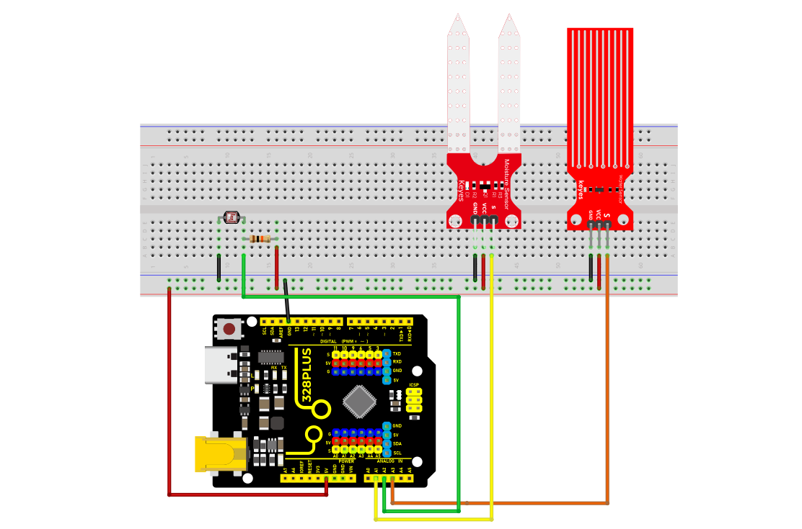
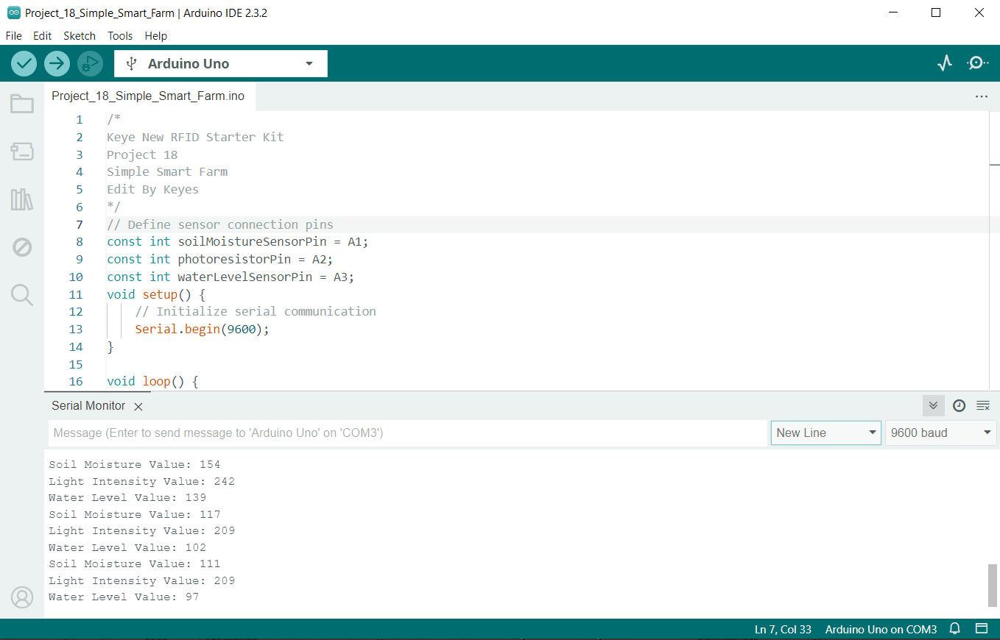

### Project 18 Simple Smart Farm


#### Description

This project aims to create a simple smart farm system using Arduino. By connecting common sensors such as soil moisture sensors, photoresistors, and water level sensors, it enables real-time monitoring of soil moisture, light intensity, and water level. This system helps users understand various parameters of the plant growth environment and provides a foundation for smart agriculture research and applications.

#### Hardware

1.328 Plus development board x1

2.Soil moisture sensor ×1

3.Photoresistor (light sensor) ×1

4.Water level sensor ×1

5.Breadboard x1 

6.jumper wires

#### Working Principle

**Soil Moisture Sensor**: Detects soil conductivity and outputs a corresponding voltage value, reflecting soil moisture level.

**Photoresistor**: Changes its resistance based on light intensity, generating a different voltage signal to reflect environmental lighting.

**Water Level Sensor**: Detects water level height and outputs a corresponding voltage value, reflecting the current water level information.

Arduino reads the analog signals from each sensor using the `analogRead()` function, processes them, and outputs specific values through the serial monitor for user observation and analysis.

#### Wiring Diagram

**Soil Moisture Sensor**: Connects to Arduino's A1 pin

**Photoresistor**: Connects to Arduino's A2 pin

**Water Level Sensor**: Connects to Arduino's A3 pin



#### Sample Code

```cpp

/*

Keye New RFID Starter Kit

Project 18

Simple Smart Farm

Edited by Keyes

*/

// Define sensor connection pins

const int soilMoistureSensorPin = A1; // Soil moisture sensor pin

const int photoresistorPin = A2; // Photoresistor pin

const int waterLevelSensorPin = A3; // Water level sensor pin

void setup() {

// Initialize serial communication

Serial.begin(9600);

}

void loop() {

// Read sensor data

int soilMoistureValue = analogRead(soilMoistureSensorPin); // Soil moisture data

int lightValue = analogRead(photoresistorPin); // Light intensity

int waterLevelValue = analogRead(waterLevelSensorPin); // Water level information

// Print sensor data

Serial.print("Soil Moisture Value: ");

Serial.println(soilMoistureValue);

Serial.print("Light Intensity Value: ");

Serial.println(lightValue);

Serial.print("Water Level Value: ");

Serial.println(waterLevelValue);

// Wait for a while

delay(1000); // Measure once per second

}

```

#### Code Explanation

1\. **Pin Definitions**

```cpp

const int soilMoistureSensorPin = A1;

const int photoresistorPin = A2;

const int waterLevelSensorPin = A3;

```

\-Sensor connection pins are defined using `const int`, making future code maintenance and modification easier.

2\. **Initialization Setup**

```cpp

void setup() {

// Initialize serial communication

Serial.begin(9600);

}

```

`Serial.begin(9600);` initializes the serial communication with a baud rate set at 9600, allowing you to view the data on the serial monitor.

3\. **Main Loop Function**

```cpp

void loop() {

// Read sensor data

int soilMoistureValue = analogRead(soilMoistureSensorPin); // Soil moisture data

int lightValue = analogRead(photoresistorPin); // Light intensity

int waterLevelValue = analogRead(waterLevelSensorPin); // Water level information

// Print sensor data

Serial.print("Soil Moisture Value: ");

Serial.println(soilMoistureValue);

Serial.print("Light Intensity Value: ");

Serial.println(lightValue);

Serial.print("Water Level Value: ");

Serial.println(waterLevelValue);

// Wait for a while

delay(1000); // Measure once per second

}

```

The `analogRead()` function reads the analog signals from each sensor, ranging from 0 to 1023.

`Serial.print()` and `Serial.println()` print the values to the serial monitor.

`delay(1000);` makes the program loop every 1 second.

#### Project Results

After uploading the code to the Arduino, open the Arduino IDE's Serial Monitor , set the baud rate to 9600. You will see output similar to the following:



