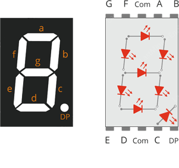
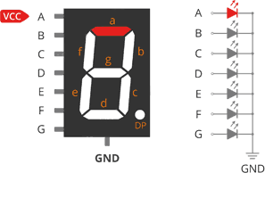
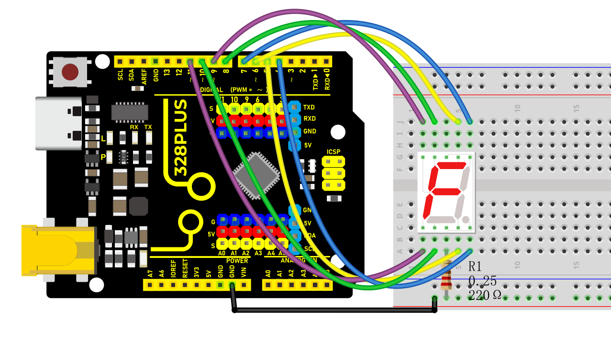
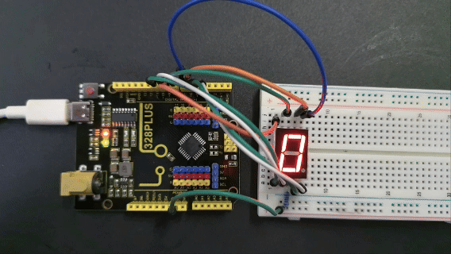

### Project 19 1-digit LED Segment Display


#### Description

A digital tube is a common electronic display that shows numbers, letters, and symbols by emitting light. 1-digit tubes are the simplest kind, which can only display one number or symbol.

This project will guide to create a simple Arduino project through 328 Plus development board and 1-digit tube display. Through this project, you will learn how to control this tube to display numbers from 0 to 9.

#### Hardware

1\. 328 Plus development board x1

2\. 1-digit LED Segment Display x1

3\. 220Ω resistor x1

4\. Breadboard x1

5\. Jumper wires

#### Working Principle

The 7-segment display, also written as “seven segment display”, consists of seven LEDs arranged in a ‘8’-shaped pattern. Each LED is referred to as a segment, because when illuminated, it forms part of a digit. An eighth LED is sometimes used to indicate a decimal point.



Each segment LED has one of its connection pins brought directly out of the rectangular plastic package. These pins are labeled with the letters ‘a’ through ‘g’. The remaining LED pins are wired together to form a single common pin.

Each segment can be individually turned on or off by setting the corresponding pin to HIGH or LOW, just like a regular LED. By lighting up individual segments, you can create any numerical character and even some basic representations of letters.

#### Specifications

Available in two modes Common Cathode (CC) and Common Anode (CA)

Available in many different sizes like 9.14mm,14.20mm,20.40mm,38.10mm,57.0mm and 100mm (Commonly used/available size is 14.20mm)

Available colours: White, Blue, Red, Yellow and Green (Res is commonly used)

Low current operation

Better, brighter and larger display than conventional LCD displays.

Current consumption : 30mA / segment

Peak current : 70mA

#### Pinout

Now, let’s review the segment configuration so you know which pin corresponds to which segment. The 7-segment display pinout is as follows.


a, b, c, d, e, f, g, and DP are connected to the digital pins on an Arduino to operate the display’s individual segments. By lighting up individual segments, you can create any numeric character.

COM The pins 3 and 8 are connected internally to form a common pin. Depending on the type of display, this pin must be connected to either GND (common cathode) or 5V (common anode).

Common Cathode(CC) vs Common Anode(CA)

There are two types of seven segment displays: common cathode (CC) and common anode (CA).

The internal structure of both types is nearly identical. The difference is the polarity of the LEDs and the common terminal. As the name implies, in common cathode displays, all of the cathodes (or negative terminals) of the segment LEDs are tied together, whereas in common anode displays, all of the anodes (or positive terminals) of the segment LEDs are tied together.

In a common cathode display, the com pin is connected to GND, and a positive voltage is applied to each segment (a-g) to illuminate it.



Common Cathode 7 Segment Working

In a common anode display, the com pin is connected to VCC, and each segment (a-g) is individually grounded to illuminate it.


Common Anode 7 Segment Working

#### Wiring Diagram


Connect pin a to digital pin D6

Connect pin b to digital pin D7

Connect pin c to digital pin D5

Connect pin d to digital pin D10

Connect pin e to digital pin D11

Connect pin f to digital pin D8

Connect pin g to digital pin D9

Connect pin DP to digital pin D4

Connect pin COM to GND pin with a 220Ω resistor




#### Sample Code

```cpp

/*

Keye New RFID Starter Kit

Project 19

1-digit LED Segment Display

Edit By Keyes

*/

// define the pins of each segments

const int a = 6;

const int b = 7;

const int c = 5;

const int d = 10;

const int e = 11;

const int f = 8;

const int g = 9;

const int dp = 4;

// Define the segment combination of number 0 to 9

const int num[][] = {

{1, 1, 1, 1, 1, 1, 0}, // 0

{0, 1, 1, 0, 0, 0, 0}, // 1

{1, 1, 0, 1, 1, 0, 1}, // 2

{1, 1, 1, 1, 0, 0, 1}, // 3

{0, 1, 1, 0, 0, 1, 1}, // 4

{1, 0, 1, 1, 0, 1, 1}, // 5

{1, 0, 1, 1, 1, 1, 1}, // 6

{1, 1, 1, 0, 0, 0, 0}, // 7

{1, 1, 1, 1, 1, 1, 1}, // 8

{1, 1, 1, 1, 0, 1, 1} // 9

};

void setup() {

// set pins to output

pinMode(a, OUTPUT);

pinMode(b, OUTPUT);

pinMode(c, OUTPUT);

pinMode(d, OUTPUT);

pinMode(e, OUTPUT);

pinMode(f, OUTPUT);

pinMode(g, OUTPUT);

pinMode(dp, OUTPUT);

}

void loop() {

// show number 0 to 9 in loop

for (int i = 0; i < 10; i++) {

displayNumber(i);

delay(1000);

}

}

// show numbers

void displayNumber(int n) {

// set the on and off of each segment

digitalWrite(a, num[][]);

digitalWrite(b, num[][]);

digitalWrite(c, num[][]);

digitalWrite(d, num[][]);

digitalWrite(e, num[][]);

digitalWrite(f, num[][]);

digitalWrite(g, num[][]);

digitalWrite(dp, LOW); // Decimal point is off

}

```

#### Code Explanation

Pin Definitions

The beginning of the code defines the Arduino pins connected to each segment of the seven-segment display:

```cpp

const int a = 6;

const int b = 7;

const int c = 5;

const int d = 10;

const int e = 11;

const int f = 8;

const int g = 9;

const int dp = 4;

```

Here, variables `a` to `g` correspond to the seven segments of the display, while `dp` represents the decimal point. Each variable is assigned a number indicating the specific pin number they are connected to on the Arduino.

Number Definitions

Next, an array `num` is defined to represent how each number is displayed on the seven-segment display:

```cpp

const int num[][] = {

{1, 1, 1, 1, 1, 1, 0}, // 0

{0, 1, 1, 0, 0, 0, 0}, // 1

...

{1, 1, 1, 1, 0, 1, 1} // 9

};

```

Each row in the array represents a number (from 0 to 9), and the seven values (0 or 1) in each row indicate whether the corresponding segment (`a` to `g`) should be lit. 1 means the segment is lit, while 0 means it is off.

Setup Function

In the `setup()` function, all pins are configured as output mode:

```cpp

void setup() {

pinMode(a, OUTPUT);

pinMode(b, OUTPUT);

...

pinMode(dp, OUTPUT);

}

```

This function runs once when the Arduino starts up, ensuring that all pins controlling the seven-segment display are set as outputs.

Main Loop

The `loop()` function contains a loop that continuously displays numbers 0 to 9:

```cpp

void loop() {

for (int i = 0; i < 10; i++) {

displayNumber(i);

delay(1000);

}

}

```

Here, the `displayNumber()` function is responsible for controlling the seven-segment display to show a specific number, while `delay(1000)` makes each number display for 1 second.

Displaying Numbers

Finally, the `displayNumber()` function controls the lighting of each segment based on the input number parameter `n` using the `digitalWrite()` function:

```cpp

void displayNumber(int n) {

digitalWrite(a, num[][]);

...

digitalWrite(g, num[][]);

digitalWrite(dp, LOW); // Decimal point off

}

```

Each `digitalWrite()` call sets a specific segment to high or low, controlling whether the segment is lit or off. The decimal point remains off in this project.

#### Project Result

Upload code and you will see the digital tube shows number from 0 to 9 in sequence, with each lighting up for 1s.



