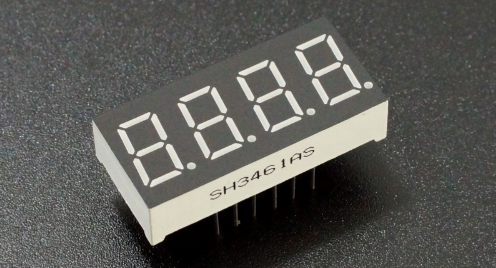
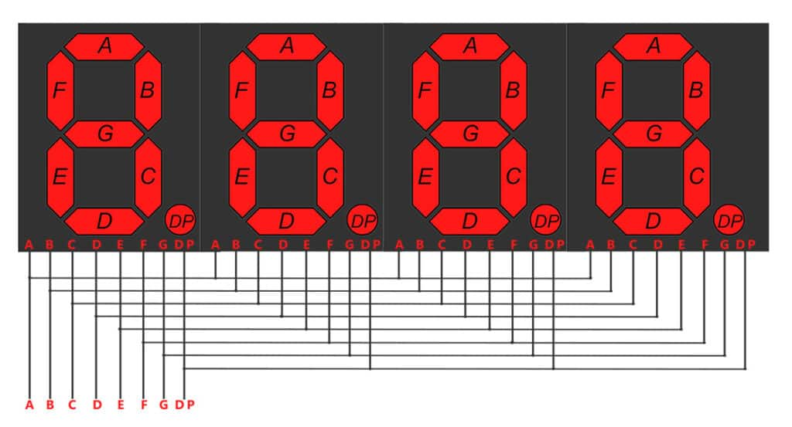
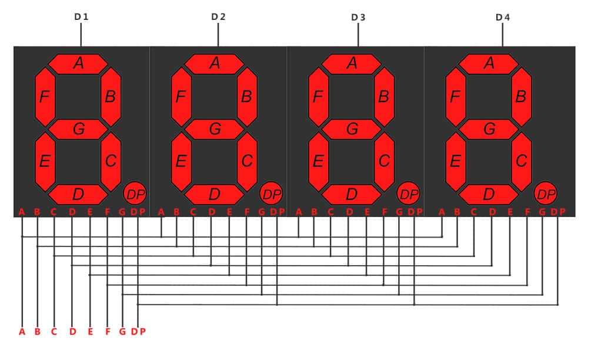
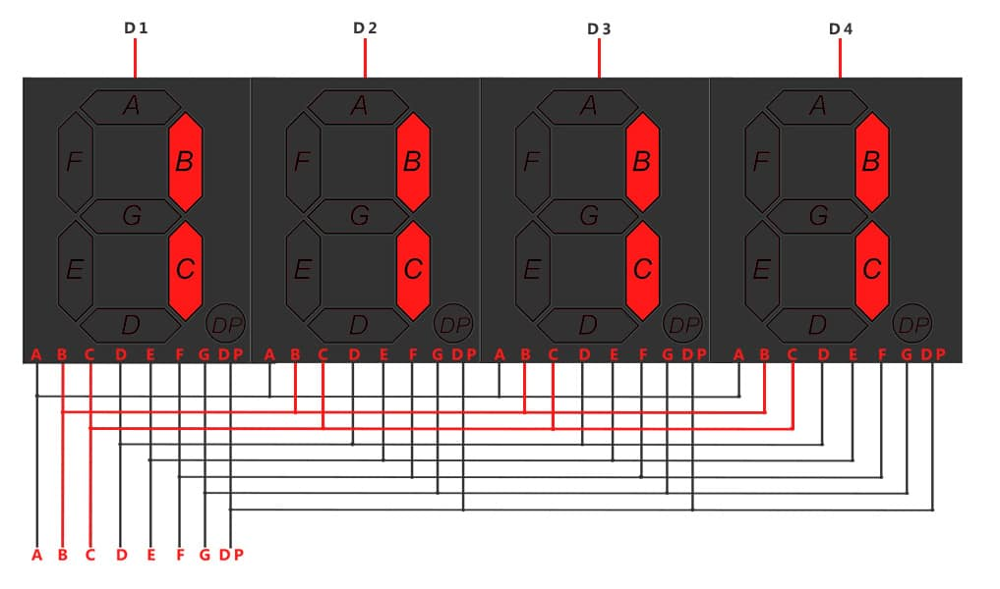
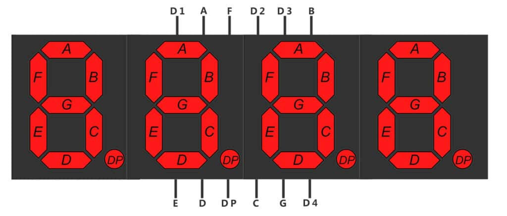
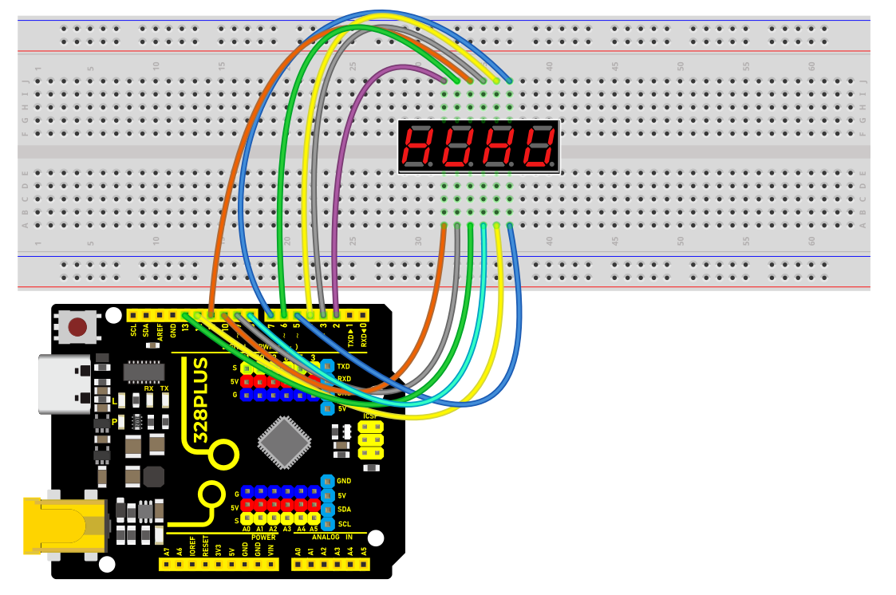
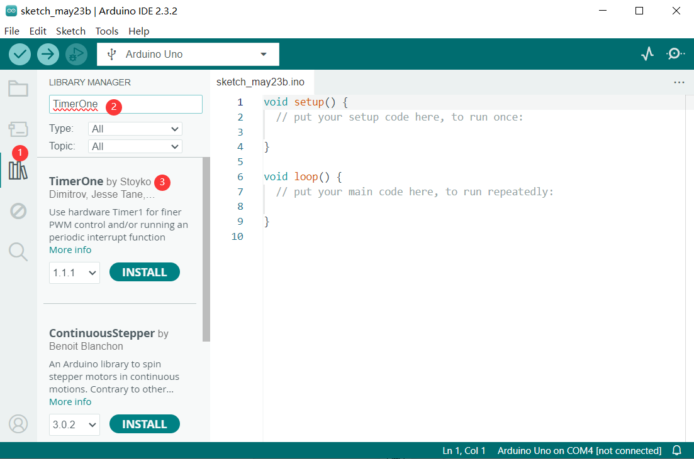
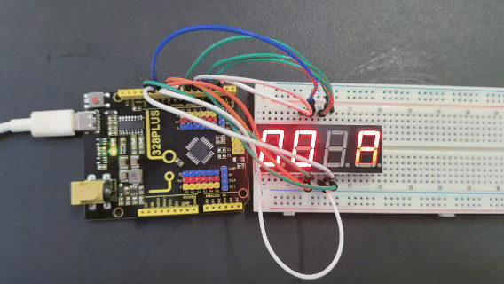

### Project 20 4-digit LED Segment Display



#### Description

The four-digit tube consists of four separate seven-segment digital tubes that can show four numbers or characters.

In this project, we will introduce how to create an Arduino project that shows numbers you want by the 328 Plus development board and 4-digit LED Segment Display.

#### Hardware

1\. 328 Plus development board x1

2\. 4-digit LED Segment Display x1

3\. Breadboard x1

4.Jumper wires

#### Working Principle

The four-digit tube consists of four separate seven-segment digital tubes that can show four numbers or characters.



This reduces the number of pins of a multi-digit display but increases the complexity of controlling it. For example, with this wiring, if we apply voltage to the A pin of the 4-digit display, the A segments of all LED blocks will be turned on. In order to control which LED block will let that signal to pass, we have another pin for each of the LED blocks, the digit pin. Therefore, in a 4-digit display we will also have 4 digit pins that control the LED blocks individually. Below we show the 4 digit LED display with the additional 4 control input pins, one for each of the LED block.

4-digit *7-segment* LED display internal connectivity showing the segment pins and the digit control pins that control whether or not the signal from the segment pins will be displayed in the corresponding LED block.

As a result if we want to display the number 1111, we have to apply voltage to the D1, D2, D3 and D4 because all displays will show a digit. We also need to apply voltage to inputs B and C as shown below:

Image showing with red color the wires that should be activated for displaying the number ‘1111’

#### Specifications

Function: SDK

Segment color: Milky white or same as emitting color

Digit height: 0.28 inch

Face color: Black, grey or red

Digit number: 4

Feature: Energy saving & high stability

#### Pinout

A typical 4-digit 7-segment LED display has 12 pins, with six pins on each side, as shown in the figure below.



4-digit *7-segment* LED display pinout

Four of these pins (D1, D2, D3, and D4) are used to control the individual digits and determine which signals pass through the LED blocks. The remaining pins correspond to the individual segments.

#### Wiring Diagram

Connect the cathode pins (D1, D2, D3, D4) of the digital tube to digital pins (D2, D3, D4, D5) on the board.

Connect the anode pins (a, b, c, d, e, f, g, dp) of the digital tube to digital pins (D6, D7, D8, D9, D10, D11, D12, D13) on the board.




#### Install Library

Before starting to code, we need to install the TimerOne library file first.

**Navigate to Library Manager**: Click on the “Tools” menu option, then select “Manage Libraries…”.


**Search for Libraries**:

In the Library Manager window that pops up, you'll see a search box. Enter the name of the"TimerOne" library .



**Select and Install Libraries**:

Find the desired library in the search results and click on it.

An “Install” button will appear on the right side of the window. Click the “Install” button.


**Wait for Installation**: The Arduino IDE will automatically download and install the selected library. Once the installation is complete, the “Install” button will change to “Installed”, indicating a successful installation.

#### Sample Code

```cpp

/*

Keye New RFID Starter Kit

Project 20

4-digit LED Segment Display

Edit By Keyes

*/

#include <TimerOne.h>

//the pins of 4-digit 7-segment display attach to pin2-13 respectively

int a = 6;

int b = 7;

int c = 8;

int d = 9;

int e = 10;

int f = 11;

int g = 12;

int p = 13;

int d4 = 5;

int d3 = 4;

int d2 = 3;

int d1 = 2;

long n = 0;// n represents the value displayed on the LED display. For example, when n=0, 0000 is displayed. The maximum value is 9999.

int x = 100;

int del = 5;//Set del as 5; the value is the degree of fine tuning for the clock

int count = 0;//Set count=0. Here count is a count value that increases by 1 every 0.1 second, which means 1 second is counted when the value is 10

void setup()

{

//set all the pins of the LED display as output

pinMode(d1, OUTPUT);

pinMode(d2, OUTPUT);

pinMode(d3, OUTPUT);

pinMode(d4, OUTPUT);

pinMode(a, OUTPUT);

pinMode(b, OUTPUT);

pinMode(c, OUTPUT);

pinMode(d, OUTPUT);

pinMode(e, OUTPUT);

pinMode(f, OUTPUT);

pinMode(g, OUTPUT);

pinMode(p, OUTPUT);

Timer1.initialize(100000); // set a timer of length 100000 microseconds (or 0.1 sec - or 10Hz => the led will blink 5 times, 5 cycles of on-and-off, per second)

Timer1.attachInterrupt( add ); // attach the service routine here

}

/*************************************\**/

void loop()

{

clearLEDs();//clear the 7-segment display screen

pickDigit(0);//Light up 7-segment display d1

pickNumber((n/1000));// get the value of thousand

delay(del);//delay 5ms

clearLEDs();//clear the 7-segment display screen

pickDigit(1);//Light up 7-segment display d2

pickNumber((n%1000)/100);// get the value of hundred

delay(del);//delay 5ms

clearLEDs();//clear the 7-segment display screen

pickDigit(2);//Light up 7-segment display d3

pickNumber(n%100/10);//get the value of ten

delay(del);//delay 5ms

clearLEDs();//clear the 7-segment display screen

pickDigit(3);//Light up 7-segment display d4

pickNumber(n%10);//Get the value of single digit

delay(del);//delay 5ms

}

/**************************************/

void pickDigit(int x) //light up a 7-segment display

{

//The 7-segment LED display is a common-cathode one. So also use digitalWrite to set d1 as high and the LED will go out

digitalWrite(d1, HIGH);

digitalWrite(d2, HIGH);

digitalWrite(d3, HIGH);

digitalWrite(d4, HIGH);

switch(x)

{

case 0:

digitalWrite(d1, LOW);//Light d1 up

break;

case 1:

digitalWrite(d2, LOW); //Light d2 up

break;

case 2:

digitalWrite(d3, LOW); //Light d3 up

break;

default:

digitalWrite(d4, LOW); //Light d4 up

break;

}

}

//The function is to control the 7-segment LED display to display numbers. Here x is the number to be displayed. It is an integer from 0 to 9

void pickNumber(int x)

{

switch(x)

{

default:

zero();

break;

case 1:

one();

break;

case 2:

two();

break;

case 3:

three();

break;

case 4:

four();

break;

case 5:

five();

break;

case 6:

six();

break;

case 7:

seven();

break;

case 8:

eight();

break;

case 9:

nine();

break;

}

}

void clearLEDs() //clear the 7-segment display screen

{

digitalWrite(a, LOW);

digitalWrite(b, LOW);

digitalWrite(c, LOW);

digitalWrite(d, LOW);

digitalWrite(e, LOW);

digitalWrite(f, LOW);

digitalWrite(g, LOW);

digitalWrite(p, LOW);

}

void zero() //the 7-segment led display 0

{

digitalWrite(a, HIGH);

digitalWrite(b, HIGH);

digitalWrite(c, HIGH);

digitalWrite(d, HIGH);

digitalWrite(e, HIGH);

digitalWrite(f, HIGH);

digitalWrite(g, LOW);

}

void one() //the 7-segment led display 1

{

digitalWrite(a, LOW);

digitalWrite(b, HIGH);

digitalWrite(c, HIGH);

digitalWrite(d, LOW);

digitalWrite(e, LOW);

digitalWrite(f, LOW);

digitalWrite(g, LOW);

}

void two() //the 7-segment led display 2

{

digitalWrite(a, HIGH);

digitalWrite(b, HIGH);

digitalWrite(c, LOW);

digitalWrite(d, HIGH);

digitalWrite(e, HIGH);

digitalWrite(f, LOW);

digitalWrite(g, HIGH);

}

void three() //the 7-segment led display 3

{

digitalWrite(a, HIGH);

digitalWrite(b, HIGH);

digitalWrite(c, HIGH);

digitalWrite(d, HIGH);

digitalWrite(e, LOW);

digitalWrite(f, LOW);

digitalWrite(g, HIGH);

}

void four() //the 7-segment led display 4

{

digitalWrite(a, LOW);

digitalWrite(b, HIGH);

digitalWrite(c, HIGH);

digitalWrite(d, LOW);

digitalWrite(e, LOW);

digitalWrite(f, HIGH);

digitalWrite(g, HIGH);

}

void five() //the 7-segment led display 5

{

digitalWrite(a, HIGH);

digitalWrite(b, LOW);

digitalWrite(c, HIGH);

digitalWrite(d, HIGH);

digitalWrite(e, LOW);

digitalWrite(f, HIGH);

digitalWrite(g, HIGH);

}

void six() //the 7-segment led display 6

{

digitalWrite(a, HIGH);

digitalWrite(b, LOW);

digitalWrite(c, HIGH);

digitalWrite(d, HIGH);

digitalWrite(e, HIGH);

digitalWrite(f, HIGH);

digitalWrite(g, HIGH);

}

void seven() //the 7-segment led display 7

{

digitalWrite(a, HIGH);

digitalWrite(b, HIGH);

digitalWrite(c, HIGH);

digitalWrite(d, LOW);

digitalWrite(e, LOW);

digitalWrite(f, LOW);

digitalWrite(g, LOW);

}

void eight() //the 7-segment led display 8

{

digitalWrite(a, HIGH);

digitalWrite(b, HIGH);

digitalWrite(c, HIGH);

digitalWrite(d, HIGH);

digitalWrite(e, HIGH);

digitalWrite(f, HIGH);

digitalWrite(g, HIGH);

}

void nine() //the 7-segment led display 9

{

digitalWrite(a, HIGH);

digitalWrite(b, HIGH);

digitalWrite(c, HIGH);

digitalWrite(d, HIGH);

digitalWrite(e, LOW);

digitalWrite(f, HIGH);

digitalWrite(g, HIGH);

}

/*****************************************\**/

void add()

{

// Toggle LED

count ++;

if(count == 10)

{

count = 0;

n++;

if(n == 10000)

{

n = 0;

}

}

}

```

#### Code Explanation

```cpp

#include <TimerOne.h>

```

This line includes a library named `TimerOne`, which is used to create timers and interrupts.

```cpp

int a = 6;

int b = 7;

int c = 8;

int d = 9;

int e = 10;

int f = 11;

int g = 12;

int p = 13;

int d4 = 5;

int d3 = 4;

int d2 = 3;

int d1 = 2;

long n = 0;

int x = 100;

int del = 5;

int count = 0;

```

These lines define a series of variables and constants:

`a` through `g` and `p` are pins used to connect the 7-segment LED.

`d1` through `d4` are pins used to select the digit to display.

`n` stores the number to be displayed.

`x` defines the frequency of LED blinking, set to 100 times per second.

`del` is the delay between each digit refresh, measured in milliseconds.

`count` is used to count intervals of 0.1 seconds for updating the display.

```cpp

void setup() {

pinMode(d1, OUTPUT);

pinMode(d2, OUTPUT);

pinMode(d3, OUTPUT);

pinMode(d4, OUTPUT);

pinMode(a, OUTPUT);

pinMode(b, OUTPUT);

pinMode(c, OUTPUT);

pinMode(d, OUTPUT);

pinMode(e, OUTPUT);

pinMode(f, OUTPUT);

pinMode(g, OUTPUT);

pinMode(p, OUTPUT);

Timer1.initialize(100000);

Timer1.attachInterrupt( add );

}

```

In the `setup()` function:

All LED and digit pins are set as output pins.

The timer is initialized with an interval of 100,000 microseconds (0.1 second).

The interrupt service function `add` is attached to the timer.

```cpp

void loop() {

clearLEDs();

pickDigit(0);

pickNumber((n/1000));

delay(del);

clearLEDs();

pickDigit(1);

pickNumber((n%1000)/100);

delay(del);

clearLEDs();

pickDigit(2);

pickNumber(n%100/10);

delay(del);

clearLEDs();

pickDigit(3);

pickNumber(n%10);

delay(del);

}

```

In the `loop()` function, the following steps are repeated to display the digits:

Clear the LED display.

Select each digit sequentially and display the corresponding number.

```cpp

void pickDigit(int x) {

digitalWrite(d1, HIGH);

digitalWrite(d2, HIGH);

digitalWrite(d3, HIGH);

digitalWrite(d4, HIGH);

switch(x) {

case 0:

digitalWrite(d1, LOW);

break;

case 1:

digitalWrite(d2, LOW);

break;

case 2:

digitalWrite(d3, LOW);

break;

default:

digitalWrite(d4, LOW);

break;

}

}

```

The `pickDigit(int x)` function is used to illuminate a specific digit:

First, turn off all digit LEDs.

Based on the value of the parameter `x`, select the digit to illuminate.

```cpp

void pickNumber(int x) {

switch(x) {

default:

zero();

break;

case 1:

one();

break;

case 2:

two();

break;

case 3:

three();

break;

case 4:

four();

break;

case 5:

five();

break;

case 6:

six();

break;

case 7:

seven();

break;

case 8:

eight();

break;

case 9:

nine();

break;

}

}

```

The `pickNumber(int x)` function is used to select the number to be displayed based on the parameter `x`, and it calls the corresponding number display function.

```cpp

void clearLEDs() {

digitalWrite(a, LOW);

digitalWrite(b, LOW);

digitalWrite(c, LOW);

digitalWrite(d, LOW);

digitalWrite(e, LOW);

digitalWrite(f, LOW);

digitalWrite(g, LOW);

digitalWrite(p, LOW);

}

```

The `clearLEDs()` function is used to turn off all LEDs to clear the display.

```cpp

void add() {

count ++;

if(count == 10) {

count = 0;

n++;

if(n == 10000) {

n = 0;

}

}

}

```

The `add()` function is the interrupt service routine for the timer, used to update the displayed number:

Increment `count` every 0.1 seconds.

When `count` reaches 10, reset it to 0 and increment `n`.

If `n` reaches 10,000, reset it to 0 to cycle the display.

#### Project Result

After uploading the code to the Arduino board, you will see a four-digit 7-segment LED display start flashing numbers at specified intervals. The displayed numbers will gradually increase from 0 to 9999 and then restart from 0. The LED will flash 5 times per second, updating the number every 0.1 seconds.



