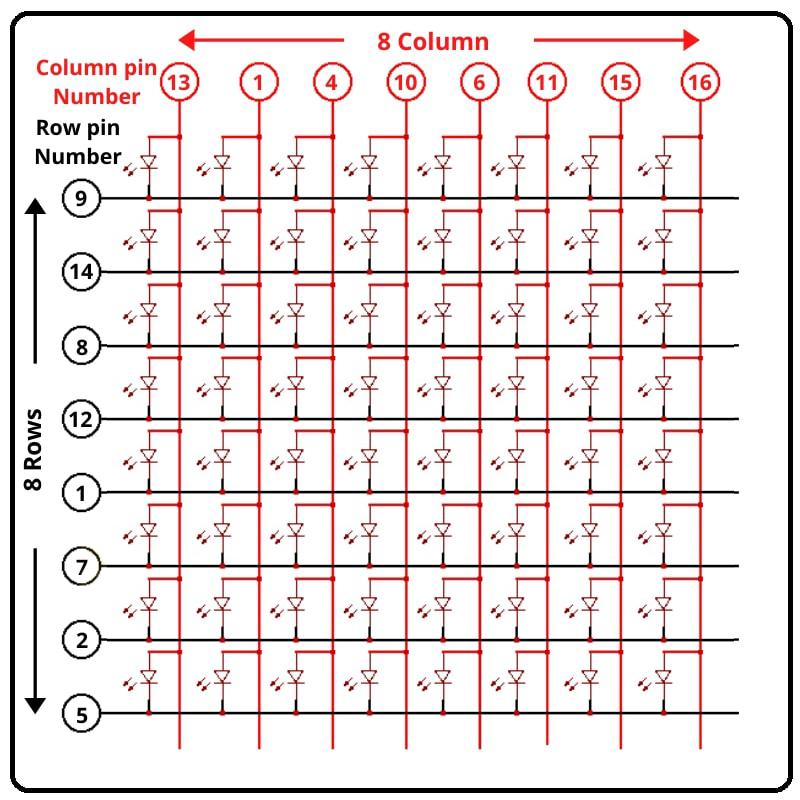
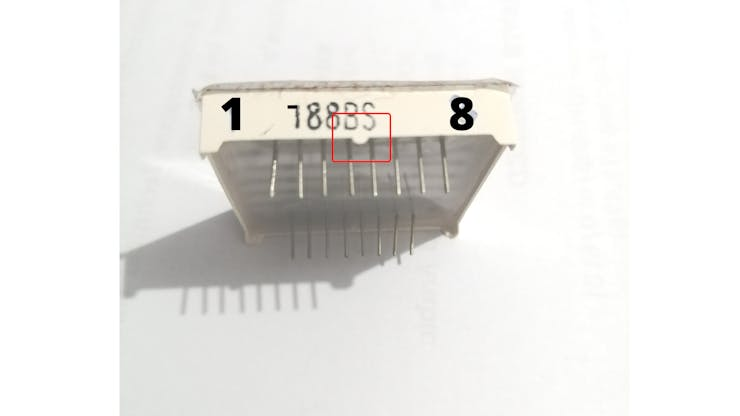
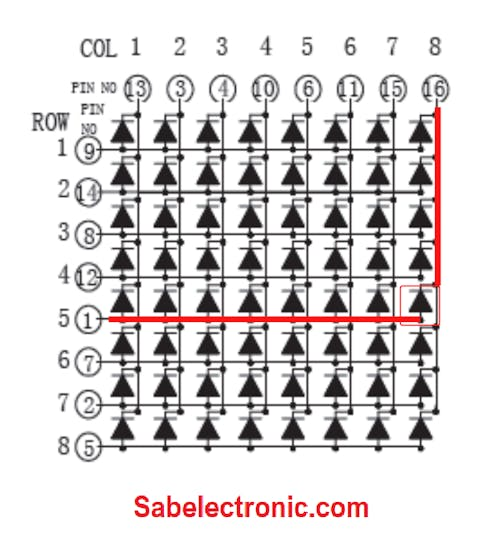
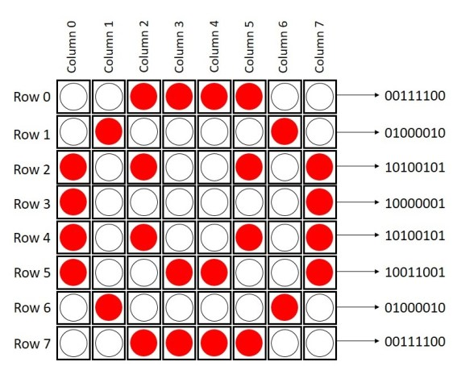
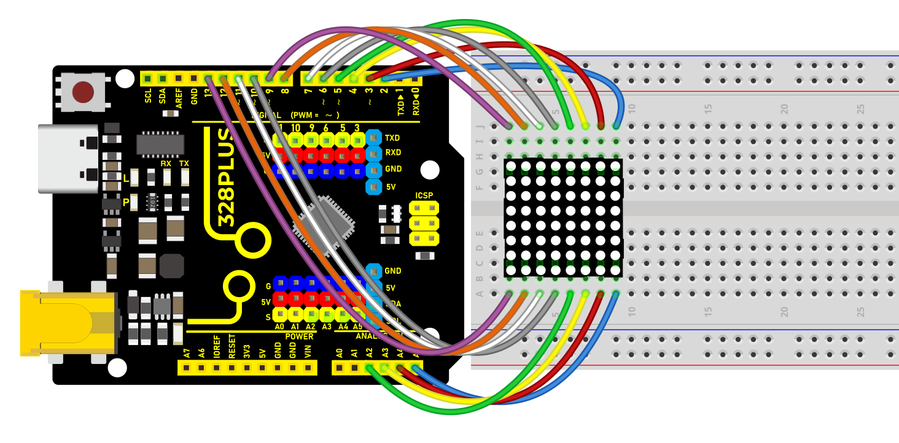
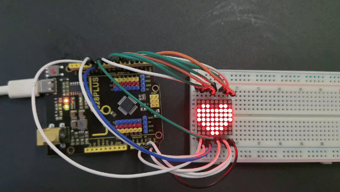

### Project 21 8x8 LED Matrix


#### Description

8\*8 LED dot matrix consists of 8 rows and 8 columns of LED, a total of 64 LEDs. Each one can be independently controlled, turned on or off, thus forming different patterns and characters.

In this project, you will learn how to program on the 328 Plus development boards to control an 8×8 LED matrix display, showcasing patterns of a large heart and a small heart.

#### Hardware

1\. 328 Plus development board x 1

2\. 8*8 LED Matrix x 1

3\. Breadboard x 1

4\. Jumper wires

#### Working Principle

The external view of a dot-matrix is shown as follows


The 8*8 dot-matrix is made up of sixty-four LEDs, and each LED is placed at the cross point of a row and a column.

When the electrical level of a certain row is 1 and the electrical level of a certain column is 0, the corresponding LED will lighten. If you want to light the LED on the first dot, you should set pin 9 to high level and pin 13 to low level.

If you want to light LEDs on the first row, you should set pin 9 to high level and pins 13, 3, 4, 10, 6, 11, 15 and 16 to low level.

If you want to light the LEDs on the first column, set pin 13 to low level and pins 9, 14, 8, 12, 1, 7, 2 and 5 to high level.

The internal view of a dot-matrix is shown as follows



If we have an 8x8 dot matrix, And how do we know where pin 1 is? As in IC Chips near Pin 1, a dot mentioned at IC/Microcontroller Chip. But here, how do we know?



Pins Starts at knob side

At the led matrix module, the manufacturer writes the tag or mark at pin 1 side, as shown in the figure. We definitely find it. And also a curve mentioned at pin number 1 side.


Battery connection

Row = + Positive Supply

Column = - Negative Supply

The testing power supply should be 1.5V DC required. So the only one battery cell enough or uses one 130 ohm resistance in series at a positive/negative side.


Led matrix Testing with Battery cell

After that attached led to the power supply. We found that the 8th column and 5th rows led become ON as Connection shown in the figure. How to connect the battery cell with a matrix display.



Column and Row Pin connection

#### Pin Test of LED Dot Matrix

As shown in fig pin 1 and pin 16 got Energize and 8th Column and 5th-row led become ON. We should verify the Dot-matrix before using it because if any led found blown we can replace it with a good one.


Led matrix light up

if you want to display a happy face, here’s what you need to do:



#### Wiring Diagram


Row 1--8> digital pins D2--D9

Column 1--8> digital pins D10--D17




#### Sample Code

```cpp

/*

Keye New RFID Starter Kit

Project 21

8\*8 LED Matrix

Edit By Keyes

*/

// 2-dimensional array of row pin numbers:

int R[] = {2,7,A5,5,13,A4,12,A2};

// 2-dimensional array of column pin numbers:

int C[] = {6,11,10,3,A3,4,8,9};

unsigned char biglove[][] = //the big "heart"

{

0,0,0,0,0,0,0,0,

0,1,1,0,0,1,1,0,

1,1,1,1,1,1,1,1,

1,1,1,1,1,1,1,1,

1,1,1,1,1,1,1,1,

0,1,1,1,1,1,1,0,

0,0,1,1,1,1,0,0,

0,0,0,1,1,0,0,0,

};

unsigned char smalllove[][] = //the small "heart"

{

0,0,0,0,0,0,0,0,

0,0,0,0,0,0,0,0,

0,0,1,0,0,1,0,0,

0,1,1,1,1,1,1,0,

0,1,1,1,1,1,1,0,

0,0,1,1,1,1,0,0,

0,0,0,1,1,0,0,0,

0,0,0,0,0,0,0,0,

};

void setup()

{

// iterate over the pins:

for(int i = 0;i<8;i++)

// initialize the output pins:

{

pinMode(R[],OUTPUT);

pinMode(C[],OUTPUT);

}

}

void loop()

{

for(int i = 0 ; i < 100 ; i++) //Loop display 100 times

{

Display(biglove); //Display the "Big Heart"

}

for(int i = 0 ; i < 50 ; i++) //Loop display 50 times

{

Display(smalllove); //Display the "small Heart"

}

}

void Display(unsigned char dat[][])

{

for(int c = 0; c<8;c++)

{

digitalWrite(C[],LOW);//use thr column

//loop

for(int r = 0;r<8;r++)

{

digitalWrite(R[],dat[][]);

}

delay(1);

Clear(); //Remove empty display light

}

}

void Clear() //clear the display

{

for(int i = 0;i<8;i++)

{

digitalWrite(R[],LOW);

digitalWrite(C[],HIGH);

}

}

```

#### Code Explanation

1\. Pin Configuration

First, we need to configure the row and column pins:

```cpp

// 2-dimensional array of row pin numbers:

int R[] = {2, 7, A5, 5, 13, A4, 12, A2};

// 2-dimensional array of column pin numbers:

int C[] = {6, 11, 10, 3, A3, 4, 8, 9};

```

In the code, two arrays `R[]` and `C[]` are defined to represent the pin numbers for the rows and columns of the LED matrix respectively. The arrays `R[]` and `C[]` each contain 8 pins, which are used to control an 8x8 LED matrix.

2\. Pattern Definition

Next, we define two 2-dimensional arrays, `biglove` and `smalllove`, which represent the patterns for a large heart and a small heart:

```cpp

unsigned char biglove[][] = {

0,0,0,0,0,0,0,0,

0,1,1,0,0,1,1,0,

1,1,1,1,1,1,1,1,

1,1,1,1,1,1,1,1,

1,1,1,1,1,1,1,1,

0,1,1,1,1,1,1,0,

0,0,1,1,1,1,0,0,

0,0,0,1,1,0,0,0,

};

unsigned char smalllove[][] = {

0,0,0,0,0,0,0,0,

0,0,0,0,0,0,0,0,

0,0,1,0,0,1,0,0,

0,1,1,1,1,1,1,0,

0,1,1,1,1,1,1,0,

0,0,1,1,1,1,0,0,

0,0,0,1,1,0,0,0,

0,0,0,0,0,0,0,0,

};

```

In these arrays, `1` indicates that the LED is on, and `0` indicates that the LED is off. Using these arrays, the LEDs on the matrix can be manipulated to form heart patterns.

3\. Initialization Settings

In the `setup()` function, all the pins are initialized as output pins:

```cpp

void setup() {

for (int i = 0; i < 8; i++) {

pinMode(R[], OUTPUT);

pinMode(C[], OUTPUT);

}

}

```

4\. Main Loop Function

In the `loop()` function, the primary operations are to sequentially display the large heart pattern and the small heart pattern:

```cpp

void loop() {

for (int i = 0; i < 100; i++) {

Display(biglove);

}

for (int i = 0; i < 50; i++) {

Display(smalllove);

}

}

```

Using `for` loops, the large heart pattern is displayed 100 times and the small heart pattern 50 times.

5\. Display Function

The `Display(unsigned char dat[][])` function is responsible for the specific display operations:

```cpp

void Display(unsigned char dat[][]) {

for (int c = 0; c < 8; c++) {

digitalWrite(C[], LOW);

for (int r = 0; r < 8; r++) {

digitalWrite(R[], dat[][]);

}

delay(1);

Clear();

}

}

```

This function scans each column one by one, using `dat[][]` to determine whether each LED should be on or off. The `Clear()` function is then called to clear the display to prevent ghosting effects.

6\. Clear Display Function

The `Clear()` function is used to clear the current display content:

```cpp

void Clear() {

for (int i = 0; i < 8; i++) {

digitalWrite(R[], LOW);

digitalWrite(C[], HIGH);

}

}

```

All row pins are set to low voltage and column pins to high voltage, thus turning off all the LEDs.

#### Project Result

After uploading the code to the Arduino board, the LED matrix can clearly display patterns of both large and small hearts. As the patterns switch, there is a noticeable change in the lighting, making the effect very intuitive.



