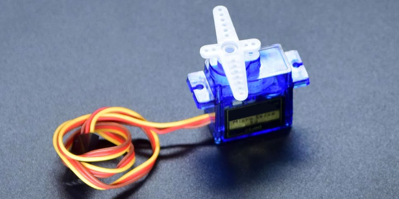
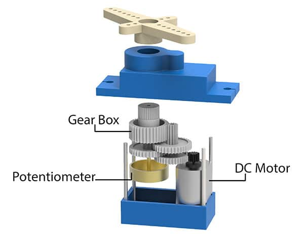
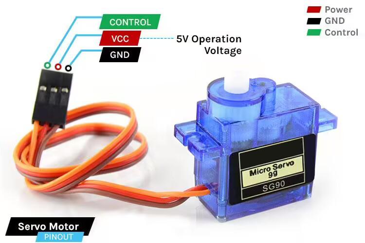
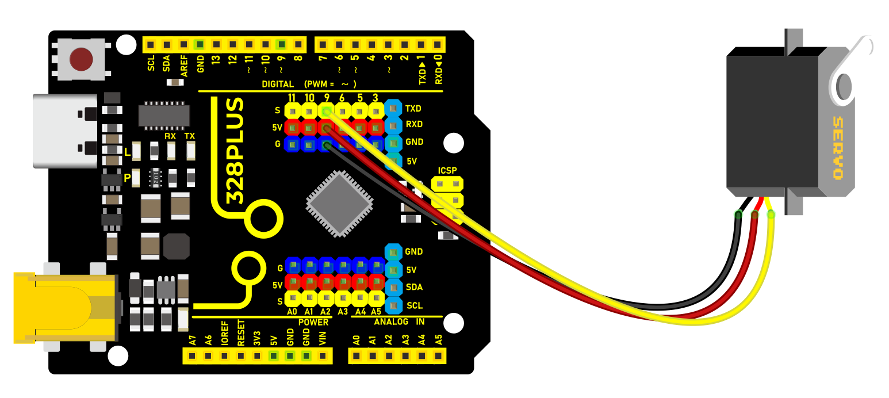
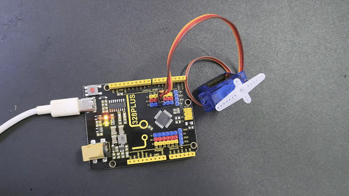

### Project 22 Servo



#### Description

Servo is an actuator that converts electrical signals into mechanical displacement. It plays an important role in life and is widely used in robotics, drones, smart homes as well we industrial control.

In this project, we write Arduino code to control the servo by 328 Plus development board.

#### Hardware

1\. 328 Plus development board x1

2\. Servo x1

3\. DuPont wires

#### Working Principle

There are four main components inside of a hobby servo, a DC motor, a gearbox, a potentiometer and a control circuit. The DC motor is high speed and low torque but the gearbox reduces the speed to around 60 RPM and at the same time increases the torque.



The potentiometer is attached on the final gear or the output shaft, so as the motor rotates the potentiometer rotates as well, thus producing a voltage that is related to the absolute angle of the output shaft. In the control circuit, this potentiometer voltage is compared to the voltage coming from the signal line. If needed, the controller activates an integrated H-Bridge which enables the motor to rotate in either direction until the two signals reach a difference of zero.

A servo motor is controlled by sending a series of pulses through the signal line. The frequency of the control signal should be 50Hz or a pulse should occur every 20ms. The width of pulse determines angular position of the servo and these type of servos can usually rotate 180 degrees (they have a physical limits of travel).


Generally pulses with 1ms duration correspond to 0 degrees position, 1.5ms duration to 90 degrees and 2ms to 180 degrees. Though the minimum and maximum duration of the pulses can sometimes vary with different brands and they can be 0.5ms for 0 degrees and 2.5ms for 180 degrees position.

#### Specifications

T-pro Mini Servo Motor SG-90 9g Servo

Best choice for RC aircraft

Accessories attached

ROHS compliance

Dimension: 23x12.2x29mm

Torque: 0.5kg/cm

Stall torque: 1.5kg/cm at 5V

Operating speed: 0.3sec/60degree at 4.8V

Operating voltage: 4.2-6V

Temperature range: 0-55 °C

Dead band width: 10us

Gear medium: Nylon

#### Pinout



GND Ground (Brown Wire) – This is the ground pin.

VCC +5V (Red Wire) – Voltage is supplied to the servo motor through this Pin.

Control (Orange Wire) – Through this wire, Position control signals are received via PWM.

#### Wiring Diagram

1\. Connect the red wire (positive) of the servo to 5V pin on the board

2\. Connect the black wire (negative) of the servo to GND on the board

3\. Connect the orange wire (signal) of the servo to digital pin D9 on the board




#### Sample Code

```cpp

/*

Keye New RFID Starter Kit

Project 22

Servo

Edit By Keyes

*/

#include <Servo.h>

Servo myservo; // create a Servo object

void setup() {

myservo.attach(9); // connect servo to digital pin 9

}

void loop() {

myservo.write(0); // rotate servo to 0 degree

delay(1000); // delay 1s

myservo.write(90); // rotate servo to 90 degree

delay(1000); // delay 1s

myservo.write(180); // rotate servo to 180 degree

delay(1000); // delay 1s

}

```

#### Code Explanation

Importing Libraries and Creating a Servo Object

First, at the top of the Arduino program, we need to include the `Servo.h` library, which can be done using the preprocessor directive `#include <Servo.h>`. Next, we create an object of the `Servo` class, named `myservo` in this example. This object will be used for all subsequent operations related to the servo motor.

```cpp

#include <Servo.h>

Servo myservo; // Create a servo object

```

Setup Function

In the `setup()` function, we connect the servo motor to a specific digital pin on the Arduino board. In this example, we use digital pin 9. The line `myservo.attach(9);` binds the servo object to digital pin 9, allowing the output signal from that pin to control the servo motor.

```cpp

void setup() {

myservo.attach(9); // Connect the servo motor to digital pin 9

}

```

Loop Function

In the `loop()` function, we write the specific logic to control the servo motor. This function will repeat continuously, forming an infinite loop. In this example, we make the servo motor rotate to 0 degrees, 90 degrees, and 180 degrees, respectively. After each rotation, the program pauses for one second (1000 milliseconds), which is achieved using the `delay(1000);` function.

```cpp

void loop() {

myservo.write(0); // Rotate servo to 0 degrees

delay(1000); // Delay for 1 second

myservo.write(90); // Rotate servo to 90 degrees

delay(1000); // Delay for 1 second

myservo.write(180); // Rotate servo to 180 degrees

delay(1000); // Delay for 1 second

}

```

In this process, the `myservo.write(angle);` function is used to specify the target angle for the servo motor. The parameter `angle` is an integer representing the angle to which the motor should rotate. The Servo library handles the generation of signals to ensure the motor moves to the specified position.

#### Project Result

After uploading code, the servo rotates to 0°, 90° and 180°, with each position for 1s. These actions repeat.



