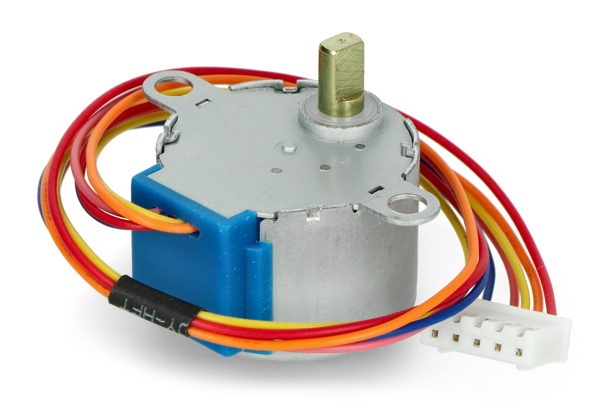
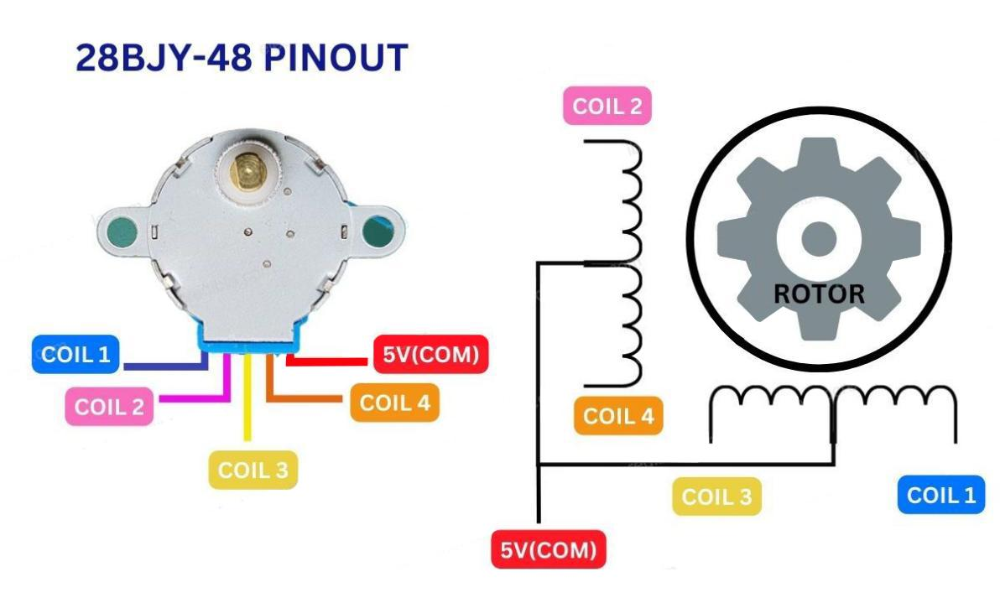
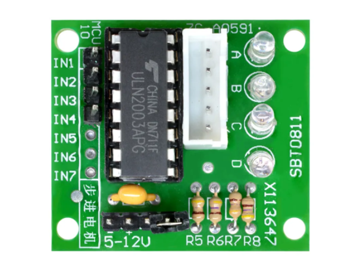
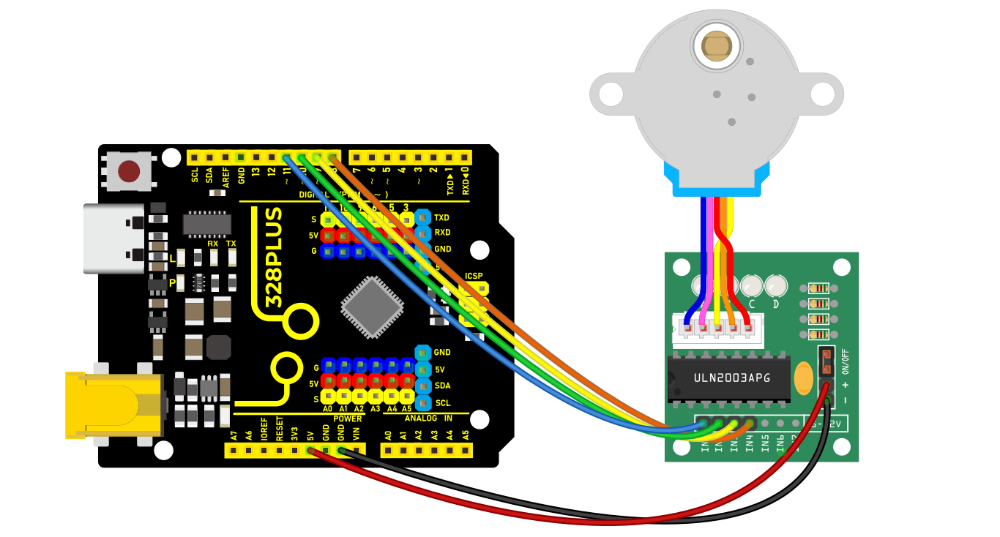
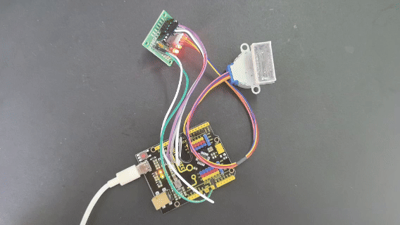

### Project 23 Stepper Motor


#### Description

Stepper motor can convert electrical signals into precise angular displacement to realize precise positioning control. 5V stepper motor only requires a voltage of 5 volts, so it features small size, light weight and simple operation, and is widely used in many electronic equipment and automation system.

In this project, we precisely control the stepper motor by 328 Plus development board. Through this project, you will understand the **Working Principle** of the stepper motor, learn how to control the stepper motor and adjust its speed, rotation direction and rotation Angle as needed.

#### Hardware

1\. 328 Plus development board x1

2\. Stepper Motor 28BYJ-48 x1

3\. ULN2003 stepper motor drive board x1

4\. Breadboard x1

5\. DuPont wires

#### Working Principle

The 28BYJ-48 is a 5-wire unipolar stepper motor that runs on 5V. It’s perfect for projects that require precise positioning, like opening and closing a vent.



Because the motor does not use contact brushes, it has a relatively precise movement and is quite reliable.

Despite its small size, the motor delivers a decent torque of 34.3 mN.m at a speed of around 15 RPM. It provides good torque even at a standstill and maintains it as long as the motor receives power.

The only drawback is that it is somewhat power-hungry and consumes energy even when it is stationary.

#### Stepper Motor Pinout

The 28BYJ-48 stepper motor has five wires. The pinout is as follows:



The 28BYJ-48 has two coils, each of which has a center tap. These two center taps are connected internally and brought out as the 5th wire (red wire).

Together, one end of the coil and the center tap form a **Phase**. Thus, 28BYJ-48 has a total of four phases.

The red wire is always pulled HIGH, so when the other lead is pulled LOW, the phase is energized.

The stepper motor rotates only when the phases are energized in a logical sequence known as a **step sequence**.

The ULN2003 Driver Board

Because the 28BYJ-48 stepper motor consumes a significant amount of power, it cannot be controlled directly by a microcontroller such as Arduino. To control the motor, a driver IC such as the ULN2003 is required; therefore, this motor typically comes with a ULN2003-based driver board.

The ULN2003, known for its high current and high voltage capability, provides a higher current gain than a single transistor and allows a microcontroller’s low voltage low current output to drive a high current stepper motor.

The ULN2003 consists of an array of seven Darlington transistor pairs, each of which can drive a load of up to 500mA and 50V. This board utilizes four of the seven pairs.



The board has four control inputs and a power supply connection.

Additionally, there is a Molex connector that is compatible with the connector on the motor, allowing you to plug the motor directly into it.

The board includes four LEDs that indicate activity on the four control input lines. They provide a good visual indication while stepping.

There is an ON/OFF jumper on the board for disabling the stepper motor if needed.

#### Stepper Driver Pinout

The ULN2003 stepper driver board has the following pinout:


IN1 – IN4 are motor control input pins. Connect them to the Arduino’s digital output pins.

GND is the ground pin.

VCC pin powers the motor. Because the motor consumes a significant amount of power, it is preferable to use an external 5V power supply rather than from the Arduino.

out1-out4 This is where the motor plugs in. The connector is keyed, so it will only go in one way.

#### Wiring Diagram

1.Connect the stepper motor to pins out1, out2, out3 out4 on the ULN2003 drive board.

2.connect ULN2003 drive board + and - to 5V and GND on the development board respectively.

3.Connect digital pins D8, D9, D10, D11 on the development board to pins IN1, IN2, IN3, IN4 on the drive board.



#### Sample Code

```cpp

/*

Keye New RFID Starter Kit

Project 23

Stepper Motor

Edit By Keyes

*/

#include <Stepper.h>

const int stepsPerRevolution = 2048; // the steps of a cycle

// initialization

Stepper myStepper(stepsPerRevolution, 8, 10, 9, 11);

void setup() {

// Set motor speed(rpm)

myStepper.setSpeed(5);

// initialize serial port

Serial.begin(9600);

}

void loop() {

// rotate a cycle clockwise

Serial.println("clockwise");

myStepper.step(stepsPerRevolution);

delay(500);

// rotate half a cycle counterclockwise

Serial.println("counterclockwise");

myStepper.step(-stepsPerRevolution / 2);

delay(500);

}

```

#### Code Explanation

Importing the Library

```cpp

#include <Stepper.h>

```

This line of code imports the Stepper library in Arduino, which provides functions and methods for controlling stepper motors, simplifying the programming complexity.

Defining Constants and Creating a Stepper Object

```cpp

const int stepsPerRevolution = 2048; // Number of steps per revolution

Stepper myStepper(stepsPerRevolution, 8, 10, 9, 11);

```

Here, a constant `stepsPerRevolution` is defined, representing the number of steps required for the motor to complete one revolution. This value depends on the specific model and configuration of the motor. Next, an object `myStepper` of the `Stepper` class is created, initialized with the number of steps and the four pin numbers (8, 10, 9, 11) that control the motor. These four pins are connected to the control interface of the stepper motor driver.

Setup Function

```cpp

void setup() {

myStepper.setSpeed(5); // Set the motor speed (rpm)

Serial.begin(9600); // Initialize the serial port

}

```

In the `setup()` function, the code first calls `myStepper.setSpeed(5);` to set the motor's rotation speed to 5 revolutions per minute (rpm). Then, it initializes the serial communication port using `Serial.begin(9600);`, setting the baud rate to 9600 for data transmission and debugging information output.

Main Loop Function

```cpp

void loop() {

Serial.println("clockwise"); // Output clockwise rotation information

myStepper.step(stepsPerRevolution); // Rotate the motor clockwise by one revolution

delay(500); // Delay for 500 milliseconds

Serial.println("counterclockwise"); // Output counterclockwise rotation information

myStepper.step(-stepsPerRevolution / 2);// Rotate the motor counterclockwise by half a revolution

delay(500); // Delay for 500 milliseconds

}

```

In the `loop()` function, the code first outputs the message "clockwise" using `Serial.println("clockwise");`, then calls `myStepper.step(stepsPerRevolution);` to rotate the motor clockwise by one full revolution. The `delay(500);` function pauses the program for 500 milliseconds.

Next, it outputs the message "counterclockwise" and uses `myStepper.step(-stepsPerRevolution / 2);` to rotate the motor counterclockwise by half a revolution. The negative sign indicates the rotation direction is counterclockwise. After that, it delays for another 500 milliseconds.

#### Project Result

After uploading code, the stepper motor will rotates a cycle clockwise and then half a cycle counterclockwise, in a loop. Meanwhile, the real-time rotation direction can be checked on the monitor.



