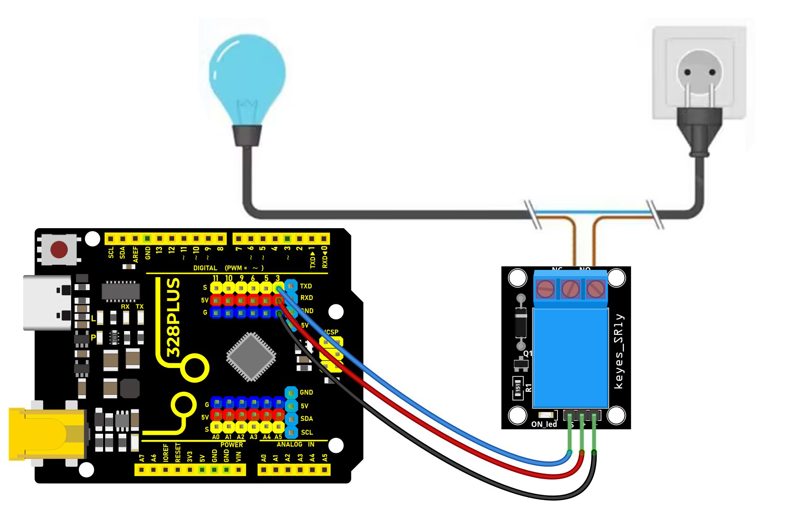
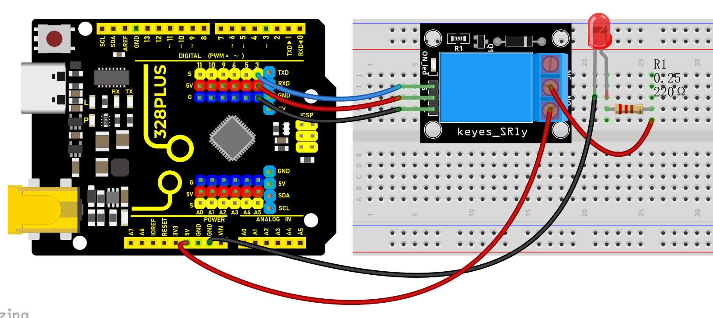
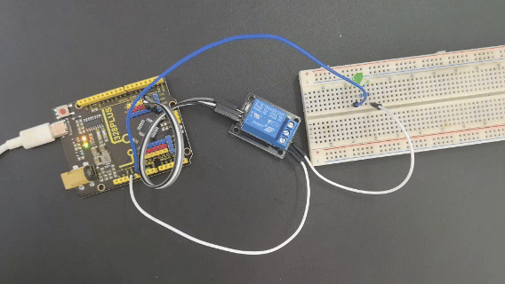

### Project 24 5V Relay


#### Description

Relay module is used to control high current or voltage in a circuit. It consists of a coil and a contact. When the coil is energized, the contacts close, and then the circuit is connected. When the coil is powered off, the contact and is disconnected, thus breaking the circuit.

In this project, we control the 5V relay module through the Arduino development board, so as to realize the switch control of the external circuit or equipment. When the Arduino outputs high, the relay will be triggered, and the normally open contact is closed, so then connect the external circuit; When the Arduino outputs low, the relay will return to its initial state and disconnect the external circuit.

#### Hardware

1. 328 Plus development board x1

2. 5V relay x1

3. LED x1

4. 220 ohm resistor x1

5. DuPont wires

#### Working Principle

At the core of a relay is an electromagnet (a wire coil that becomes a temporary magnet when electricity is passed through it). A relay can be thought of as an electric lever; you turn it on with a relatively small current, and it turns on another device with a much larger current.

Relay Basics

Here’s a small animation showing how a relay links two circuits together.


To illustrate, think about two simple circuits: one with an electromagnet and a switch or sensor, and the other with a magnetic switch and a light bulb.

Initially, both circuits are open, with no current flowing through them.

When a small current flows through the first circuit, the electromagnet is energized, creating a magnetic field around it. The energized electromagnet attracts the second circuit’s contact, closing the switch and allowing a large current to flow.

When the current in the first circuit stops flowing, the contact returns to its original position, reopening the second circuit.

Specifications

Supply voltage – 3.3V to 5V

Quiescent current: 2mA

Current when the relay is active: \~70mA

Relay maximum contact voltage – 250VAC or 30VDC

Relay maximum current – 10A

#### Pinout


GND is the common ground pin.

VCC pin provides power to the module.

S is used to control the relay. This is an active low pin, which means that pulling it LOW activates the relay and pulling it HIGH deactivates it.

Output Terminals:

COM terminal connects to the device you intend to control.

NC terminal is normally connected to the COM terminal, unless you activate the relay, which breaks the connection.

NO terminal is normally open, unless you activate the relay that connects it to the COM terminal.

#### Wiring Diagram

1\. Connect VCC pin of the relay to Arduino 5V

2\. Connect GND pin of the relay to Arduino GND

3\. Connect S pin of the relay to Arduino Digital pin D3

4\. Connect an external circuit or device to the normally open and common contacts of the relay



High voltage connections can be made to this screw terminal. For example: Bulb, ceiling fan etc., But in this project we are just using an LED.

When you make the connection between a) and b), the connected LED is always ON until it receives a signal from the Arduino to turn it OFF.

When you make the connection between b) and c), the connected LED is OFF until it receives a signal from the Arduino to turn it ON.



#### Sample Code

```cpp

/*

Keye New RFID Starter Kit

Project 24

5V Relay

Edit By Keyes

*/

const int relayPin = 3; // set relay pin

void setup() {

pinMode(relayPin, OUTPUT); // set pin to output

}

void loop() {

digitalWrite(relayPin, HIGH); // output high to trigger the relay

delay(1000); // delay 1s

digitalWrite(relayPin, LOW); //output low to disable the relay

delay(1000); // delay 1s

}

```

#### Code Explanation

First, let's start with the first line of the code:

```cpp

const int relayPin = 3; // set relay pin

```

This line defines a constant named `relayPin` and assigns it a value of 3. In Arduino, `const int` is used to define an integer constant, which means that once assigned, `relayPin` cannot be changed during program execution. The number 3 here indicates that the relay is connected to digital I/O pin 3 on the Arduino board.

Next is the `setup()` function:

```cpp

void setup() {

pinMode(relayPin, OUTPUT); // set pin to output

}

```

The `setup()` function is a mandatory part of every Arduino program. It runs only once and is used for initialization. In this function, we call `pinMode()`, which is a built-in function in the Arduino language used to set the mode of a specific pin. The `pinMode()` function takes two parameters: the pin number and the mode. Here, we set the mode of `relayPin` (i.e., digital pin 3) to `OUTPUT`, meaning this pin will be used as an output to send voltage.

Then comes the `loop()` function:

```cpp

void loop() {

digitalWrite(relayPin, HIGH); // output high to trigger the relay

delay(1000); // delay 1s

digitalWrite(relayPin, LOW); //output low to disable the relay

delay(1000); // delay 1s

}

```

The `loop()` function is the core of the Arduino program. It repeatedly executes after the Arduino board is powered on. In this function, we use the `digitalWrite()` function to control the relay. The `digitalWrite()` function also takes two parameters: the pin number and the state (HIGH or LOW). First, we set `relayPin` to `HIGH`, which sends a 5V voltage to the relay, triggering it to close. Then, the program pauses for 1000 milliseconds (i.e., 1 second) using `delay(1000);`, so the relay stays closed for a while.

After that, `digitalWrite(relayPin, LOW);` sets the pin state to `LOW`, cutting off the voltage supply to the relay, causing it to return to the open state. The `delay(1000);` function is called again to pause the program for 1 second, and then this loop starts over.

#### Project Result

After uploading code, the relay changes its state (on or off) per second. When the relay is turned on, NO is connected to COM and external circuit is closed. When the relay is turned off, NO is disconnected to COM and the circuits is opened.



