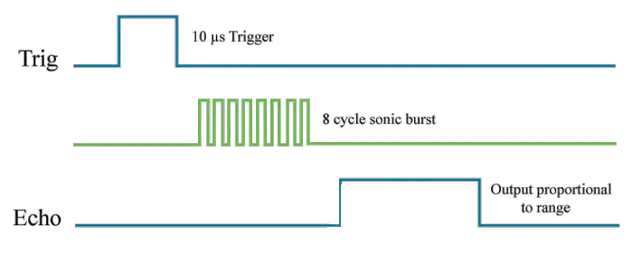
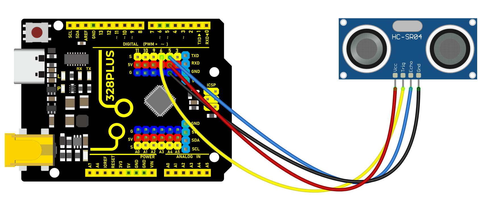
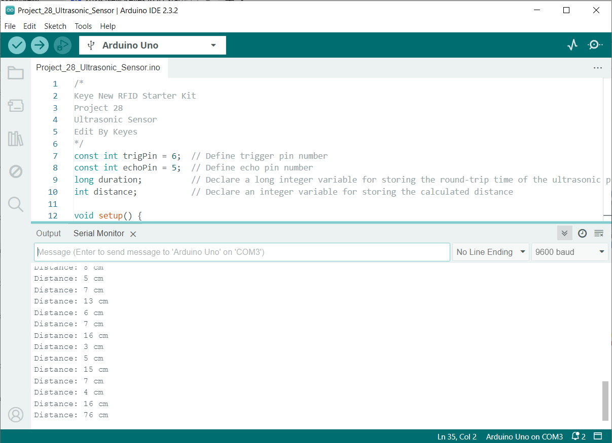

### Project 25 Ultrasonic Sensor


#### Description

HC-SR04 ultrasonic sensor is a commonly used distance measurement sensor, which measures the distance between the object and the sensor. The sensor is small in size, low in price and easy to use, so it has been widely used in robotics, smart home and industrial control.

In this project, we build a distance measurement system by 328 Plus development board and the HC-SR04 ultrasonic sensor. Through this project, you will learn how to measure the distance between an object and the sensor using the HC-SR04 ultrasonic sensor and display the measurement results on a serial monitor.

#### Hardware

1\. 328 Plus development board x1

2\. HC-SR04 ultrasonic sensor x1

3\. DuPont wires

#### Working Principle

It emits an ultrasound at 40 000 Hz which travels through the air and if there is an object or obstacle on its path It will bounce back to the module. Considering the travel time and the speed of the sound you can calculate the distance.


In order to generate the ultrasound we need to set the Trig pin on a High State for 10 µs. That will send out an 8 cycle ultrasonic burst which will travel at the [](https://en.wikipedia.org/wiki/Speed_of_sound). The Echo pins goes high right away after that 8 cycle ultrasonic burst is sent, and it starts listening or waiting for that wave to be reflected from an object.

If there is no object or reflected pulse, the Echo pin will time-out after 38ms and get back to low state.



If we receive a reflected pulse, the Echo pin will go down sooner than those 38ms. According to the amount of time the Echo pin was HIGH, we can determine the distance the sound wave traveled, thus the distance from the sensor to the object.

For that purpose we are using the following basic formula for calculating distance:

*Distance = Speed x Time*

We actually know both the speed and the time values. The time is the amount of time the Echo pin was HIGH, and the speed is the speed of sound which is 340m/s. There’s one additional step we need to do, and that’s divide the end result by 2. and that’s because we are measuring the duration the sound wave needs to travel to the object and bounce back.


Let’s say the Echo pin was HIGH for 2ms. If we want the get the distance result in cm, we can convert the speed of sound value from 340m/s to 34cm/ms.

*Distance = (Speed x Time) / 2* **= (34cm/ms x 1.5ms) / 2 = 25.5cm.**

So, if the Echo pin was HIGH for 2ms (which we measure using the **pulseIn()** function), the distance from the sensor to the object is 34cm.

#### Specifications

Working Voltage DC 5V

Working Current 15mA

Working Frequency 40KHz

Max Range 4m

Min Range 2cm

Measuring Angle 15 degree

Trigger Input Signal 10µS TTL pulse

Echo Output Signal Input TTL lever signal and the range in proportion

#### Pinout


VCC supplies power to the HC-SR04 ultrasonic sensor. You can connect it to the 5V output from your Arduino.

Trig (Trigger) pin is used to trigger ultrasonic sound pulses. By setting this pin to HIGH for 10µs, the sensor initiates an ultrasonic burst.

Echo pin goes high when the ultrasonic burst is transmitted and remains high until the sensor receives an echo, after which it goes low. By measuring the time the Echo pin stays high, the distance can be calculated.

GND is the ground pin. Connect it to the ground of the Arduino.

#### Wiring Diagram

1\. Connect ultrasonic sensor VCC to 5V on the board

2\. Connect ultrasonic sensor Trig pin to digital pin D6 on the board

3\. Connect ultrasonic sensor Echo pin to digital pin D5 on the board

4\. Connect ultrasonic sensor GND pin to GND on the board



#### Sample Code

```cpp

/*

Keye New RFID Starter Kit

Project 25

Ultrasonic Sensor

Edit By Keyes

*/

const int trigPin = 6; // Define trigger pin number

const int echoPin = 5; // Define echo pin number

long duration; // Declare a long integer variable for storing the round-trip time of the ultrasonic pulse

int distance; // Declare an integer variable for storing the calculated distance

void setup() {

pinMode(trigPin, OUTPUT); // Set trigPin as output

pinMode(echoPin, INPUT); // Set echoPin as input

Serial.begin(9600); // Initialize serial communication with a baud rate of 9600

}

void loop() {

digitalWrite(trigPin, LOW); // Ensure the trigger pin is low

delayMicroseconds(2); // Wait for 2 microseconds

digitalWrite(trigPin, HIGH); // Send a 10-microsecond pulse

delayMicroseconds(10); // Keep the pulse for 10 microseconds

digitalWrite(trigPin, LOW); // End the pulse

duration = pulseIn(echoPin, HIGH); // Read the length of the pulse from the echo pin

// Calculate distance: sound speed is 0.034 cm per microsecond, divide the round-trip distance by 2

distance = duration * 0.034 / 2;

Serial.print("Distance: "); // Print text "Distance: "

Serial.print(distance); // Print the measured distance

Serial.println(" cm"); // Print the unit " cm" and go to the next line

delay(500); // Wait for 0.5 seconds before measuring again

}

```

#### Code Explanation

Definition of Pins and Variables

```cpp

const int trigPin = 6;

const int echoPin = 5;

long duration;

int distance;

```

In this section, two constants `trigPin` and `echoPin` are defined, representing the digital pin numbers on the Arduino board connected to the trigger (Trig) and echo (Echo) pins of the HC-SR04 sensor. Additionally, two variables `duration` and `distance` are defined to store the duration of the echo signal and the calculated distance.

Setup Function

```cpp

void setup() {

pinMode(trigPin, OUTPUT);

pinMode(echoPin, INPUT);

Serial.begin(9600);

}

```

The `setup()` function is a standard initialization function in Arduino code that sets the pin modes and initializes serial communication. `pinMode(trigPin, OUTPUT)` and `pinMode(echoPin, INPUT)` set the Trig pin to output mode and the Echo pin to input mode, respectively. `Serial.begin(9600)` starts the serial port and sets the data transmission rate to 9600 bits per second, allowing data to be output to the serial monitor on the computer.

Main Loop

```cpp

void loop() {

digitalWrite(trigPin, LOW);

delayMicroseconds(2);

digitalWrite(trigPin, HIGH);

delayMicroseconds(10);

digitalWrite(trigPin, LOW);

duration = pulseIn(echoPin, HIGH);

distance = duration * 0.034 / 2;

Serial.print("Distance: ");

Serial.print(distance);

Serial.println(" cm");

delay(500);

}

```

The `loop()` function contains the main logic of the program and is repeatedly executed. First, the Trig pin is set to a low level and held for 2 microseconds to ensure the stability of the ultrasonic signal transmission. Then, the Trig pin is set to a high level for 10 microseconds, triggering the sensor to send an ultrasonic pulse. After that, the Trig pin is set back to a low level, waiting for the Echo pin to receive the echo.

`duration = pulseIn(echoPin, HIGH);` measures the time the Echo pin remains at a high level (i.e., the time for the ultrasonic wave to travel back and forth). `distance = duration * 0.034 / 2;` calculates the distance based on the speed of sound (approximately 340 meters/second or 0.034 centimeters/microsecond). Since the sound wave needs to travel both ways, the actual distance is the time multiplied by the speed and then divided by 2.

Finally, the calculated distance is output through the serial port, and there is a delay of 500 milliseconds after each measurement.

#### Project Result

After uploading code, open the serial monitor and set baud rate to 9600. The distance value will be output on the monitor in cm. When the object approaches or keeps away form the sensor, the value changes.



