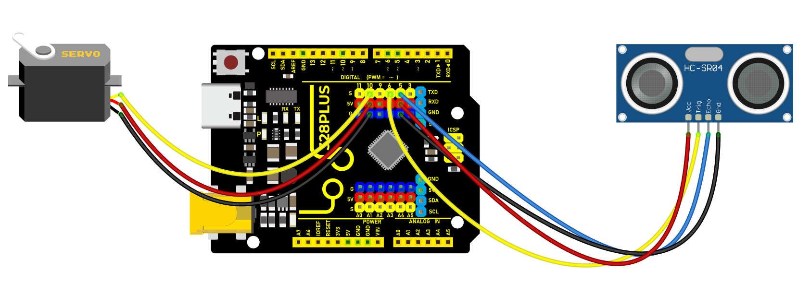
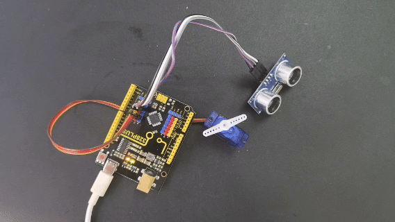

### Project 26 Smart Bin


#### Description

Smart bin not only has the basic functions of traditional garbage cans, but also integrates a variety of intelligent technologies, which brings a lot of convenience to our lives.

In this project, we make a smart bin by 328 Plus development board, ultrasonic sensor and servo. When someone is near the bin, the lid will automatically open; When people leave, the lid automatically closes

#### Hardware

1. 328 Plus development board x1

2. HC-SR04 ultrasonic sensor x1

3. SG90 servo x1

4. DuPont wires

5. Jumper wires

#### Working Principle

The HC-SR04 ultrasonic sensor calculates the distance from the object by transmitting and receiving ultrasonic waves. When a person is detected, the servo controls the lid to open. When the person leaves, the lid closes.


#### Wiring Diagram

1.  Connect HC-SR04 Trig pin to digital pin D6, Echo pin to digital pin D5.
2.  Connect the yellow wire(signal) of servo to digital pin D10 on the board.

 

#### Sample Code

```cpp

/*

Keye New RFID Starter Kit

Project 26

Smart Bin

Edited By Keyes

*/

#include <Servo.h>

const int trigPin = 6; // Ultrasonic sensor Trig pin

const int echoPin = 5; // Ultrasonic sensor Echo pin

const int servoPin = 10; // Servo motor pin

Servo myservo; // Create a servo object

void setup() {

pinMode(trigPin, OUTPUT); // Set Trig pin as output

pinMode(echoPin, INPUT); // Set Echo pin as input

myservo.attach(servoPin); // Attach servo motor to pin 10

myservo.write(0); // Initialize servo to 0 degrees

Serial.begin(9600); // Initialize serial communication with a baud rate of 9600

}

void loop() {

long duration, distance;

// Send a 10-microsecond high pulse to trigger the ultrasonic sensor

digitalWrite(trigPin, LOW);

delayMicroseconds(2);

digitalWrite(trigPin, HIGH);

delayMicroseconds(10);

digitalWrite(trigPin, LOW);

// Read the high pulse duration from the Echo pin

duration = pulseIn(echoPin, HIGH);

// Calculate distance (in centimeters)

distance = duration * 0.034 / 2;

// Print the distance value to the serial monitor

Serial.print("Distance: ");

Serial.print(distance);

Serial.println(" cm");

if (distance < 20) { // If the distance is less than 20 cm, open the lid

myservo.write(180);

delay(3000); // Keep it open for 3 seconds

} else { // If the distance is greater than 20 cm, close the lid

myservo.write(0);

}

delay(100); // Delay for 100 milliseconds

}

```

#### Code Explanation

**Library File Inclusion:**

```cpp

#include <Servo.h>

```

This includes the Arduino Servo library, which is used to control the servo motor.

**Pin Definitions and Object Creation:**

```cpp

const int trigPin = 6; // Trig pin for the ultrasonic sensor

const int echoPin = 5; // Echo pin for the ultrasonic sensor

const int servoPin = 10; // Pin for the servo motor

Servo myservo; // Create a servo motor object

```

Defines the Trig and Echo pins for the ultrasonic sensor and the pin for the servo motor connection. It also creates a servo object for later control.

**Initialization Setup:**

```cpp

void setup() {

pinMode(trigPin, OUTPUT); // Set the Trig pin as an output

pinMode(echoPin, INPUT); // Set the Echo pin as an input

myservo.attach(servoPin); // Attach the servo to digital pin 10

myservo.write(0); // Set initial servo position to 0 degrees (closed position)

Serial.begin(9600); // Initialize serial communication at 9600 baud rate

}

```

Sets the pin modes for the ultrasonic sensor, connects the servo, and initializes its position. Serial communication is also started for debugging and monitoring sensor data.

**Main Loop Function:**

```cpp

void loop() {

// ... (continued as above)

}

```

In the main loop, the ultrasonic sensor data is continuously read, and the servo's action is controlled based on distance.

**Ultrasonic Sensor Trigger and Read:**

```cpp

// Send a 10-microsecond high pulse to trigger the ultrasonic sensor

digitalWrite(trigPin, LOW);

delayMicroseconds(2);

digitalWrite(trigPin, HIGH);

delayMicroseconds(10);

digitalWrite(trigPin, LOW);

// Read the high duration on the Echo pin

duration = pulseIn(echoPin, HIGH);

```

Sends a specific pulse signal to trigger the ultrasonic sensor, then uses the `pulseIn` function to measure the duration of the high signal on the Echo pin.

**Distance Calculation:**

```cpp

// Calculate distance (in centimeters)

distance = duration * 0.034 / 2;

```

Calculates the distance from the sensor to an object based on the principle of ultrasonic sensors. Sound travels in air at approximately 340 meters per second, or 0.034 centimeters per microsecond. Because the sound has to travel to and from the object, the result is divided by two.

**Serial Distance Output:**

```cpp

// Print the distance to the serial monitor

Serial.print("Detected Distance: ");

Serial.print(distance);

Serial.println(" cm");

```

Outputs the calculated distance to the serial monitor, which can be viewed in the Arduino IDE.

**Servo Motor Control:**

```cpp

if (distance < 20) { // If the distance is less than 20 cm, open the trash bin lid

myservo.write(180); // Rotate the servo to 180 degrees (open position)

delay(3000); // Keep it open for 3 seconds

} else { // If the distance is 20 cm or greater, close the trash bin lid

myservo.write(0); // Rotate the servo to 0 degrees (closed position)

}

```

Determines if someone is nearby based on distance. If the detected distance is less than 20 centimeters, it assumes someone is approaching and opens the trash bin lid, holding it open for 3 seconds; otherwise, the servo maintains a closed position.

**Loop Delay:**

```cpp

delay(100); // Delay for 100 milliseconds to control loop frequency

```

Delays the loop by 100 milliseconds to prevent the loop from running too quickly and consuming excessive resources.

#### Project Result

When someone is near the bin (less than 20 cm away), the lid will automatically open for 3 seconds.

When people leave (the distance is greater than or equal to 20 cm), the lid automatically closes to keep the environment clean.



