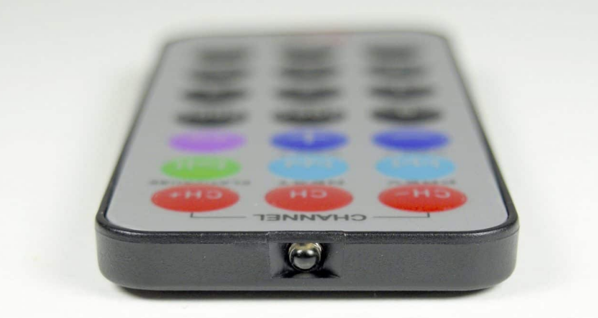
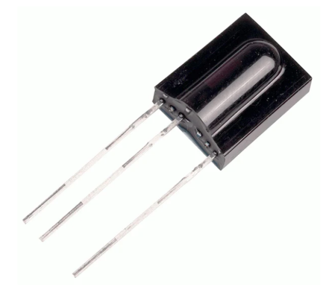
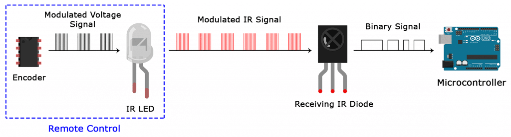
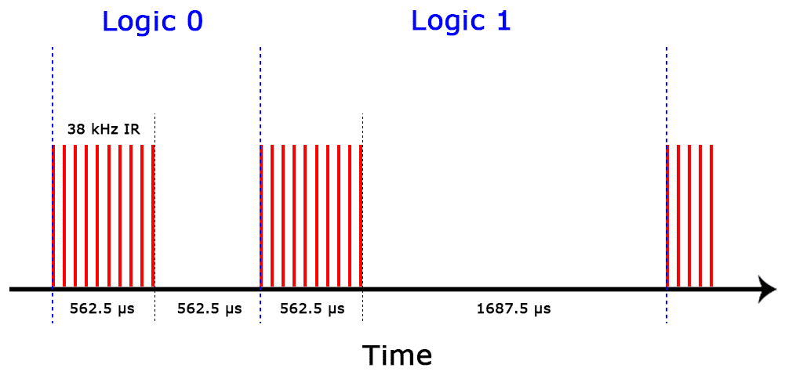
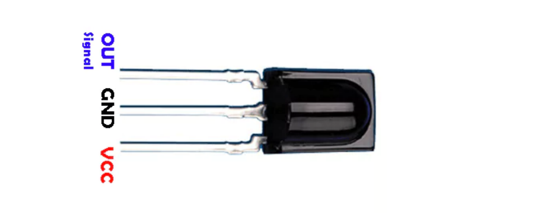
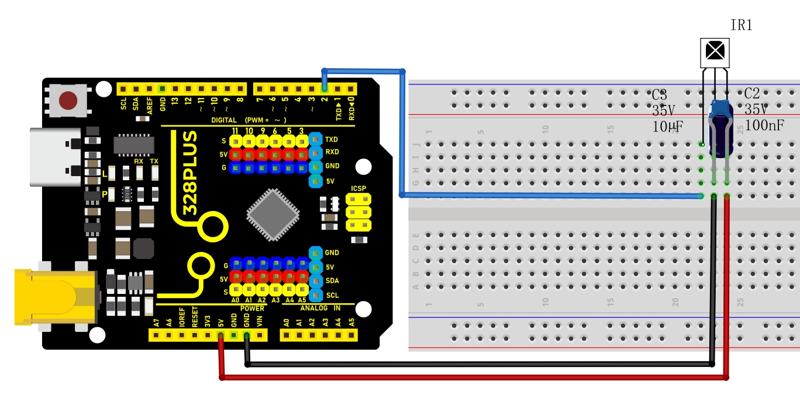
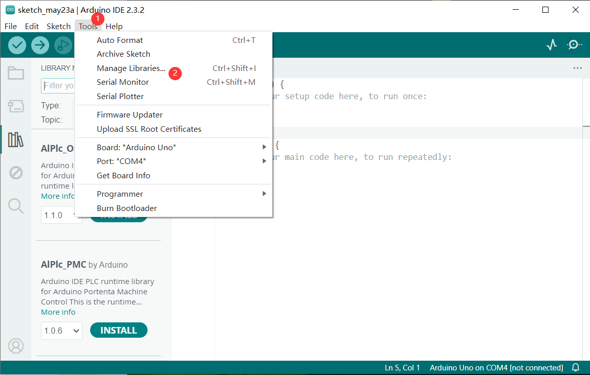
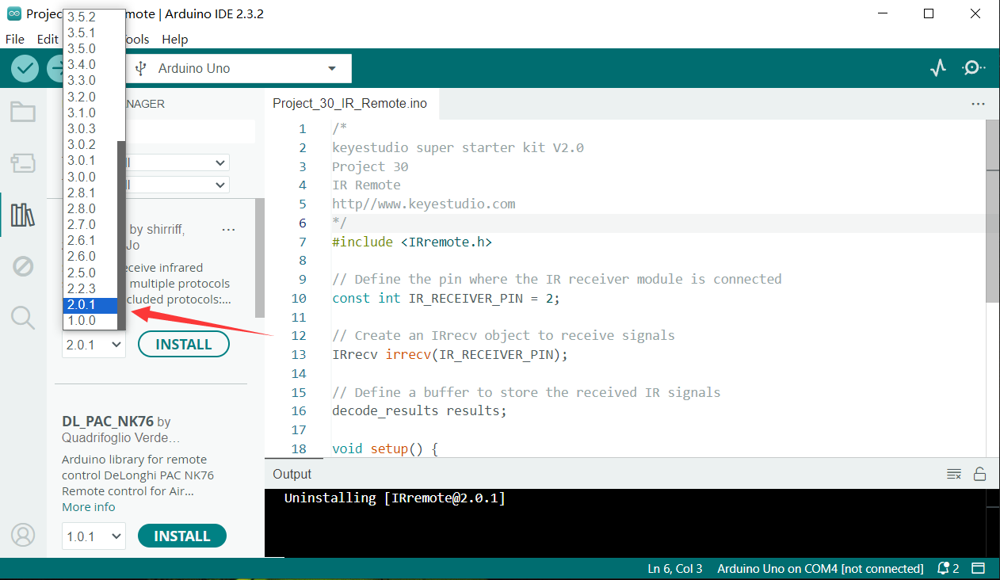
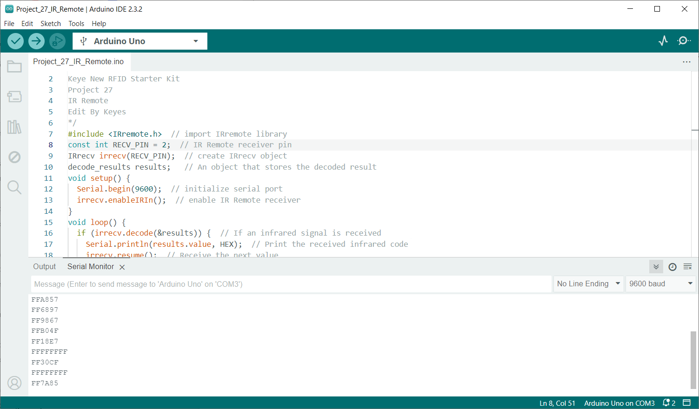

### Project 27 IR Remote


#### Description

IR control is a wireless remote control equipment for signal transmission. It is widely used in TV, air conditioning, audio and other household appliances. By transmitting infrared signals, it controls the receiver to perform corresponding operations.

In this project, we realize infrared remote control function by Arduino programming on 328 Plus development board.

#### Hardware

1. 328 Plus development board x1

2. Infrared Remote Controller x1
   
3. Infrared Receiver x1
   
4. 100NF capacitor x1
   
5. 10μF capacitor x1
   
6. Breadboard x1
   
7. Jumper wires

#### Working Principle

**WHAT IS INFRARED?**

Infrared radiation is a form of light similar to the light we see all around us. The only difference between IR light and visible light is the frequency and wavelength. Infrared radiation lies outside the range of visible light, so humans can’t see it:


Because IR is a type of light, IR communication requires a direct line of sight from the receiver to the transmitter. It can’t transmit through walls or other materials like WiFi or Bluetooth.

**HOW IR REMOTES AND RECEIVERS WORK**

A typical infrared communication system requires an IR transmitter and an IR receiver. The transmitter looks just like a standard LED, except it produces light in the IR spectrum instead of the visible spectrum. If you have a look at the front of a TV remote, you’ll see the IR transmitter LED:



The IR receiver is a photodiode and pre-amplifier that converts the IR light into an electrical signal. IR receiver diodes typically look like this:



**IR SIGNAL MODULATION**

IR light is emitted by the sun, light bulbs, and anything else that produces heat. That means there is a lot of IR light noise all around us. To prevent this noise from interfering with the IR signal, a signal modulation technique is used.

In IR signal modulation, an encoder on the IR remote converts a binary signal into a modulated electrical signal. This electrical signal is sent to the transmitting LED. The transmitting LED converts the modulated electrical signal into a modulated IR light signal. The IR receiver then demodulates the IR light signal and converts it back to binary before passing on the information to a microcontroller:



The modulated IR signal is a series of IR light pulses switched on and off at a high frequency known as the carrier frequency. The carrier frequency used by most transmitters is 38 kHz, because it is rare in nature and thus can be distinguished from ambient noise. This way the IR receiver will know that the 38 kHz signal was sent from the transmitter and not picked up from the surrounding environment.

The receiver diode detects all frequencies of IR light, but it has a band-pass filter and only lets through IR at 38 kHz. It then amplifies the modulated signal with a pre-amplifier and converts it to a binary signal before sending it to a microcontroller.

**IR TRANSMISSION PROTOCOLS**

The pattern in which the modulated IR signal is converted to binary is defined by a transmission protocol. There are many IR transmission protocols. Sony, Matsushita, NEC, and RC5 are some of the more common protocols.

The NEC protocol is also the most common type in Arduino projects, so I’ll use it as an example to show you how the receiver converts the modulated IR signal to a binary one.

Logical ‘1’ starts with a 562.5 µs long HIGH pulse of 38 kHz IR followed by a 1,687.5 µs long LOW pulse. Logical ‘0’ is transmitted with a 562.5 µs long HIGH pulse followed by a 562.5 µs long LOW pulse:



This is how the NEC protocol encodes and decodes the binary data into a modulated signal. Other protocols differ only in the duration of the individual HIGH and LOW pulses.

#### Specifications

Operating Voltage: 2.5V to 5.5V

Carrier Frequency (38kHz)

Operating current: 5mA

High Range and wide coverage area.

Improved immunity against HF and RF noise

Has in-built pre amplifier

TTL and CMOS compatible

#### Pinout



VCC: development board 5V

GND: development board GND

OUT: development board digital pin

#### Wiring Diagram

1.  Connect VCC of IR Remote component to 5V on the board
2.  Connect GND of IR Remote component to GND on the board
3.  Connect OUT of IR Remote component to the digital pin D2 on the board

4. Connect the 100NF and 10μF capacitors between the VCC and GND of the IR receiver.




### Install Library

Before starting to code, we need to install the IRremote library file first.

**Navigate to Library Manager**: Click on the “Tools” menu option, then select “Manage Libraries…”.



**Search for Libraries**:

In the Library Manager window that pops up, you'll see a search box. Enter the name of the" IRremote " library .


**Select and Install Libraries**:

Open the list in the IRremote library file, select version 2.0.1, click and install.



An “Install” button will appear on the right side of the window. Click the “Install” button.


**Wait for Installation**: The Arduino IDE will automatically download and install the selected library. Once the installation is complete, the “Install” button will change to “Installed”, indicating a successful installation.

#### Code Explanation

First, introduce the IRremote library:

```cpp

#include <IRremote.h>

```

This line of code imports the IRremote library. The IRremote library is a library for Arduino that allows Arduino to communicate with external devices via infrared signals. This library supports multiple infrared protocols and can decode signals from common devices such as TV remotes and air conditioner remotes.

Define the receiving pin and objects

Next, the code defines the pin for receiving infrared signals and the necessary objects:

```cpp

const int RECV_PIN = 2; // IR Remote receiver pin

IRrecv irrecv(RECV_PIN); // create IRrecv object

decode_results results; // An object that stores the decoded result

```

Here, `RECV_PIN` defines the pin number on the Arduino for receiving infrared signals, which is set to pin 2. The `IRrecv` object `irrecv` is initialized by specifying the pin and is used to set and read infrared signals. The `decode_results` object `results` is used to store the decoded infrared signal data.

Initialization and configuration

In the `setup()` function, some basic initialization and configuration are performed:

```cpp

void setup() {

Serial.begin(9600); // initialize serial port

irrecv.enableIRIn(); // enable IR Remote receiver

}

```

`Serial.begin(9600);` initializes serial communication with a baud rate of 9600 for data output and display. `irrecv.enableIRIn();` starts the infrared receiver, enabling it to begin receiving signals from the infrared remote control.

Main loop

In the `loop()` function, the code processes the received infrared signals:

```cpp

void loop() {

if (irrecv.decode(&results)) { // If an infrared signal is received

Serial.println(results.value, HEX); // Print the received infrared code

irrecv.resume(); // Receive the next value

}

delay(100); // delay 100ms

}

```

This part of the code is the core of the program, continuously checking whether an infrared signal has been received. `irrecv.decode(&results)` checks if a signal has been received, and if so, the function returns `true` and stores the decoded result in the `results` object. Next, `Serial.println(results.value, HEX);` outputs the received infrared code in hexadecimal format to the serial monitor for observation and debugging. `irrecv.resume();` prepares to receive the next infrared signal. `delay(100);` pauses for 100 milliseconds after each iteration of the loop to avoid excessively frequent processing.

#### Sample Code

```cpp

/*

Keye New RFID Starter Kit

Project 27

IR Remote

Edit By Keyes

*/

#include <IRremote.h> // import IRremote library

const int RECV_PIN = 2; // IR Remote receiver pin

IRrecv irrecv(RECV_PIN); // create IRrecv object

decode_results results; // An object that stores the decoded result

void setup() {

Serial.begin(9600); // initialize serial port

irrecv.enableIRIn(); // enable IR Remote receiver

}

void loop() {

if (irrecv.decode(&results)) { // If an infrared signal is received

Serial.println(results.value, HEX); // Print the received infrared code

irrecv.resume(); // Receive the next value

}

delay(100); // delay 100ms

}

```

#### Project Result

After uploading code, open the serial monitor and set baud rate to 9600. When you press the key on the remote control, the serial monitor displays the received infrared code. Each key corresponds to a unique coded value.



