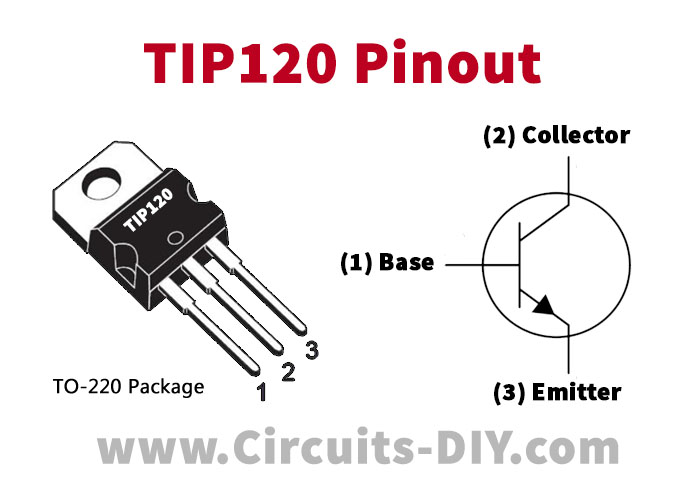
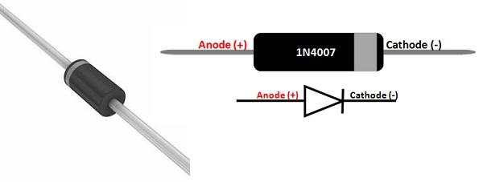
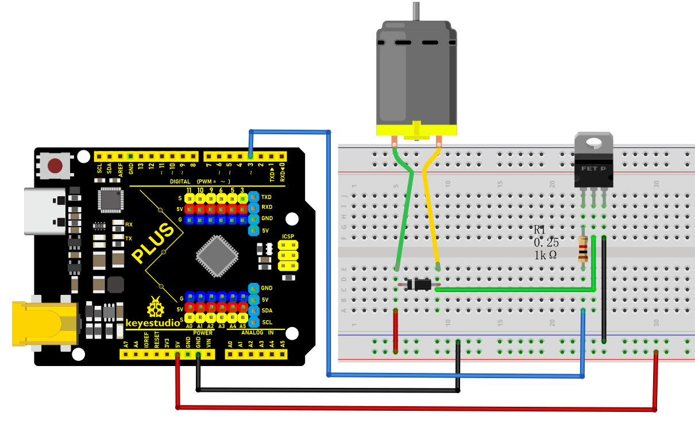
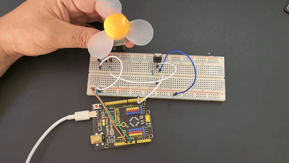

### Project 28 Motor fan


#### Description

The goal of this project is to create a fan system controlled by an Arduino, with adjustable motor speed. By using PWM (Pulse Width Modulation) signals, we can accurately control the fan speed to meet different usage needs. We will use a TIP120 transistor as a switch to drive the motor and achieve speed control through simple Arduino code.

#### Hardware

1\. 328 Plus development board x1

2\. DC Motor x1

3\. TIP120 power transistor x1

4\. 1N4007 diode x1

5\. 1KΩ resistor x1

6\. Breadboard x1

7\. Jumper wires

#### Working Principle

The core of this project is to use Arduino to generate a PWM signal to control the TIP120 transistor. A PWM signal is essentially a type of analog signal, and by adjusting the duty cycle, we can effectively control the current flowing through the motor, thus changing its speed. The TIP120 acts as a switch to control the current of the 130 DC motor, and with the protection of the 1N4007 diode, it prevents damage to the circuit due to the motor's back EMF.

#### Pinout



#### Wiring Diagram

1\. Connect the positive pole of the motor to the collector pin of TIP120 power transistor.

2\. Connect the emitter pin of TIP120 to GND on the board.

3\. Connect the cathode (with white ring) of the 1N4007 diode to the positive pole of the motor and the anode to the power positive.

4\. Connect one end of the 1KΩ resistor to the digital pin D3 on the development board and the other end to the base pin of TIP120.

5\. Connect board GND to power negative.



#### Sample Code

```cpp

/*

Keye New RFID Starter Kit

Project 28

Motor fan

Edit By Keyes

*/

const int motorPin = 3; // Define the motor control pin

void setup() {

pinMode(motorPin, OUTPUT); // Set the motor pin to output mode

}

void loop() {

// Gradually increase PWM signal

for (int speed = 0; speed <= 255; speed++) {

analogWrite(motorPin, speed);

delay(10); // Delay to observe motor speed change

}

// Gradually decrease PWM signal

for (int speed = 255; speed >= 0; speed--) {

analogWrite(motorPin, speed);

delay(10); // Delay to observe motor speed change

}

}

```

#### Code Explanation

**Constant Definition**: `const int motorPin = 3;` sets the PWM output pin for motor control to D3.

**setup() Function**: Use the `pinMode()` function to set motorPin to output, enabling the sending of PWM signals.

**loop() Function**: Two for loops are used to gradually increase and decrease motor speed:

First, the speed increases gradually from 0 to 255, using `analogWrite()` to send PWM signals to motorPin.

Then, the speed decreases gradually from 255 to 0, completing a full acceleration and deceleration process.

#### Project Result

Once the code is successfully connected and uploaded, the Arduino will control the motor speed, enabling the fan to speed up and slow down. By observing the change in fan speed, we can intuitively understand how PWM affects motor speed.



