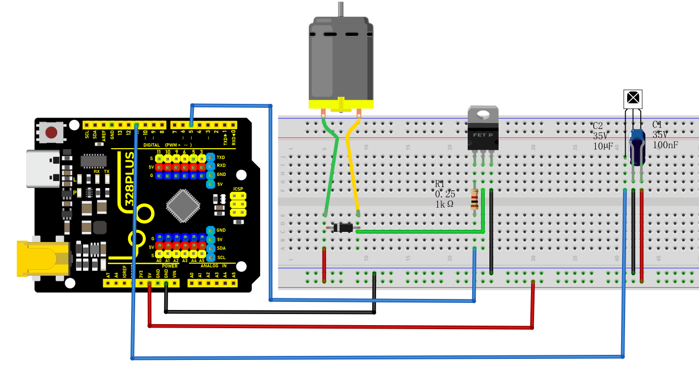
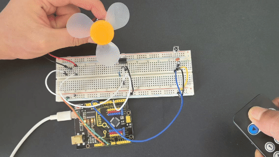

### Project 29 Smart Fan


#### Description

Imagine how cool it would be to make a smart fan that can be controlled remotely! In this project, we use an Arduino microcontroller and infrared (IR) receiver components to create a smart fan system. The fan can be turned on and off and the speed can be adjusted using an IR remote control.

#### Hardware 

1\. 328 Plus development board X1

2\. TIP120 power transistor X1

3\. DC motor X1

4\. 1N4007 diode X1

5\. VS1838 Infrared receiver X1

6\. Infrared remote control X1

7\. 1KΩ resistor X1

8\. 100NF capacitor X1

9\. 10μF capacitor X1

10\. Breadboard and connecting wires

#### Working Principle

The project works by detecting the environment temperature and receiving remote control signals:

1\. **TIP120 Transistor**: The Arduino pin cannot provide enough current to drive the motor, so the TIP120 is used as a switch to allow a larger current to drive the motor.

2\. **1N4007 Diode**: Protects the circuit by preventing damage from the back electromotive force generated when the motor stops.

3\. **IR Remote Control and Receiver**: The IR receiver module receives signals from the remote, allowing the user to manually control the fan's on/off function.

#### **Wiring Diagram**

1\. Use a 1KΩ resistor to connect the base of the TIP120 to the digital pin D5 on the Arduino. Connect the collector to one end of the motor and the emitter to GND.

2\. Connect the anode of the 1N4007 diode to the other end of the motor, and parallel the cathode back to the positive terminal of the power supply.

3\. Connect the VCC and GND of the IR receiver to the 5V and GND on the Arduino, and connect the signal pin to D11.

4\. Connect the 100NF and 10μF capacitors between the VCC and GND of the IR receiver.



#### **Sample Code**

```cpp

/*

Keye New RFID Starter Kit

Project 29

Smart Fan

Edit By Keyes

*/

#include <IRremote.h> // Include the infrared remote library

int RECV_PIN = 11; // Pin connected to the infrared receiver

int MOTOR_PIN = 5; // Motor control pin (PWM)

int motorSpeed = 0; // Motor speed, range 0-255

IRrecv irrecv(RECV_PIN); // Create an infrared receiver object

decode_results results; // Structure to store decoding results

void setup()

{

Serial.begin(9600); // Initialize serial communication at 9600 baud rate

irrecv.enableIRIn(); // Enable infrared reception

pinMode(MOTOR_PIN, OUTPUT); // Set motor pin as output

analogWrite(MOTOR_PIN, motorSpeed); // Initial speed is 0, motor is off

}

void loop()

{

if (irrecv.decode(&results)) // If an infrared signal is received

{

unsigned long value = results.value;

Serial.print("Received infrared value: 0x");

Serial.println(value, HEX); // Print the infrared value in hexadecimal to the serial monitor

// Perform actions based on the received infrared value

if (value == 0xFF02FD) // Assume the "OK" button is encoded as 0xFF02FD

{

// Control fan power

if (motorSpeed == 0)

{

motorSpeed = 128; // Set fan to medium speed

Serial.println("Fan is on, medium speed");

}

else

{

motorSpeed = 0;

Serial.println("Fan is off");

}

analogWrite(MOTOR_PIN, motorSpeed);

}

else if (value == 0xFF629D) // Assume the "UP" button is encoded as 0xFF629D

{

// Increase fan speed

motorSpeed += 50;

if (motorSpeed > 255) motorSpeed = 255; // Limit to maximum value

analogWrite(MOTOR_PIN, motorSpeed);

Serial.print("Fan speed increased, current speed: ");

Serial.println(motorSpeed);

}

else if (value == 0xFFA857) // Assume the "DOWN" button is encoded as 0xFFA857

{

// Decrease fan speed

motorSpeed -= 50;

if (motorSpeed < 0) motorSpeed = 0; // Limit to minimum value

analogWrite(MOTOR_PIN, motorSpeed);

Serial.print("Fan speed decreased, current speed: ");

Serial.println(motorSpeed);

}

else

{

Serial.println("Undefined button");

}

irrecv.resume(); // Receive the next infrared signal

}

}

```

#### Code Explanation

**Initialization Section**

`#include <IRremote.h>`: Includes the IRremote library, which is a standard library for decoding infrared signals.

**Variable Declarations**:

`int RECV_PIN = 11;`: Defines the pin number 11 where the infrared receiver is connected.

`int MOTOR_PIN = 5;`: Defines the motor control pin, using PWM signal, connected to pin 5.

`int motorSpeed = 0;`: Initializes the motor speed, ranging from 0 to 255, with an initial value of 0 indicating the motor is not running.

**Objects and Structures**:

`IRrecv irrecv(RECV_PIN);`: Creates an infrared receiver object `irrecv`, connected to the specified pin.

`decode_results results;`: Defines a structure `results` to store the decoded infrared signals.

**`setup()` Function**

**`Serial.begin(9600);`**: Initializes serial communication with a baud rate of 9600, used for outputting information to the serial monitor.

**`irrecv.enableIRIn();`**: Enables the infrared receiving function to start listening for infrared signals.

**`pinMode(MOTOR_PIN, OUTPUT);`**: Sets the motor control pin as an output.

**`analogWrite(MOTOR_PIN, motorSpeed);`**: Controls the motor speed using PWM signal, initially set to 0 to keep the motor off.

**`loop()` Function**

This is the core part of the program, continuously checking for infrared signal input and processing different functions based on the received signals.

**`if (irrecv.decode(&results))`**: Checks if there is an infrared signal and decodes it.

**`unsigned long value = results.value;`**: Retrieves the raw infrared signal code.

**`Serial.print("Received IR value: 0x");` and `Serial.println(value, HEX);`**: Outputs the received infrared value in hexadecimal format to the serial monitor.

**Functionality Check**:

`if (value == 0xFF02FD)`: Checks if the received signal is the code for the "OK" button, 0xFF02FD.

If `motorSpeed == 0`, it means the fan is currently off, so it sets it to medium speed (128) and outputs "Fan turned on, medium speed".

If `motorSpeed` is not zero, it means the fan is currently on, so it turns it off (sets `motorSpeed = 0`) and outputs "Fan turned off".

Finally, it controls the actual motor speed using `analogWrite(MOTOR_PIN, motorSpeed);`.

`else if (value == 0xFF629D)`: Checks if it is the "UP" button, used to increase the fan speed, with the code 0xFF629D.

Increases the `motorSpeed` value (+50), ensuring it does not exceed the maximum value of 255.

After adjustment, writes the new speed value to the motor control pin using `analogWrite(MOTOR_PIN, motorSpeed);`.

Outputs the current fan speed information to the serial monitor.

`else if (value == 0xFFA857)`: Checks if it is the "DOWN" button, used to decrease the fan speed, with the code 0xFFA857.

Decreases the `motorSpeed` value (-50), ensuring it does not go below the minimum value of 0.

Uses `analogWrite(MOTOR_PIN, motorSpeed);` to control the updated motor speed.

Outputs the current fan speed to the serial monitor.

`else`: If an undefined infrared code is received, outputs "Undefined button" to the serial monitor.

**`irrecv.resume();`**: Prepares to receive the next infrared signal.

#### Project Result

This code successfully implements a fan that can be controlled using an infrared remote. Users can turn the fan on or off with the remote and adjust the fan speed using different buttons.



