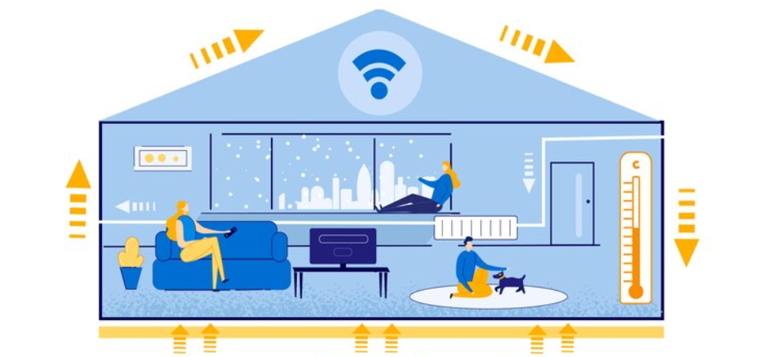
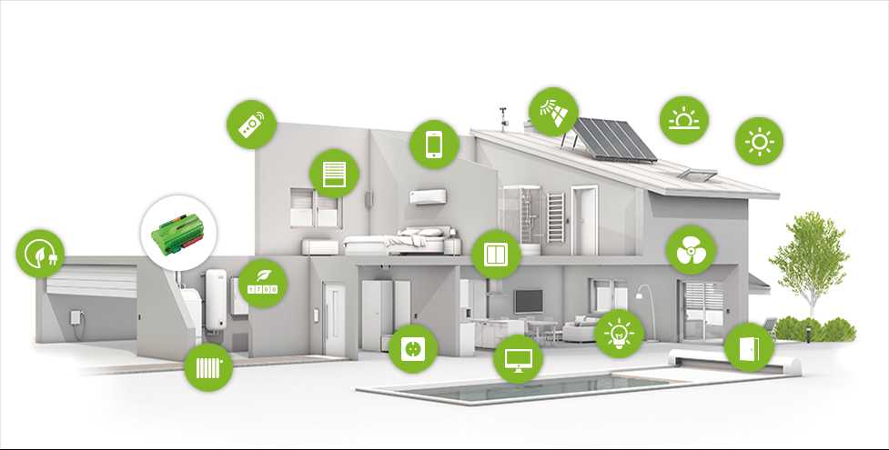
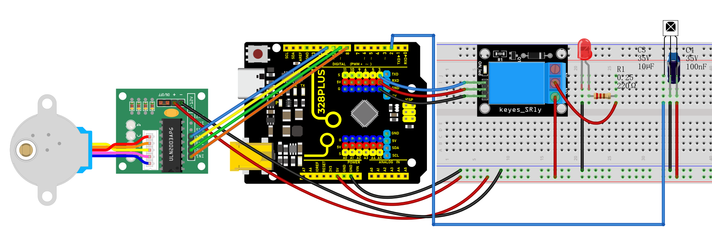
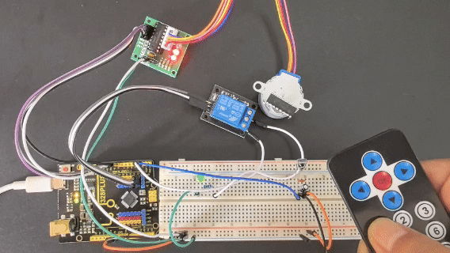

### Project 30 infrared remote control Smart Home



#### Description

Smart home adopts artificial intelligence technology to provide people with a more comfortable, convenient and safe living experience. It covers many aspects from lighting, security, home appliance control to environmental monitoring, so we can manage and control the home environment through intelligent devices and systems.

In this project, we create a smart home system by the Keyestudio development board, infrared remote control module, relay and stepper motor. You can control various household appliances, such as lights, fans and curtains, with an infrared remote control.

#### Hardware

1\. 328 Plus development board x1

2\. IR receiver x1

3\. Relay module x1

4\. Stepper motor x1

5\. Stepper motor driver x1

6\. IR remote control x1

7\. LED x1

8\. 100NF capacitor x1

9\. 10μF capacitor x1

10\. 220Ω resistor x1

11\. DuPont wires x1

12\. Jumper wires

13\. Breadboard x1

#### Working Principle

When you press the button on the remote control, the infrared receiver receives the corresponding infrared signals. These signals will be decoded to trigger corresponding actions. For example, press the "Light" button to turn on or off the connected light via the relay; press the "Curtain" button to open or close the curtain through stepper motor.



#### Wiring Diagram

1.  Connect digital pin D8, D9, D10, D11 on the board to pins IN1, IN2, IN3, IN4 of the stepper motor via DuPont wires.
2.  Connect pin S of the relay to digital pin D3 on the board.
3.  Connect LED pins to the normally-open contacts and common contacts of the relay.
4.  Connect OUT pin of IR receiver to the digital pin D2 on the board.

 

#### Sample Code

```cpp

/*

Keye New RFID Starter Kit

Project 30

infrared remote Smart Home

Edit By Keyes

*/

#include <IRremote.h>

#include <Stepper.h>

#define IR_RECEIVE_PIN 2

#define RELAY_PIN 3

#define STEPS_PER_REV 2048

IRrecv irrecv(IR_RECEIVE_PIN);

decode_results results;

Stepper stepper(STEPS_PER_REV, 8, 10, 9, 11);

void setup() {

irrecv.enableIRIn(); // initialize ir receiver

pinMode(RELAY_PIN, OUTPUT); // set relay pin to output

stepper.setSpeed(10); // set the stepper motor speed

}

void loop() {

if (irrecv.decode(&results)) {

switch (results.value) {

case 0xFF6897: // light button

digitalWrite(RELAY_PIN, !digitalRead(RELAY_PIN)); // change the relay state

break;

case 0xFF9867: // open curtain button

stepper.step(STEPS_PER_REV); // stepper motor rotates to open the curtain

break;

case 0xFFB04F: // close curtain button

stepper.step(-STEPS_PER_REV); // stepper motor reverses to close the curtain

break;

}

irrecv.resume(); // receive next ir receiver

}

}

```

#### Code Explanation

The code includes references to two libraries:

```cpp

#include <IRremote.h>

#include <Stepper.h>

```

The `IRremote.h` library is used to implement functionality related to infrared remote control, enabling the Arduino to receive and decode signals from an infrared remote. The `Stepper.h` library is used to control a stepper motor, allowing it to rotate with precise angles, which is very useful in automated control systems, such as automatic curtain control.

Next, the code defines some constants and objects:

```cpp

#define IR_RECEIVE_PIN 2

#define RELAY_PIN 3

#define STEPS_PER_REV 2048

IRrecv irrecv(IR_RECEIVE_PIN);

decode_results results;

Stepper stepper(STEPS_PER_REV, 8, 10, 9, 11);

```

`IR_RECEIVE_PIN` defines the pin number (pin 2) where the infrared receiver is connected to the Arduino.

`RELAY_PIN` defines the pin number (pin 3) where the relay is connected.

`STEPS_PER_REV` represents the number of steps required for the stepper motor to complete one full revolution (2048 steps).

An `IRrecv` object is created to handle the reception of infrared signals, and a `decode_results` object is used to store the decoded results. The `Stepper` object is configured with the parameters of the stepper motor, including the number of steps per revolution and the four pins used to control the motor.

In the `setup()` function, some basic initialization settings are made:

```cpp

void setup() {

irrecv.enableIRIn(); // Initialize the infrared receiver

pinMode(RELAY_PIN, OUTPUT); // Set the relay pin as an output

stepper.setSpeed(10); // Set the speed of the stepper motor

}

```

Here, `irrecv.enableIRIn()` starts the infrared receiver module, `pinMode(RELAY_PIN, OUTPUT)` sets the relay pin as an output, and `stepper.setSpeed(10)` sets the rotation speed of the stepper motor.

The `loop()` function is the core of the code. It continuously checks if an infrared signal has been received and performs corresponding actions based on the different signals:

```cpp

void loop() {

if (irrecv.decode(&results)) {

switch (results.value) {

case 0xFF6897: // "Turn on light" button

digitalWrite(RELAY_PIN, !digitalRead(RELAY_PIN)); // Toggle the relay state

break;

case 0xFF9867: // "Open curtain" button

stepper.step(STEPS_PER_REV); // Rotate the stepper motor to open the curtain

break;

case 0xFFB04F: // "Close curtain" button

stepper.step(-STEPS_PER_REV); // Rotate the stepper motor in reverse to close the curtain

break;

}

irrecv.resume(); // Continue receiving the next infrared signal

}

}

```

In this code, `irrecv.decode(&results)` checks if an infrared signal has been received and decodes it. The decoded results are stored in the `results` object. Depending on the different signal values, actions such as toggling the relay or controlling the rotation of the stepper motor are executed. After each operation, `irrecv.resume()` is called to prepare for receiving the next signal.

#### Project Result

With this smart home system, you can easily control lights and curtains (stepper motor) using an infrared remote. Based on the remote key codes read from previous projects, pressing the "1" key on the remote will toggle the lights on or off. Pressing the "2" key will automatically open the curtains (stepper motor rotates forward), and pressing the "3" key will automatically close the curtains (stepper motor rotates backward). This simple and intuitive method makes it more convenient to manage your home devices, enhancing your living comfort.



