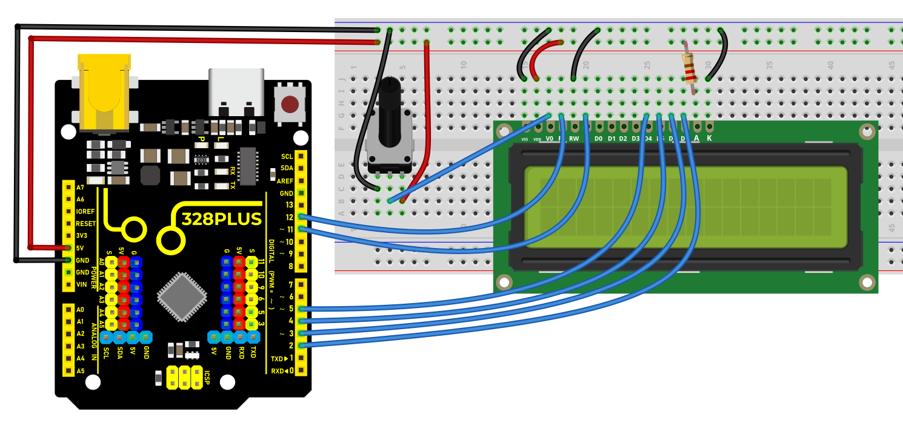
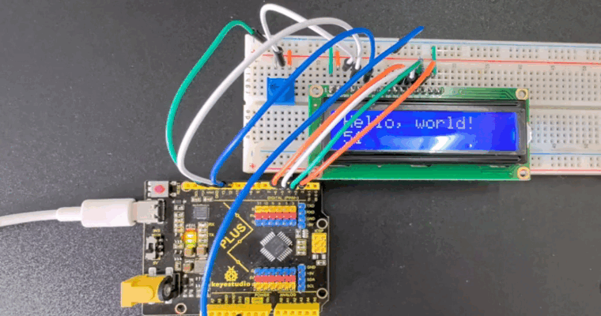

### Project 31 1602 LCD


#### Description

1602 LCD boasts 16 columns and 2 rows that can display a total of 32 characters. It is easy to use and features low cost, so it is widely used in various electronic equipment.

In this project, we will write programs on the Arduino development board to control the 1602 LCD to display what we want to show.

#### Hardware

1\. 328 Plus development board x1

2\. 1602 LCD display x1

3\. 10K potentiometer x1

4\. Breadboard x1

5\. Jumper wires

#### Working Principle

An LCD screen is an electronic display module that uses liquid crystal to produce a visible image. The 16×2 LCD display is a very basic module commonly used in [](https://www.electronicsforu.com/category/electronics-projects/hardware-diy) and circuits. The 16×2 translates a display of 16 characters per line in 2 such lines. In this LCD, each character is displayed in a 5×7 pixel matrix.


#### Specifications

Display Type: Alphanumeric character display

Character Format: 5x8 dots matrix format

Display Size: 16 characters x 2 lines

Display Color: Blue or Green

Backlight: LED backlight

Voltage Supply: 5V DC

Operating Temperature: -20°C to +70°C

Interface: 4-bit or 8-bit mode

Dimension: 84.0 x 44.0 x 13.0 mm

#### Pinout


| **No.** | **Mark** | **Pin Description**       | **No.** | **Mark** | **Pin Description**       |
|---------|----------|---------------------------|---------|----------|---------------------------|
| 1       | VSS      | Power GND                 | 9       | D2       | Date I/O                  |
| 2       | VDD      | Power positive            | 10      | D3       | Date I/O                  |
| 3       | V0       | LCD voltage bias signal   | 11      | D4       | Date I/O                  |
| 4       | RS       | Select data/command (V/L) | 12      | D5       | Date I/O                  |
| 5       | R/W      | Select read/write(H/L)    | 13      | D6       | Date I/O                  |
| 6       | E        | Enable signal             | 14      | D7       | Date I/O                  |
| 7       | D0       | Date I/O                  | 15      | A        | Back light power positive |
| 8       | D1       | Date I/O                  | 16      | K        | Back light power negative |

Two power pins, one for module power, another one for back light, generally use 5V. In this project, we use 3.3V for backlight.

**V0** is the pin for adjusting contrast ratio. It usually connects a potentiometer(no more than 5KΩ) in series for its adjustment. In this experiment, we use a 1KΩ resistor. For its connection, it has two methods, namely high potential and low potential. Here, we use low potential method; connect the resistor and then the GND.

**RS** is a very common pin in LCD. It’s a selecting pin for command/data. When the pin is in high level, it’s in data mode; when it’s in low level, it’s in command mode.

**RW** pin is also very common in LCD. It’s a selecting pin for read/write. When the pin is in high level, it’s in read operation; if in low level, it’s in write operation.

**E** pin is also very common in LCD. Usually, when the signal in the bus is stabilized, it sends out a positive pulse requiring read operation. When this pin is in high level, the bus is not allowed to have any change.

**D0-D7** is 8-bit bidirectional parallel bus, used for command and data transmission.

**BLA** is anode for back light; BLK, cathode for back light.

#### Wiring Diagram

Connect 1602 LCD pin VSS to GND

Connect 1602 LCD pin VDD to 5V

Connect 1602 LCD pin V0 to the middle pin of the 10K potentiometer, and the two ends of the potentiometer are connected to 5V and GND respectively.

Connect 1602 LCD pin RS to Arduino digital pin D12

Connect 1602 LCD pin RW to GND

Connect 1602 LCD pin E to Arduino digital pin D11

Connect 1602 LCD pin D4 to Arduino digital pin D5

Connect 1602 LCD pin D5 to Arduino digital pin D4

Connect 1602 LCD pin D6 to Arduino digital pin D3

Connect 1602 LCD pin D7 to Arduino digital pin D2

Connect 1602 LCD pin A to 5V, K to GND





#### Sample Code

```cpp

/*

Keye New RFID Starter Kit

Project 31

1602 LCD

Edit By Keyes

*/

#include <LiquidCrystal.h>

// Initialize 1602 LCD and set the Arduino pin

LiquidCrystal lcd(12, 11, 5, 4, 3, 2);

void setup() {

// set the numbers of row and column of 1602 LCD

lcd.begin(16, 2);

// Print character strings on 1602 LCD

lcd.print("Hello, world!");

}

void loop() {

// set the the cursor to row 2 column 0

lcd.setCursor(0, 1);

// Print the current operating time in ms

lcd.print(millis() / 1000);

}

```

#### Code Explanation

Introduction to the LiquidCrystal Library

```cpp

#include <LiquidCrystal.h>

```

This line of code is the beginning of the program. It includes the LiquidCrystal library using the `#include` directive. This library provides functions and methods for controlling liquid crystal displays (LCDs), particularly those compatible with the HD44780 controller. This type of LCD is very common and widely used for displaying text output on various devices.

Initializing the LCD

```cpp

LiquidCrystal lcd(12, 11, 5, 4, 3, 2);

```

This line of code creates a `LiquidCrystal` object named `lcd`. The numbers inside the parentheses represent the Arduino pins connected to the LCD. These pins are RS, E, D4, D5, D6, and D7, respectively. This connection method is known as 4-bit mode, where only four data lines (D4 to D7) are used to transmit data.

Setup Function

```cpp

void setup() {

lcd.begin(16, 2);

lcd.print("Hello, world!");

}

```

The `setup()` function is a mandatory part of every Arduino program. It is executed only once after the Arduino board is reset. In this function, `lcd.begin(16, 2);` is called first to set the number of columns and rows of the LCD. In this example, it is set to 16 columns and 2 rows.

Immediately after that, `lcd.print("Hello, world!");` displays the text "Hello, world!" on the LCD. This demonstrates how to print a string on the LCD.

Loop Function

```cpp

void loop() {

lcd.setCursor(0, 1);

lcd.print(millis() / 1000);

}

```

The `loop()` function is another core part of Arduino code. It runs indefinitely after the device is reset. In this function, `lcd.setCursor(0, 1);` sets the cursor position to the beginning of the second row (note that row and column numbering starts from 0).

Then, `lcd.print(millis() / 1000);` calculates the number of seconds since the program started running and displays it on the LCD. Here, the `millis()` function returns the number of milliseconds since the program began, and dividing it by 1000 converts it to seconds.

#### Project Result

After uploading code, the 1602 LCD will displays two rows of contents: "Hello, world!" on the first line and the current operating time (ms) of Arduino development board on the second line.



Through this project, you learned how to use 1602 LCD via 328 Plus development board. You may modify codes to try complex functions, such as showing different messages and adding other modules like button or temperature.

