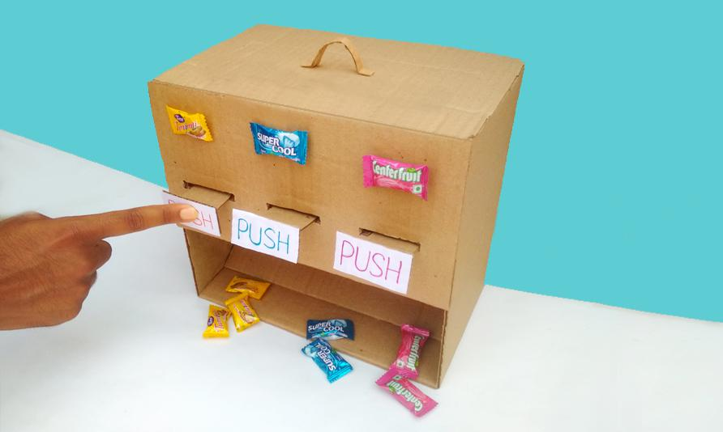
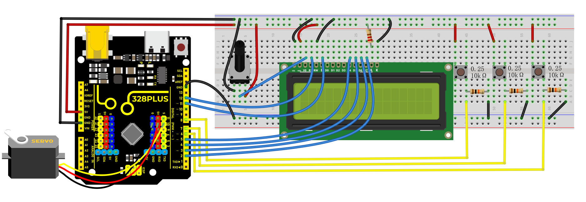
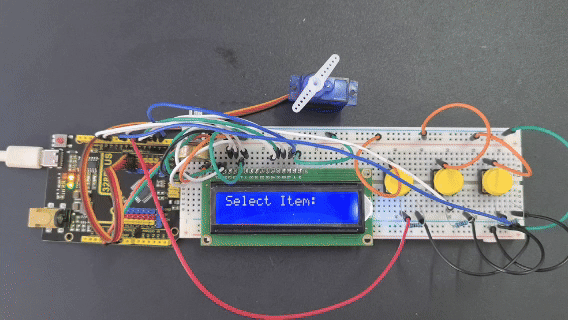

### Project 33 Vending Machine



#### Description

A vending machine is like a small shop, offering people all kinds of goods and serving 24 hours a day. From drinks, snacks to daily necessities, and even mobile phone top-up and ticket purchase, vending machines are everywhere, and it brings great convenience to our lives.

In this project, we build a simple vending machine by 328 Plus development board. For the machine, we can select products via buttons, and LCD displays product information and prices, and servo controls the delivery.

Through this project, you can have a clear understand of Arduino programming and learn how to use buttons, servo and LCD display.

#### Hardware

1\. 328 Plus development board x1

2\. button x3

3\. servo x1

4\. LCD display (16x2) x1

5\. Breadboard x1

6\. DuPont wires

7\. Jumper wires

#### Working Principle

When different buttons are pressed, the Arduino development board will detect the status of each button to select the corresponding product. The LCD displays the name and price of the selected item. After confirming the purchase, the servo rotates to a specific Angle to send the product out. The selling process is completed.


#### Wiring Diagram

1.  Connect the yellow wire(signal) of servo to the digital pin D10 on the board.
2.  Connect the S pins of buttons to digital pins D6, D7, D8,on the board.
3.  For 1602 LCD module, connect VSS to GND, VDD to 5V, V0 to the middle pin of the 10K potentiometer. The two ends of the potentiometer are connected to 5V and GND respectively. Connect RS of LCD to pin D12 on the board, RW to GND, E to board pin D11, D4 to board pin D5, D5 to board pin D4, D6 to board pin D3, D7 to board pin D2, A to 5V and K to GND.




#### Sample Code

```cpp

/*

Keye New RFID Starter Kit

Project 33

Vending machine

Edit By Keyes

*/

#include <LiquidCrystal.h>

#include <Servo.h>

// Initialize LCD1602

LiquidCrystal lcd(12, 11, 5, 4, 3, 2);

// Initialize servo motor

Servo myservo;

// Define button pins

const int button1Pin = 6;

const int button2Pin = 7;

const int button3Pin = 8;

// Item selection variable

int selectedItem = 0;

void setup() {

// Set button pin modes

pinMode(button1Pin, INPUT);

pinMode(button2Pin, INPUT);

pinMode(button3Pin, INPUT);

// Initialize LCD

lcd.begin(16, 2);

lcd.print("Select Item:");

// Initialize servo motor

myservo.attach(10);

myservo.write(0); // Initial position

}

void loop() {

// Read button states

int button1State = digitalRead(button1Pin);

int button2State = digitalRead(button2Pin);

int button3State = digitalRead(button3Pin);

// Detect button 1 (select previous item)

if (button1State == HIGH) {

selectedItem--;

if (selectedItem < 0) {

selectedItem = 2; // Assume there are 3 items

}

updateLCD();

delay(200); // Debounce delay

}

// Detect button 2 (select next item)

if (button2State == HIGH) {

selectedItem++;

if (selectedItem > 2) {

selectedItem = 0;

}

updateLCD();

delay(200); // Debounce delay

}

// Detect button 3 (confirm purchase)

if (button3State == HIGH) {

dispenseItem();

delay(200); // Debounce delay

}

}

void updateLCD() {

lcd.clear();

lcd.print("Select Item:");

lcd.setCursor(0, 1);

lcd.print("Item ");

lcd.print(selectedItem + 1); // Display item number

}

void dispenseItem() {

lcd.clear();

lcd.print("Dispensing...");

myservo.write(180); // Rotate servo to release item

delay(1000); // Wait for item to be released

myservo.write(0); // Reset servo

lcd.clear();

lcd.print("Select Item:");

}

```

#### Code Explanation

Importing Library Files

```cpp

#include <LiquidCrystal.h>

#include <Servo.h>

```

These two lines of code import the libraries necessary for controlling the LCD1602 liquid crystal display and the servo motor.

LCD1602 Initialization

```cpp

LiquidCrystal lcd(12, 11, 5, 4, 3, 2);

```

The `LiquidCrystal` object is created and initialized for the LCD1602 display, using digital pins 12, 11, 5, 4, 3, and 2 on the Arduino.

Servo Motor Initialization

```cpp

Servo myservo;

```

Creating a `Servo` object to control the servo motor.

Defining Button Pins and Selected Item Variable

```cpp

const int button1Pin = 6;

const int button2Pin = 7;

const int button3Pin = 8;

int selectedItem = 0;

```

Three button pins (pin 6, pin 7, pin 8) are defined along with a variable `selectedItem` to store the currently selected item.

Setup Function

```cpp

void setup() {

pinMode(button1Pin, INPUT);

pinMode(button2Pin, INPUT);

pinMode(button3Pin, INPUT);

lcd.begin(16, 2);

lcd.print("Select Item:");

myservo.attach(10);

myservo.write(0);

}

```

In the `setup()` function, the button pins are set to input mode, the LCD display is initialized, and "Select Item:" is printed on the first line. The servo motor is then attached to pin 10, and its initial position is set to 0 degrees.

Main Loop

```cpp

void loop() {

int button1State = digitalRead(button1Pin);

int button2State = digitalRead(button2Pin);

int button3State = digitalRead(button3Pin);

if (button1State == HIGH) {

selectedItem--;

if (selectedItem < 0) {

selectedItem = 2;

}

updateLCD();

delay(200);

}

if (button2State == HIGH) {

selectedItem++;

if (selectedItem > 2) {

selectedItem = 0;

}

updateLCD();

delay(200);

}

if (button3State == HIGH) {

dispenseItem();

delay(200);

}

}

```

In the `loop()` function, the state of each button is constantly read. If button 1 is pressed, the previous item is selected; if button 2 is pressed, the next item is selected. If button 3 is pressed, the `dispenseItem()` function is called to dispense the currently selected item. After each button press, the LCD display is updated, and there is a 200-millisecond debounce delay.

Updating LCD Display

```cpp

void updateLCD() {

lcd.clear();

lcd.print("Select Item:");

lcd.setCursor(0, 1);

lcd.print("Item ");

lcd.print(selectedItem + 1);

}

```

The `updateLCD()` function clears the current display on the LCD and reprints "Select Item:" along with the currently selected item's number.

Distribution of Items

```cpp

void dispenseItem() {

lcd.clear();

lcd.print("Dispensing...");

myservo.write(180);

delay(1000);

myservo.write(0);

lcd.clear();

lcd.print("Select Item:");

}

```

The `dispenseItem()` function displays the message "Dispensing..." and then rotates the servo motor to 180 degrees to distribute the item. After waiting for a second, the servo motor is returned to its initial position, and the message "Select Item:" is displayed again.

#### Project Result

On the LCD1602 display, you can clearly see the prompt "Select Item:" along with the number of the currently selected item.

When Button 1 and Button 2 are pressed, the LCD1602 screen promptly updates to reflect the newly selected item number. Pressing Button 3 causes the servo motor to rotate 180 degrees, simulating the dispensing of an item (after which it delays for one second before returning to its initial position). During this process, the LCD1602 shows the message "Dispensing...". After dispensing, the screen returns to the selection interface.



