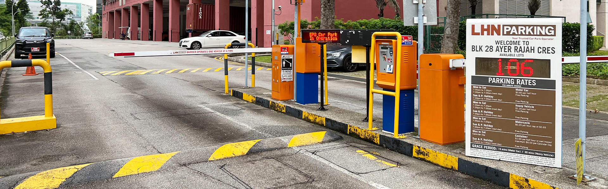
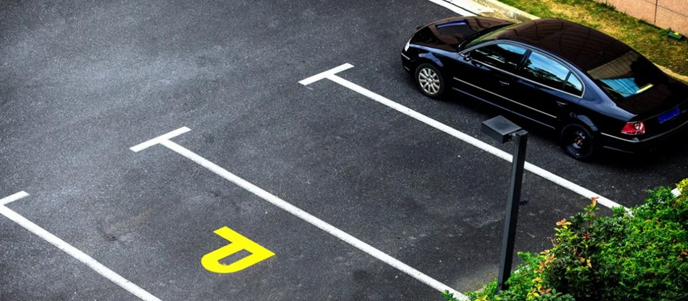
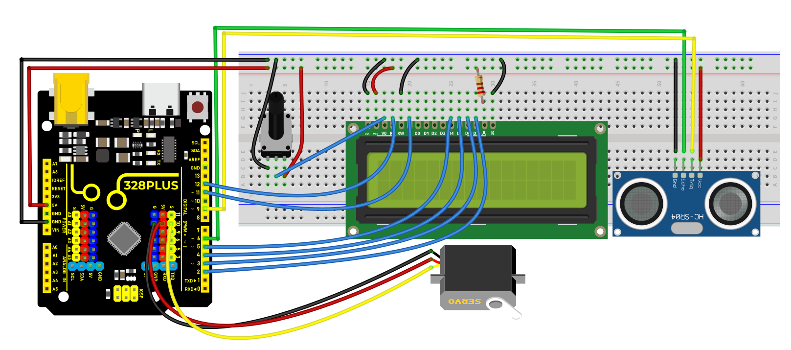
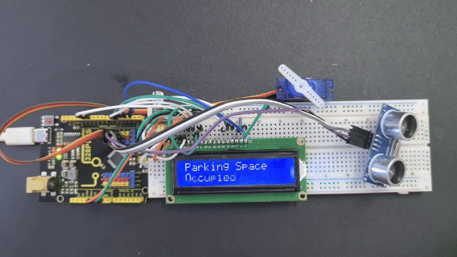

### Project 34 Parking Management



#### Description

Parking management is an indispensable part of modern city life, which involves parking, charging and security. An efficient parking management system can alleviate traffic congestion, improve parking efficiency, and ensure the safety of vehicles and personnel.

In this project, we implement a simple parking management system by the 328 Plus development board, ultrasonic sensor, servo and LCD display. This system detects the presence of vehicles to open or close the gate, and displays the status of parking Spaces on an LCD.

#### Hardware

1\. 328 Plus development board x1

2\. HC-SR04 ultrasonic sensor x1

3\. SG90 servo x1

4\. LCD 1602 display x1

5\. Breadboard x1

6\. DuPont wires

7\. Jumper wires

#### Working Principle

Ultrasonic sensor detects the presence of vehicles. When the vehicle enters the parking lot, the sensor detect it and send a signal to the development board. After receiving the signal, the board will control the servo to rotate to the specified Angle to simulate the opening of the gate. At the same time, the LCD shows the status of the parking space, such as "parking space occupied". When the vehicle leaves, the ultrasonic sensor detects it and the servo rotates the initial Angle to close the gate. On LCD, the parking status will be updated to "parking free".



#### Wiring Diagram

1.  Connect the Trig pin of HC-SR04 to digital pin D9, Echo pin to digital pin D6.
2.  Connect the yellow wire(signal) of servo to the digital pin D10 on the board.
3.  For 1602 LCD module, VSS to GND，VDD to 5V, V0 to the middle pin of the 10K potentiometer. The two ends of the potentiometer are connected to 5V and GND respectively. Connect RS of LCD to pin D12 on the board, RW to GND, E to board pin D11, D4 to board pin D5, D5 to board pin D4, D6 to board pin D3, D7 to board pin D2, A to 5V and K to GND.




#### Sample Code

```cpp

/*

Keye New RFID Starter Kit

Project 34

Parking Management

Edit By Keyes

*/

#include <Servo.h>

#include <LiquidCrystal.h>

const int trigPin = 9;

const int echoPin = 6;

const int servoPin = 10;

const int rs = 12, en = 11, d4 = 5, d5 = 4, d6 = 3, d7 = 2;

Servo myServo;

LiquidCrystal lcd(rs, en, d4, d5, d6, d7);

void setup() {

pinMode(trigPin, OUTPUT);

pinMode(echoPin, INPUT);

myServo.attach(servoPin);

lcd.begin(16, 2);

}

void loop() {

long duration, distance;

digitalWrite(trigPin, LOW);

delayMicroseconds(2);

digitalWrite(trigPin, HIGH);

delayMicroseconds(10);

digitalWrite(trigPin, LOW);

duration = pulseIn(echoPin, HIGH);

distance = (duration / 2) / 29.1;

if (distance < 10) {

myServo.write(90);

lcd.setCursor(0, 0);

lcd.print("Parking Space");

lcd.setCursor(0, 1);

lcd.print("Occupied");

} else {

myServo.write(0);

lcd.setCursor(0, 0);

lcd.print("Parking Space");

lcd.setCursor(0, 1);

lcd.print("Available");

}

delay(500);

lcd.clear();

}

```

#### Code Explanation

First, let's start by including the necessary libraries to control the servo motor and LCD in the Arduino IDE. You can do this by adding the following lines of code:

```cpp

#include <Servo.h>

#include <LiquidCrystal.h>

```

These libraries are essential for managing the servo motor and operating the LCD, respectively.

Next, we need to define the pins for the ultrasonic sensor, servo motor, and LCD that are connected to the Arduino. For example:

```cpp

int trigPin = 9; // Trigger pin for the ultrasonic sensor

int echoPin = 6; // Echo pin for the ultrasonic sensor

int servoPin = 10; // Control pin for the servo motor

```

For connecting the LCD, the number of pins required can vary depending on the type of LCD used. Assuming a common 1602 LCD, the connection would look like this:

```cpp

LiquidCrystal lcd(12, 11, 5, 4, 3, 2);

```

In the `setup()` function, we'll configure the pin modes, connect the servo motor, and initialize the LCD display. This includes setting the pin modes for the ultrasonic sensor and activating the servo motor and LCD:

```cpp

void setup() {

pinMode(trigPin, OUTPUT);

pinMode(echoPin, INPUT);

Servo myServo;

myServo.attach(servoPin);

lcd.begin(16, 2);

}

```

During the main `loop()`, the system first measures the distance using the ultrasonic sensor. This involves sending a short pulse through `trigPin` and then measuring the time it takes for `echoPin` to receive the echo:

```cpp

void loop() {

digitalWrite(trigPin, LOW);

delayMicroseconds(2);

digitalWrite(trigPin, HIGH);

delayMicroseconds(10);

digitalWrite(trigPin, LOW);

long duration = pulseIn(echoPin, HIGH);

int distance = duration * 0.034 / 2;

```

Based on the measured distance, the system decides how to operate the servo motor and what information to display on the LCD. If the distance is less than 10 centimeters, indicating a vehicle is present, the servo motor rotates 90 degrees to open the door, and the LCD displays "Parking Space Occupied":

```cpp

if (distance < 10) {

myServo.write(90);

lcd.setCursor(0, 0);

lcd.print("Parking Space");

lcd.setCursor(0, 1);

lcd.print("Occupied");

} else {

myServo.write(0);

lcd.setCursor(0, 0);

lcd.print("Parking Space");

lcd.setCursor(0, 1);

lcd.print("Available");

}

delay(500);

lcd.clear();

}

```

This setup efficiently manages parking space availability and provides clear, real-time updates on an LCD screen.

#### Project Result

When a vehicle enters the parking lot, the servo rotates to 90 degrees to open the gate, and the LCD displays "Parking Space Occupied".

When it leaves, the servo rotates to 0 degrees to close the gate, and the LCD displays "Parking Space Available".



