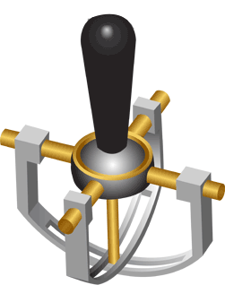
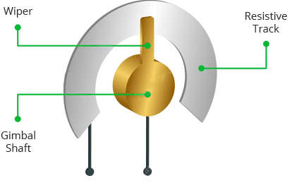
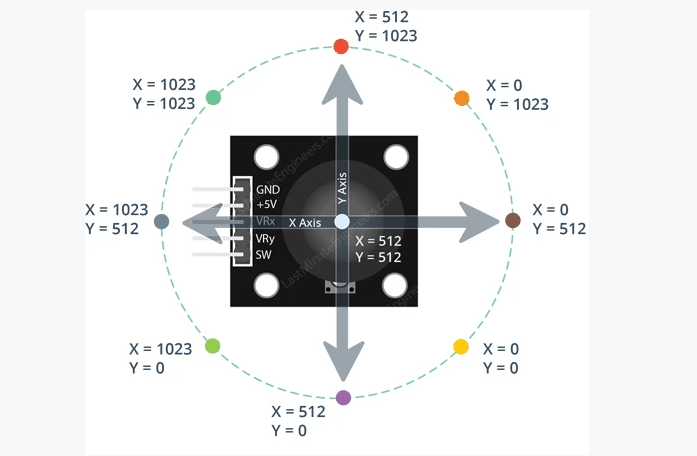
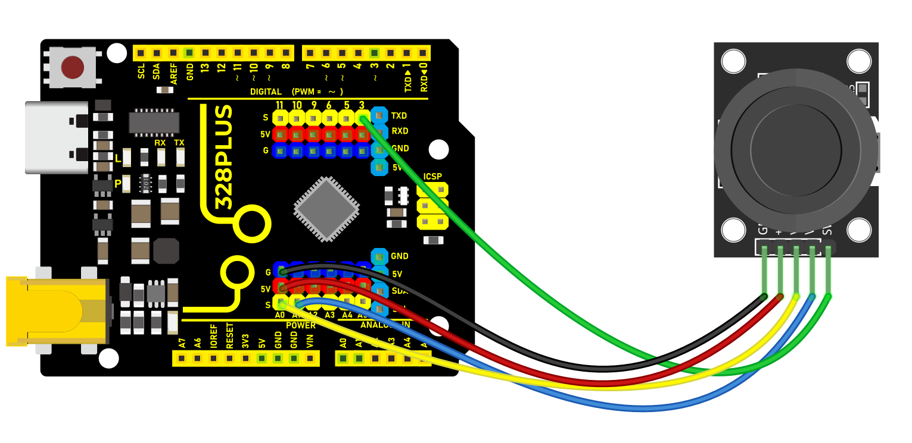

### Project 35 Joystick Module


#### Description

Lots of robot projects need joystick. This module provides an affordable solution. By simply connecting to two analog inputs, the robot is at your commands with X, Y control. It also has a switch that is connected to a digital pin.

#### Hardware

1\. 328 Plus development board x1

2\. Joystick Module x1

3\. DuPont wires

#### Working Principle

It is truly remarkable how a joystick can translate every tiny motion of your fingertips. This is made possible by the joystick’s design, which consists of two potentiometers and a gimbal mechanism.

Gimbal Mechanism

When you move the joystick, a thin rod that sits between two rotatable-slotted-shafts (Gimbal) moves. One of the shafts allows movement along the X-axis (left and right), while the other allows movement along the Y-axis (up and down).


When you move the joystick back and forth, the Y-axis shaft pivots. When you move it left to right, the X-axis shaft pivots. And when you move it diagonally, both shafts pivot.



Each shaft is connected to a potentiometer so that moving the shaft rotates the corresponding potentiometer’s wiper. In other words, pushing the knob all the way forward will cause the potentiometer wiper to move to one end of the resistive track, and pulling it back will cause it to move to the opposite end.



By reading these potentiometers, the knob position can be determined.

Reading analog values from Joystick

The joystick outputs an analog signal whose voltage varies between 0 and 5V. When you move the joystick along the X axis from one extreme to the other, the X output changes from 0 to 5V, and the same thing happens when you move it along the Y axis. And, when the joystick is centered (rest position), the output voltage is approximately half of VCC, or 2.5V.

This output voltage can be fed to an ADC on a microcontroller to determine the physical position of the joystick.

Because the Arduino board has a 10-bit ADC resolution, the values on each analog channel (axis) can range from 0 to 1023. Therefore, when the joystick is moved from one extreme to the other, it will read a value between 0 and 1023 for the corresponding channel. When the joystick is centered, the vertical and horizontal channels will both read 512.

The figure below depicts the X and Y axes as well as how the outputs will respond when the joystick is moved in different directions.



#### Specifications

Operating Voltage: 5V

Internal Potentiometer value: 10k

2.54mm pin interface leads

Dimensions: 1.57 in x 1.02 in x 1.26 in (4.0 cm x 2.6 cm x 3.2 cm)

Operating temperature: 0 to 70 °C

#### Pinout

The Joystick module has a total of 5 pins. Two are for power, two are for X and Y potentiometers, and one is for the middle switch. The pinout of the module is as follows:


GND is the ground pin.

VCC provides power to the module. Connect this to your positive supply (usually 5V or 3.3V depending on your logic levels).

VRx is the horizontal output voltage. Moving the joystick from left to right causes the output voltage to change from 0 to VCC. The joystick will read approximately half of VCC when it is centered (rest position).

VRy is the vertical output voltage. Moving the joystick up and down causes the output voltage to change from 0 to VCC. The joystick will read approximately half of VCC when it is centered (rest position).

SW is the output from the pushbutton switch. By default, the switch output is floating. To read the switch, a pull-up resistor is required so that when the joystick knob is pressed, the switch output becomes LOW, otherwise it remains HIGH. Keep in mind that the input pin to which the switch is connected must have the internal pull-up enabled, or an external pull-up resistor must be connected.

#### Wiring Diagram

1\. Connect VCC pin of Joystick Module to the 5V on the board

2\. Connect GND pin of Joystick Module to the GND on the board

3\. Connect X-axis output pin of Joystick Module to the analog input pin A0 on the board

4\. Connect Y-axis output pin of Joystick Module to the analog input pin A1 on the board

5\. Connect button output pin of Joystick Module to the digital input pin D3 on the board



#### Sample Code

```cpp

/*

Keye New RFID Starter Kit

Project 35

Joystick Module

Edit By Keyes

*/

const int xPin = A0; // X axis pin

const int yPin = A1; // Y axis pin

const int buttonPin = 3; // z axis (button) pin

void setup() {

Serial.begin(9600); // initialize serial port

pinMode(buttonPin, INPUT_PULLUP); // Set the button pin to input and enable the internal pull-up resistor

}

void loop() {

int xValue = analogRead(xPin); // read the potentiometer value in X axis

int yValue = analogRead(yPin); // read the potentiometer value in Y axis

int buttonState = digitalRead(buttonPin); // read the button state

Serial.print("X: ");

Serial.print(xValue);

Serial.print(" Y: ");

Serial.print(yValue);

Serial.print(" Button: ");

Serial.println(buttonState);

delay(100); // delay 100ms

}

```

#### Code Explanation

First, the code defines three constants to specify the pins connected to the Arduino board:

```cpp

const int xPin = A0; // Pin for X-axis

const int yPin = A1; // Pin for Y-axis

const int buttonPin = 3; // Pin for Z-axis (button)

```

Here, `xPin` and `yPin` are defined as analog input pins A0 and A1, used to read the analog values of the two axes. `buttonPin` is defined as digital pin 3, used to read the state of the button.

Setup Function

In the `setup()` function, some basic setup is performed:

```cpp

void setup() {

Serial.begin(9600); // Initialize serial port

pinMode(buttonPin, INPUT_PULLUP); // Set button pin as input and enable internal pull-up resistor

}

```

Here, `Serial.begin(9600);` initializes serial communication, setting the baud rate to 9600, which allows the Arduino to exchange data with a computer or other serial devices via USB. `pinMode(buttonPin, INPUT_PULLUP);` sets the button pin as an input and enables the internal pull-up resistor, which is a common way to ensure that the pin reads a high level (HIGH) when the button is not pressed.

Main Loop Function

The `loop()` function contains the main logic of the program, which continuously executes, reading inputs and sending data to the serial port:

```cpp

void loop() {

int xValue = analogRead(xPin); // Read the potentiometer value of X-axis

int yValue = analogRead(yPin); // Read the potentiometer value of Y-axis

int buttonState = digitalRead(buttonPin); // Read the button state

Serial.print("X: ");

Serial.print(xValue);

Serial.print(" Y: ");

Serial.print(yValue);

Serial.print(" Button: ");

Serial.println(buttonState);

delay(100); // Delay for 100 milliseconds

}

```

This code first uses the `analogRead()` function to read the analog values of the X-axis and Y-axis, respectively. These values typically range from 0 to 1023, depending on the variation of the input voltage. Then, it uses the `digitalRead()` function to read the state of the button, which is either HIGH (not pressed) or LOW (pressed). Afterward, these values are output through the serial port in the format "X: [] Y: [] Button: []". Finally, the `delay(100);` function call makes the loop execute every 100 milliseconds to avoid reading inputs or sending data too frequently.

#### Project Result

After uploading code, open Arduino IDE serial monitor and set baud rate to 9600. When you rotate Joystick Module, the serial monitor prints the value in X and Y axis. Press Joystick Module, the monitor shows 0(pressed) or 1(released).


