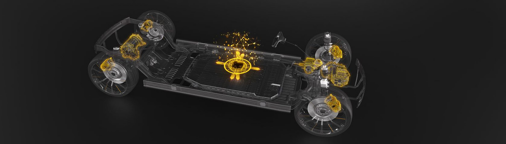
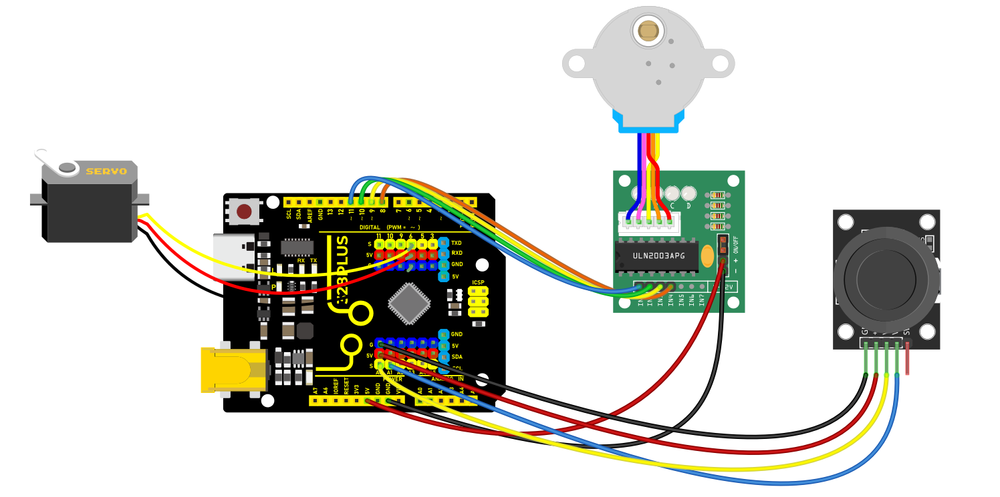
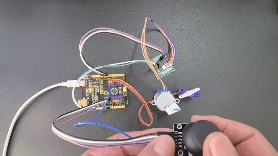

### Project 36 Joystick Motion Control

**

#### Description

This project aims to demonstrate how to use Arduino to control a joystick to drive a stepper motor and a servo. By manipulating the joystick, you can achieve precise control of the rotation of both the stepper motor and the servo. This is very useful in robotics and automation devices and serves as a foundational project for understanding how to use Arduino to control multiple devices.

#### Hardware

1\. 328 Plus development board x1

2\. 28BYJ-48 Stepper Motor and ULN2003 Motor Driver Module x1

3\. SG90 Servo x1

4\. Joystick Module x1

5\. Jumper Wires

6\. Power Supply

#### Working Principle

The core of this project is reading the output voltage values from the joystick and converting them into motion commands for the stepper motor and the servo. The joystick outputs analog voltages on two axes (X and Y), which the Arduino reads via its analog inputs. Based on the changes in these voltage values, the stepper motor (for X-axis movement) and the servo (for Y-axis movement) are controlled accordingly.

When a low voltage value is read from the joystick's X-axis, the stepper motor will rotate forward incrementally; when a high value is read, it will reverse. The Y-axis controls the servo's angle, swinging it between 0 and 180 degrees.

#### Wiring Diagram

Joystick Module:

`VRx` to Arduino `A0` (for reading the X-axis analog input)

`VRy` to Arduino `A1` (for reading the Y-axis analog input)

`GND` to Arduino `GND`

`VCC` to Arduino `5V`

Stepper Motor Driver Module:

`IN1` to Arduino `8`

`IN2` to Arduino `10`

`IN3` to Arduino `9`

`IN4` to Arduino `11`

Servo:

Signal wire to Arduino `6`

Power wire to Arduino `5V`

Ground wire to Arduino `GND`



#### Sample Code

```cpp

/*

Keye New RFID Starter Kit

Project 36

Joystick Motion Control

Edit By Keyes

*/

#include <Stepper.h>

#include <Servo.h>

const int stepsPerRevolution = 2038; // Define the number of steps per rotation

Stepper myStepper = Stepper(stepsPerRevolution, 8, 10, 9, 11);

Servo myservo;

int currentPos = 0;

bool shouldRotate = false;

int targetPos = 0;

void setup() {

myservo.attach(6);

myservo.write(0);

}

void loop() {

Control_X();

Control_Y();

}

void Control_X(){

int xValue = analogRead(A0);

if (xValue < 300) {

myStepper.setSpeed(10);

for (int i = 0; i < 10; i++) {

myStepper.step(1);

delay(10);

}

}

else if (xValue > 800) {

myStepper.setSpeed(10);

for (int i = 0; i < 10; i++) {

myStepper.step(-1);

delay(10);

}

} else {

digitalWrite(8, LOW);

digitalWrite(9, LOW);

digitalWrite(10, LOW);

digitalWrite(11, LOW);

}

}

void Control_Y(){

int y = analogRead(A1);

// Set target position based on y value

if (y < 300) {

targetPos = 180;

shouldRotate = (currentPos < targetPos);

} else if (y > 800) {

targetPos = 0;

shouldRotate = (currentPos > targetPos);

} else {

// If y is between 300 and 800, do not rotate

shouldRotate = false;

}

// If should rotate, move towards the target position step by step

if (shouldRotate) {

if (currentPos < targetPos) {

currentPos++;

} else {

currentPos--;

}

myservo.write(currentPos);

delay(15); // Delay added for smooth movement

// Stop rotating if the target position is reached

if (currentPos == targetPos) {

shouldRotate = false;

}

}

}

```

#### Code Explanation

`Stepper myStepper = Stepper(stepsPerRevolution, 8, 10, 9, 11);`: Initializes the stepper motor object, defining its control steps and I/O pins.

`Servo myservo;`: Defines the object for controlling the servo.

In the `setup` function, specifies the control pin for the servo via `myservo.attach(6);` and sets the initial position to 0 degrees.

`Control_X()` function: Reads the joystick's X-axis value and decides the stepping motor's rotational direction and steps based on its magnitude, executed using `myStepper.step()`.

`Control_Y()` function: Reads the joystick's Y-axis value and maps it to the servo's rotation angle, adjusting the servo's position.

#### Project Result

With the above configuration and code, you can control the stepper motor's rotational direction and the servo's angle immediately, responding to changes on the X and Y axes using the joystick. 



