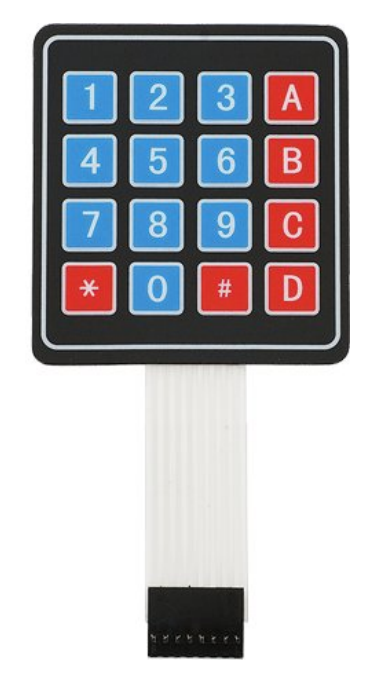
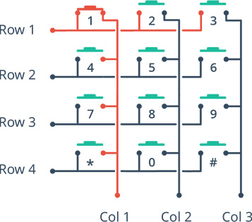
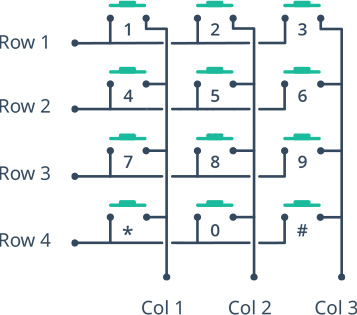
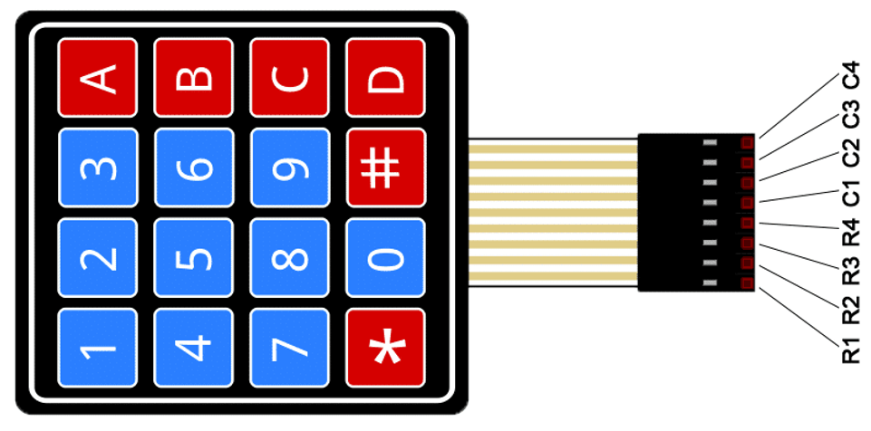
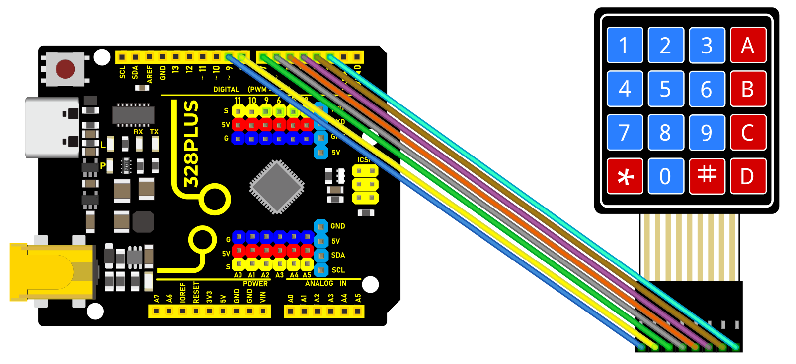
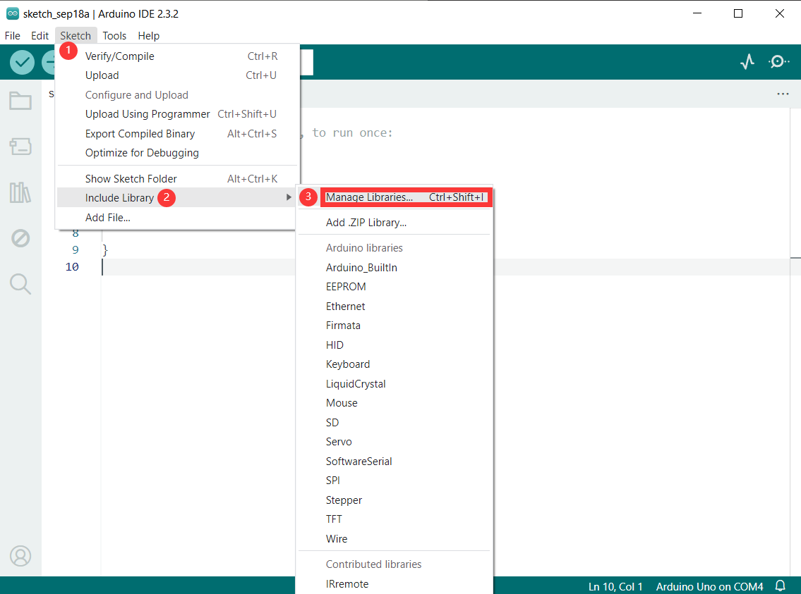
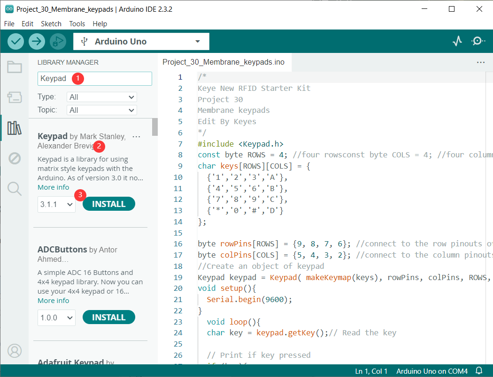
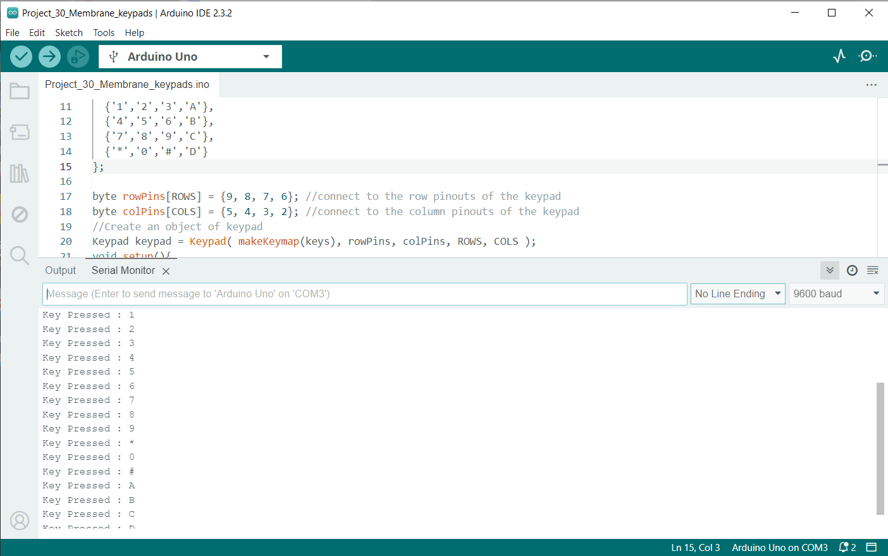

### Project 37 Membrane keypads


#### Description

Membrane keypads are an excellent starting point for adding key input to a project because they are inexpensive, long-lasting, and resistant to water. And knowing how to interface them with an Arduino is extremely useful for building a variety of projects that require user input for menu selection, password entry, or robot operation.

Membrane keypads come in a variety of sizes, the most common of which are the 4×4 keypad (16 keys). They have a layout similar to that of a standard telephone keypad, making them easy to use for anyone.



#### Hardware

1\. 328 Plus development board x1

2\. 4*4 Membrane keypads x1

3\. DuPont wires

#### Working Principle

The matrix keypad consists of pushbutton contacts that are connected to the row and column lines. There is one pin for each column and one pin for each row. So the 4×4 keypad has 4 + 4 = 8 pins, while the 4×3 keypad has 4 + 3 = 7 pins.

This illustration of a basic 4×3 keypad arrangement demonstrates how the internal conductors connect the rows and columns.



When the button is pressed, one of the rows is connected to one of the columns, allowing current to flow between them. When the key ‘4’ is pressed, for instance, column 1 and row 2 are connected.



By identifying which column and row are connected, we can determine which button has been pressed.

**Keypad Scanning**

Here is how a microcontroller scans rows and columns to identify which button has been pressed.

1.  Each row is connected to an input pin, and each column is connected to an output pin.
2.  Input pins are pulled HIGH by enabling internal pull-up resistors.
3.  The microcontroller then sequentially sets the pin for each column LOW and then checks to see if any of the row pins are LOW. Because pull-up resistors are used, the rows will be high unless a button is pressed.
4.  If a row pin is LOW, it indicates that the button for that row and column is pressed.
5.  The microcontroller then waits for the switch to be released. It then searches the keymap array for the character that corresponds to that button.

#### Pinout

The keypad has a female Dupont connector. When looking at the front of the keypad, the row pins are on the left, and they usually have a dark strip near the connector to help identify them. The pinouts are as follows:



#### Wiring Diagram

The connection is quite straightforward, as the Arduino connections are made in the same order as the keypad connector. Begin by connecting keypad pin 1 to Arduino digital pin 9. And continue doing the same with the subsequent pins (2 to 8, 3 to 7, and so on).

The most convenient way to connect everything is to use an 8-pin male-to-male Dupont ribbon cable.




#### Install Library

To determine which key was pressed, we must continuously scan rows and columns. Fortunately, [](https://playground.arduino.cc/code/keypad) was written to abstract away this unnecessary complexity.

To install the library, navigate to **Sketch > Include Library > Manage Libraries…** Wait for the Library Manager to download the libraries index and update the list of installed libraries.



Filter your search by entering **‘keypad’**. Look for **Keypad** by **Mark Stanley, Alexander Brevig**. Click on that entry and then choose Install.



#### Sample Code
```cpp
/*

Keye New RFID Starter Kit

Project 37

Membrane keypads

Edit By Keyes

*/

#include <Keypad.h>

const byte ROWS = 4; //four rows

const byte COLS = 4; //four columns

char keys[][] = {

{'1','2','3','A'},

{'4','5','6','B'},

{'7','8','9','C'},

{'*','0','#','D'}

};

byte rowPins[] = {9, 8, 7, 6}; //connect to the row pinouts of the keypad

byte colPins[] = {5, 4, 3, 2}; //connect to the column pinouts of the keypad

//Create an object of keypad

Keypad keypad = Keypad( makeKeymap(keys), rowPins, colPins, ROWS, COLS );

void setup(){

Serial.begin(9600);

}

void loop(){

char key = keypad.getKey();// Read the key

// Print if key pressed

if (key){

Serial.print("Key Pressed : ");

Serial.println(key);

}

}
```
#### Code Explanation

The sketch begins by including the Keypad.h library and defining constants for the number of rows and columns on the keypad. If you’re using a different keypad, modify these constants accordingly.

#include <Keypad.h>

const byte ROWS = 4; //four rowsconst byte COLS = 4; //four columns

Following that, we define a 2-dimensional keymap array keys[][] that contains characters to be printed when a specific keypad button is pressed. In our sketch, the characters are laid out exactly as they appear on the keypad.

char keys[][] = {

{'1','2','3','A'},

{'4','5','6','B'},

{'7','8','9','C'},

{'*','0','#','D'}

};

However, you can define these to be anything you want. For example, if you intend to create a calculator project, simply change the array definition to this:

char keys[][] = {

{'1','2','3','4'},

{'5','6','7','8'},

{'9','0','+','-'},

{'.','*','/','='}

};

Two more arrays are defined. These arrays specify the Arduino connections to the keypad’s row and column pins.

byte rowPins[] = {9, 8, 7, 6}; //connect to the row pinouts of the keypad

byte colPins[] = {5, 4, 3, 2}; //connect to the column pinouts of the keypad

Next, we create a keypad library object. The constructor accepts five arguments.

makeKeymap(keys) initializes the internal keymap to be equal to the user defined keymap.

rowPins and colPins specify the Arduino connections to the keypad’s row and column pins.

ROWS and COLS represent the keypad’s rows and columns.

//Create an object of keypad

Keypad keypad = Keypad( makeKeymap(keys), rowPins, colPins, ROWS, COLS );

In the Setup, we initialize the serial port.

void setup(){

Serial.begin(9600);

}

In the Loop, we use the getKey() method to get a key value when a keypress is detected. Then we print it to the serial monitor.

void loop(){

char key = keypad.getKey();// Read the key

// Print if key pressed

if (key){

Serial.print("Key Pressed : ");

Serial.println(key);

}

}

#### Project Result

After loading the sketch, open your serial monitor at 9600 baud. Now, press some keys on the keypad; the serial monitor should display the key values.



