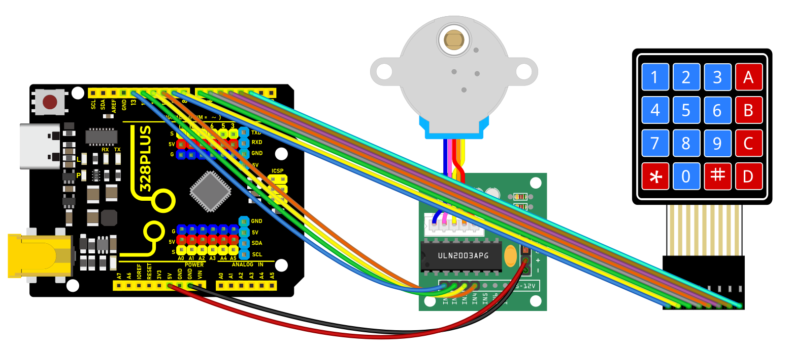
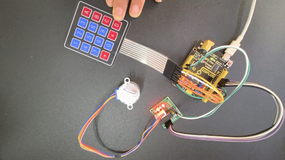

### Project 38 Password Lock

Description

In this project, we will create a basic Arduino password lock system using a membrane keypad and a stepper motor. The main function of the password lock is to control the rotation of the stepper motor by correctly entering a preset password, thereby activating a hypothetical security door.

#### Hardware

1\. 328 Plus development board x1

2\. 4x4 membrane keypad x1

3\. 28BYJ-48 stepper motor x1

4\. ULN2003 stepper motor driver module x1

5\. Breadboard and jumper wires

6\. Power supply

#### Working Principle

The basic principle of the project is to listen for input from the membrane keypad and verify input with a preset password. When the input matches, the Arduino will send a signal to activate the stepper motor, causing it to rotate once. The input from the membrane keypad is connected to the Arduino through designated pins, and the input status is read using an appropriate software library. The stepper motor is connected to the Arduino via the ULN2003 driver module, allowing precise rotational control.

#### Wiring Diagram

Membrane keypad to Arduino connection:

Row pins: 2, 3, 4, 5- Column pins: 6, 7, 8, 9

Stepper motor to Arduino connection:

IN1 -> Pin 10- IN2 -> Pin 11- IN3 -> Pin 12 - IN4 -> Pin 13



#### **Sample Code**

```cpp

/*

Keye New RFID Starter Kit

Project 38

Password lock

Edit By Keyes

*/

#include <Keypad.h>

#include <Stepper.h>

// Number of steps for the stepper motor

const int stepsPerRevolution = 2048;

// Stepper motor setup

Stepper myStepper(stepsPerRevolution, 10, 11, 12, 13);

// Keypad layout setup

const byte ROWS = 4;

const byte COLS = 4;

char keys[][] = {

{'1', '2', '3', 'A'},

{'4', '5', '6', 'B'},

{'7', '8', '9', 'C'},

{'*', '0', '#', 'D'}

};

byte rowPins[] = {9, 8, 7, 6}; //connect to the row pinouts of the keypad

byte colPins[] = {5, 4, 3, 2}; //connect to the column pinouts of the keypad

Keypad keypad = Keypad(makeKeymap(keys), rowPins, colPins, ROWS, COLS);

// Preset password

const String password = "1234";

String inputPassword;

void setup() {

Serial.begin(9600);

myStepper.setSpeed(10); // Set the stepper motor speed

}

void loop() {

char key = keypad.getKey();

if (key) {

Serial.println(key);

if (key == '#') {

// End of input, verify password

if (inputPassword == password) {

Serial.println("Access Granted");

myStepper.step(stepsPerRevolution); // Rotate motor

} else {

Serial.println("Access Denied");

}

inputPassword = ""; // Reset input

} else if (key == '*') {

inputPassword = ""; // Clear input

} else {

inputPassword += key; // Store input characters

}

}

}

```

#### Code Explanation

1\. **Libraries and Constant Declarations:**

```cpp

#include <Keypad.h>

#include <Stepper.h>

const int stepsPerRevolution = 2048;

```

The code includes two libraries: `Keypad` for handling keyboard input, and `Stepper` for controlling a stepper motor. `stepsPerRevolution` defines the number of steps the motor needs to complete a full revolution.

2\. **Stepper Motor Setup:**

```cpp

Stepper myStepper(stepsPerRevolution, 10, 11, 12, 13);

```

A `Stepper` object is created to control a motor connected to pins 10, 11, 12, and 13. These pins control the motor coils for movement and operation.

3\. **Keypad Setup:**

```cpp

const byte ROWS = 4;

const byte COLS = 4;

char keys[][] = {

{'1', '2', '3', 'A'},

{'4', '5', '6', 'B'},

{'7', '8', '9', 'C'},

{'*', '0', '#', 'D'}

};

byte rowPins[] = {9, 8, 7, 6};

byte colPins[] = {5, 4, 3, 2};

Keypad keypad = Keypad(makeKeymap(keys), rowPins, colPins, ROWS, COLS);

```

A 4x4 matrix keypad is initialized. The `keys` array defines the layout of the keypad, while the `rowPins` and `colPins` arrays specify the row and column pins connected to the Arduino.

4\. **Password Setup and Logic Execution:**

```cpp

const String password = "1234";

String inputPassword;

```

A preset password "1234" is set, and the variable `inputPassword` is used to store user input.

5\. **Initialization Setup:**

```cpp

void setup() {

Serial.begin(9600);

myStepper.setSpeed(10);

}

```

In the `setup()` function, `Serial.begin(9600)` initializes serial communication at a baud rate of 9600. `myStepper.setSpeed(10)` sets the speed of the stepper motor.

6\. **Main Loop Logic:**

```cpp

void loop() {

char key = keypad.getKey();

if (key) {

Serial.println(key);

if (key == '#') {

if (inputPassword == password) {

Serial.println("Access Granted");

myStepper.step(stepsPerRevolution);

} else {

Serial.println("Access Denied");

}

inputPassword = "";

} else if (key == '*') {

inputPassword = "";

} else {

inputPassword += key;

}

}

}

```

The main loop continuously checks for keyboard input.

If a key is pressed, it outputs the key value.

`#` indicates the end of input, triggering a password check against the preset password.

If the password matches, "Access Granted" is displayed and the motor rotates a full circle.

If incorrect, "Access Denied" is displayed.

`*` clears the current input.

Other keys are stored as password characters.

#### Project Result

Upon completing this project, you will have a functional password lock system using a membrane keypad to input a preset password to control a stepper motor.


When the correct password（1234）is entered, the stepper motor will rotate a preset angle (one full circle in this project) to simulate unlocking a security lock.

