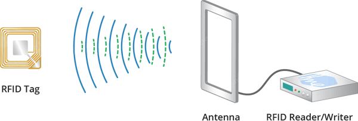
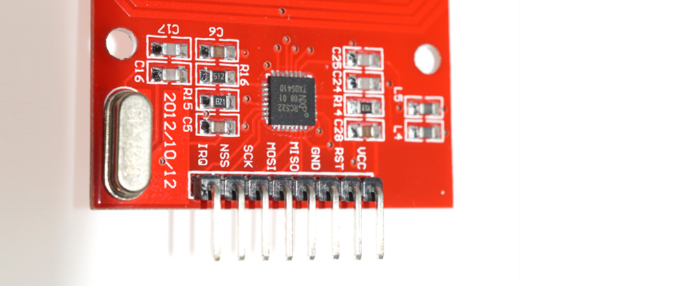
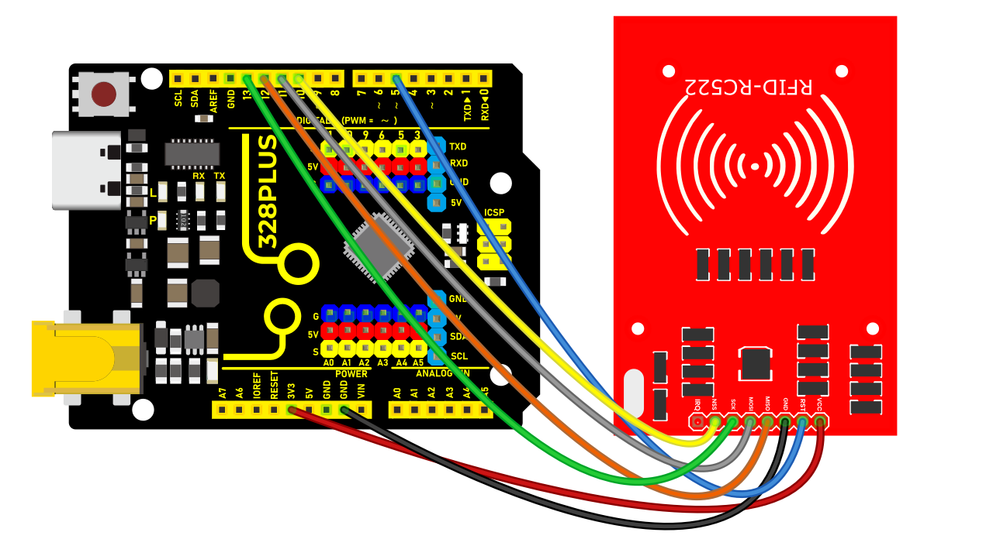
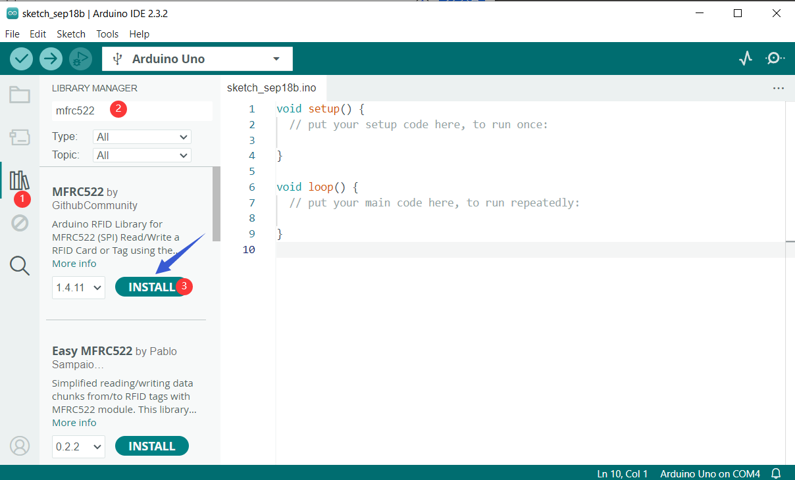
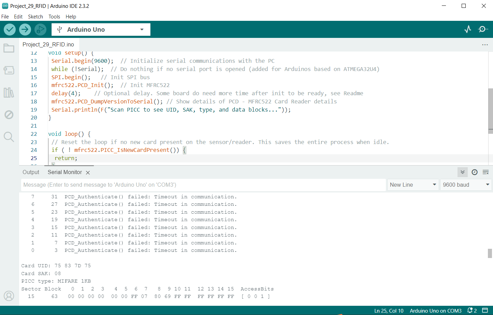

### Project 39 RFID Module


#### Description

An RFID module integrates radio frequency identification technology that identify and track tagged objects by electromagnetic fields. Each tag contains a microchip that stores unique identifying information about the object. The module identifies the object by reading the tag information and can match it with the database to track and manage the object.

In this project, we read the unique ID by 328 Plus development board and RC522 RFID module, and then perform the corresponding action based on the read ID.

#### Hardware

1\. 328 Plus development board x1

2\. RC522 RFID module x1

3\. RFID card (key or card) x1

4\. DuPont wires

#### Working Principle

An RFID or radio frequency identification system consists of two main components, a tag attached to the object to be identified, and a reader that reads the tag.

A reader consists of a radio frequency module and an antenna that generates a high frequency electromagnetic field. Whereas the tag is usually a passive device (it does not have a battery). It consists of a microchip that stores and processes information, and an antenna for receiving and transmitting a signal.



When the tag is brought close to the reader, the reader generates an electromagnetic field. This causes electrons to move through the tag’s antenna and subsequently powers the chip.

The chip then responds by sending its stored information back to the reader in the form of another radio signal. This is called a backscatter. The reader detects and interprets this backscatter and sends the data to a computer or microcontroller.

#### Specifications

| Frequency Range          | 13.56 MHz ISM Band |
|--------------------------|--------------------|
| Host Interface           | SPI / I2C / UART   |
| Operating Supply Voltage | 2.5 V to 3.3 V     |
| Max. Operating Current   | 13-26mA            |
| Min. Current(Power down) | 10µA               |
| Logic Inputs             | 5V Tolerant        |
| Read Range               | 5 cm               |

#### Pinout



VCC supplies power to the module. This can be anywhere from 2.5 to 3.3 volts. You can connect it to the 3.3V output from your Arduino. But remember that connecting it to the 5V pin will probably destroy your module!

RST is an input for reset and power-down. When this pin goes low the module enters power-down mode. In which the oscillator is turned off and the input pins are disconnected from the outside world. Whereas the module is reset on the rising edge of the signal.

GND is the ground pin and needs to be connected to the GND pin on the Arduino.

IRQ is an interrupt pin that alerts the microcontroller when an RFID tag is in the vicinity.

MISO / SCL / Tx pin acts as master-in-slave-out when SPI interface is enabled, as serial clock when I2C interface is enabled and as serial data output when the UART interface is enabled.

MOSI (Master Out Slave In) is the SPI input to the RC522 module.

SCK (Serial Clock) accepts the clock pulses provided by the SPI bus master i.e. Arduino.

SS / SDA / Rx pin acts as a signal input when the SPI interface is enabled, as serial data when the I2C interface is enabled and as a serial data input when the UART interface is enabled. This pin is usually marked by encasing the pin in a square so that it can be used as a reference to identify other pins.

#### Wiring Diagram

First connect the VCC pin on the module to 3.3V and the GND pin to ground on the Arduino. Pin RST can be connected to any digital pin on the Arduino. In our case, it is connected to digital pin \#5. The IRQ pin is left unconnected because the Arduino library we are going to use does not support it.

Now we are left with the pins that are used for SPI communication. Since RC522 modules require a lot of data transfer, they will give the best performance when connected to the hardware SPI pins on the microcontroller. For Arduino boards such as the UNO/Nano V3.0, these pins are digital 13 (SCK), 12 (MISO), 11 (MOSI) and 10 (SS).

If you are using a different Arduino than the boards mentioned above, please check the Arduino’s official documentation before proceeding.

The following table lists the pin connections:

| RC522 Module    |   | Arduino |
|-----------------|---|---------|
| VCC             |   | 3.3V    |
| GND             |   | GND     |
| RST             |   | 5       |
| MISO / SCL / Tx |   | 12      |
| MOSI            |   | 11      |
| SCK             |   | 13      |
| SS / SDA / Rx   |   | 10      |




#### Install Library

Communicating with an RC522 RFID module is a lot of work, but luckily for us there is a library called the [](https://github.com/miguelbalboa/rfid) that makes reading and writing RFID tags simple.

This library is not included in the Arduino IDE, so you will need to install it first.

To install the library navigate to Sketch > Include Libraries > Manage Libraries… Wait for Library Manager to download the library index and update the list of installed libraries.


Filter your search by typing ‘**mfrc522**‘. Look for the library by **GithubCommunity**. Click on that entry, and then select Install.



#### Sample Code

```cpp

/*

Keye New RFID Starter Kit

Project 39

RFID module

Edit By Keyes

*/

#include <SPI.h>

#include <MFRC522.h>

#define RST_PIN 9 // Configurable, see typical pin layout above

#define SS_PIN 10 // Configurable, see typical pin layout above

MFRC522 mfrc522(SS_PIN, RST_PIN); // Create MFRC522 instance

void setup() {

Serial.begin(9600); // Initialize serial communications with the PC

while (!Serial); // Do nothing if no serial port is opened (added for Arduinos based on ATMEGA32U4)

SPI.begin(); // Init SPI bus

mfrc522.PCD_Init(); // Init MFRC522

delay(4); // Optional delay. Some board do need more time after init to be ready, see Readme

mfrc522.PCD_DumpVersionToSerial(); // Show details of PCD - MFRC522 Card Reader details

Serial.println(F("Scan PICC to see UID, SAK, type, and data blocks..."));

}

void loop() {

// Reset the loop if no new card present on the sensor/reader. This saves the entire process when idle.

if ( ! mfrc522.PICC_IsNewCardPresent()) {

return;

}

// Select one of the cards

if ( ! mfrc522.PICC_ReadCardSerial()) {

return;

}

// Dump debug info about the card; PICC_HaltA() is automatically called

mfrc522.PICC_DumpToSerial(&(mfrc522.uid));

}

```

#### Code Explanation

1\. **Include Libraries**

```cpp

#include <SPI.h>

#include <MFRC522.h>

```

`SPI.h` is used for Serial Peripheral Interface (SPI) communication with the RFID module.

`MFRC522.h` is the library for controlling the MFRC522 RFID reader.

2\. **Define Pins**

```cpp

#define RST_PIN 9

#define SS_PIN 10

```

`RST_PIN` and `SS_PIN` define the reset pin and slave select pin for the module respectively. When connecting the hardware, these pin definitions should be followed.

3\. **Create MFRC522 Instance**

```cpp

MFRC522 mfrc522(SS_PIN, RST_PIN);

```

This creates an instance of type MFRC522 named `mfrc522`, which is used for subsequent RFID operations.

4\. **Initial Setup**

```cpp

void setup() {

Serial.begin(9600);

while (!Serial);

SPI.begin();

mfrc522.PCD_Init();

delay(4);

mfrc522.PCD_DumpVersionToSerial();

Serial.println(F("Scan PICC to see UID, SAK, type, and data blocks..."));

}

```

`Serial.begin(9600);` initializes serial communication with the PC at a baud rate of 9600.

`while (!Serial);` ensures the serial port is open (necessary for some Arduino boards like the ATMEGA32U4).

`SPI.begin();` initializes the SPI bus.

`mfrc522.PCD_Init();` initializes the RFID reader module.

`delay(4);` is an optional delay ensuring some boards have enough time to be ready after initialization.

`mfrc522.PCD_DumpVersionToSerial();` outputs the reader's details to the serial monitor.

`Serial.println(F("Scan PICC to see UID, SAK, type, and data blocks..."));` prompts the user to scan an RFID card.

5\. **Main Loop**

```cpp

void loop() {

if (!mfrc522.PICC_IsNewCardPresent()) {

return;

}

if (!mfrc522.PICC_ReadCardSerial()) {

return;

}

mfrc522.PICC_DumpToSerial(&(mfrc522.uid));

}

```

`if (!mfrc522.PICC_IsNewCardPresent())`: checks if a new card is present near the reader. If no new card is detected, the function returns.

`if (!mfrc522.PICC_ReadCardSerial())`: reads the card's serial number. If reading fails, the function returns.

`mfrc522.PICC_DumpToSerial(&(mfrc522.uid));`: outputs the card's information (including UID, SAK, type, and data blocks) to the serial monitor. The function automatically calls `PICC_HaltA()` to put the card in standby mode.

#### Project Result

Now upload the sketch and open Serial Monitor. As you bring the tag closer to the module, you’ll get something like the following. Do not move the tag until all the information is displayed.



It displays all the useful information about the tag including the tag’s Unique ID (UID), memory size, and the entire 1K memory.

