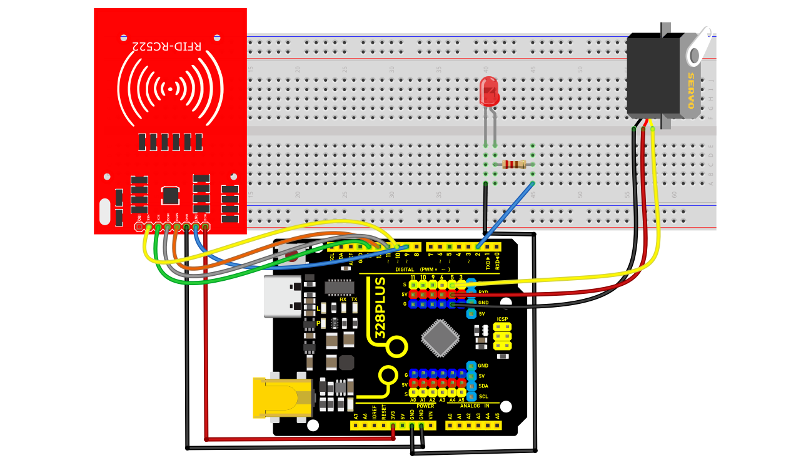
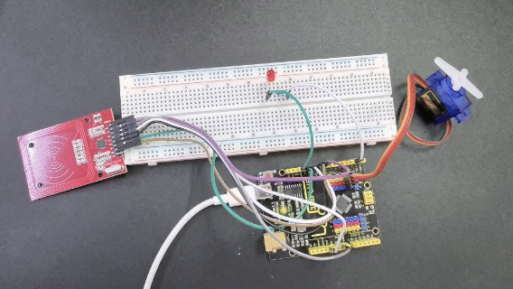

### Project 40 RFID Smart Home


#### Description

Automatic features and security are two crucial aspects of modern smart home systems. By utilizing RFID technology, we can create a secure and convenient home automation system. In this project, we will use an RFID module to control a servo motor and LED lights on an Arduino. This system can be configured, for example, to turn the lights on or off in a particular room or unlock a door lock by scanning an RFID card.

#### Hardware

1.328 Plus development board x1

2.RFID Reader Module (e.g., MFRC522) x1

3.RFID card or tag x1

4.Servo Motor x1

5.LED light x1

6.220-ohm resistor x1

7.Breadboard and connecting wires


#### Working Principle

In this project, the RFID module will be connected to the Arduino to read the UID of an RFID card. When the RFID reader detects a specific RFID card, the Arduino will control the servo motor to rotate and turn the LED light on or off. The core idea is to implement switch control of specific devices when the RFID card is successfully verified.

#### Wiring Diagram

1\. **Connecting Arduino Pins to RFID Module Pins**:

SDA → D10

SCK → D13

MOSI → D11

MISO → D12

IRQ → Not connected

GND → GND

RST → D9

3.3V → 3.3V

2\. **Connecting Arduino Pins to the Servo**:

Servo signal wire → D5

Servo power wire → 5V

Servo ground wire → GND

3\. **Connecting Arduino Pins to the LED**:

LED anode (long leg) → D2

LED cathode (short leg) → Resistor → GND



#### Sample Code

```cpp

/*

Keye New RFID Starter Kit

Project 40

RFID Smart Home

Edit By Keyes

*/

#include <SPI.h>

#include <MFRC522.h>

#include <Servo.h>

#define SS_PIN 10

#define RST_PIN 5

#define LED_PIN 2

#define SERVO_PIN 9

MFRC522 mfrc522(SS_PIN, RST_PIN);

Servo myServo;

void setup() {

Serial.begin(9600);

SPI.begin();

mfrc522.PCD_Init();

pinMode(LED_PIN, OUTPUT);

myServo.attach(SERVO_PIN);

myServo.write(0); // Initial position of servo motor

digitalWrite(LED_PIN, LOW);

}

void loop() {

if (!mfrc522.PICC_IsNewCardPresent() || !mfrc522.PICC_ReadCardSerial()) {

return;

}

Serial.print("Card UID:");

String uid;

for (byte i = 0; i < mfrc522.uid.size; i++) {

uid.concat(String(mfrc522.uid.uidByte[] < 0x10 ? " 0" : " "));

uid.concat(String(mfrc522.uid.uidByte[], HEX));

}

uid.toUpperCase();

Serial.println(uid);

if (uid == "SPECIFIC_UID_CODE") { // Replace with your card's UID

digitalWrite(LED_PIN, HIGH); // Turn on LED

myServo.write(90); // Rotate the servo to 90 degrees

delay(2000); // Maintain the state for 2 seconds

digitalWrite(LED_PIN, LOW); // Turn off LED

myServo.write(0); // Reset the servo

}

mfrc522.PICC_HaltA();

}

```

#### Code Explanation

**Library References:**

`#include <SPI.h>` and `#include <MFRC522.h>` are crucial libraries for communication with the RFID module.

`#include <Servo.h>` is used to control the servo motor.

**Pin Definitions:**

`SS_PIN`, `RST_PIN`, `SERVO_PIN`, `LED_PIN` are defined as 10, 9, 5, 2 respectively. These numbers are important for connecting the RFID reader, servo, and LED.

**Object Creation:**

`MFRC522 mfrc522(SS_PIN, RST_PIN);` creates an instance of the RFID reader.

`Servo myServo;` creates an instance of the servo motor.

**Setup Initialization**

In the `setup()` function:

1\. Initialize serial communication with `Serial.begin(9600);`.

2\. Start SPI bus communication with `SPI.begin();`.

3\. Initialize the MFRC522 reader with `mfrc522.PCD_Init();`.

4\. Connect the servo to the specified pin and set its initial position to 0 degrees.

5\. Initialize the LED in an off state and output "Waiting for RFID card..." on the serial monitor.

**Main Loop**

In the `loop()` function:

1\. Check if a new card is detected. If not, wait.

2\. Obtain and display the card’s UID.

3\. Verify if the card’s UID matches the preset UID (in this case, “75 83 7D 75”). If it matches:

Output "Authorized access."

Turn on the LED and rotate the servo to 180 degrees to simulate unlocking.

After a 2-second delay, reset the servo to its initial position and turn off the LED.

4\. If the UID does not match, output "Access denied."

#### Project Result

The code was uploaded to the development board, successfully initializing the RFID reader. During this process, the serial monitor continuously displayed the message "Waiting for RFID card...", indicating that the system was in a standby mode for reading. When an RFID card approached the reader, the device successfully identified the card's UID and displayed it on the serial monitor. By comparing the preset UID, the project triggered an "Authorized access" status for this UID card. At this point, an LED light turned on, and the servo motor rotated to 180 degrees, simulating the unlocking of a door. After 2 seconds, the servo motor returned to its initial angle, and the LED light turned off, simulating the door locking.

In tests with unauthorized cards, the system outputted "Access denied" and did not activate the LED or servo motor, verifying the effectiveness of card UID recognition and access control.

The results of this project demonstrate that using RFID technology for basic smart home lock control is feasible. In the future, its functionality and application scenarios could be further expanded through more complex network communication features and sensor integration.
